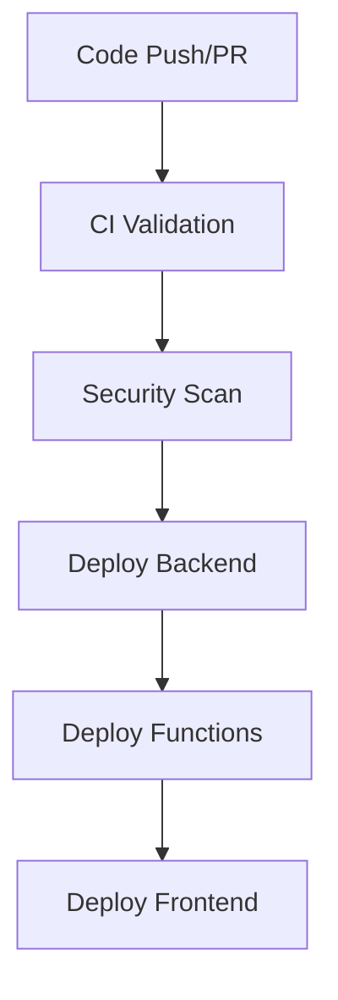

# TCDynamics GitHub Actions Workflows

This directory contains the CI/CD workflows for the TCDynamics project. The workflows provide comprehensive automation for testing, building, deploying, and securing your application.

## Workflows Overview

### 1. CI - Pull Request Validation (`ci-pr-validation.yml`)

**Purpose**: Validates code quality and functionality before merging PRs

**Triggers**:

- Pull requests to `main`/`develop` branches
- Changes to relevant files (src/, backend/, TCDynamics/, etc.)

**Jobs**:

- **Frontend Testing**: React/TypeScript linting, type checking, unit tests
- **Backend Testing**: Node.js API tests with PostgreSQL/Redis services
- **Functions Testing**: Python Azure Functions tests with coverage
- **Integration Tests**: End-to-end validation (optional)
- **Quality Gates**: Ensures all tests pass before allowing merges

### 2. Backend Deployment (`deploy-backend.yml`)

**Purpose**: Deploys the full backend stack (Node.js API + Database + Redis) to OVHcloud

**Triggers**:

- Push to `main` branch (automatic)
- Manual trigger via GitHub UI

**Jobs**:

- **Build Images**: Creates Docker images for backend and frontend
- **Push to Registry**: Publishes images to GitHub Container Registry
- **Deploy to OVH**: SSH deployment with Docker Compose
- **Health Checks**: Validates deployed services
- **Database Migration**: Runs migration scripts if available

### 3. Security Scan (`security-scan.yml`)

**Purpose**: Comprehensive security analysis and vulnerability detection

**Triggers**:

- Push to `main`/`develop` branches
- Pull requests
- Weekly schedule (Monday 2 AM UTC)
- Manual trigger

**Jobs**:

- **CodeQL Analysis**: Static code analysis for JS/TS/Python
- **Snyk Security**: Dependency vulnerability scanning
- **Container Security**: Docker image vulnerability scanning with Trivy
- **Dependency Review**: License and vulnerability checks for PRs
- **License Compliance**: Ensures only approved open-source licenses
- **Secrets Detection**: Scans for accidentally committed secrets

## Required Secrets

### For Backend Deployment

```bash
# OVHcloud Server Access
OVHCLOUD_HOST=your-server-ip
OVHCLOUD_USER=your-ssh-username
OVHCLOUD_SSH_KEY=your-private-ssh-key
OVHCLOUD_PORT=22

# Application URLs (for health checks)
OVHCLOUD_BACKEND_URL=https://your-backend-url
OVHCLOUD_FRONTEND_URL=https://your-frontend-url

# Slack Notifications (optional)
SLACK_WEBHOOK=https://hooks.slack.com/...
```

### For Security Scanning

```bash
# Snyk Token (get from https://snyk.io/account/)
SNYK_TOKEN=your-snyk-token

# Slack Notifications (optional)
SLACK_WEBHOOK=https://hooks.slack.com/...
```

### For Azure Functions (existing)

```bash
AZURE_CLIENT_ID=your-service-principal-id
AZURE_CLIENT_SECRET=your-service-principal-secret
AZURE_TENANT_ID=your-azure-tenant-id
AZURE_FUNCTIONAPP_PUBLISH_PROFILE=your-publish-profile-xml
```

## Setup Instructions

### 1. Configure GitHub Secrets

Go to your repository Settings → Secrets and variables → Actions and add the required secrets listed above.

### 2. Setup OVHcloud Server

```bash
# On your OVHcloud server:
sudo apt update
sudo apt install -y docker.io docker-compose git
sudo systemctl enable docker
sudo systemctl start docker

# Create project directory
sudo mkdir -p /opt/tcdynamics
sudo chown $USER:$USER /opt/tcdynamics

# Clone repository (optional, workflows handle deployment)
cd /opt/tcdynamics
git clone https://github.com/your-org/tcdynamics.git .
```

### 3. Configure Environment

```bash
# Copy and configure production environment
cp env.production.template backend/.env.production
# Edit backend/.env.production with your actual values
```

### 4. Setup SSH Key for Deployment

```bash
# Generate SSH key pair (if not already done)
ssh-keygen -t ed25519 -C "github-actions@tcdynamics"

# Add public key to OVHcloud server (~/.ssh/authorized_keys)
# Add private key to GitHub secret OVHCLOUD_SSH_KEY
```

### 5. Enable GitHub Container Registry

The workflows automatically use GitHub Container Registry (ghcr.io). Ensure your repository has package permissions enabled.

## Workflow Dependencies



## Monitoring and Troubleshooting

### Check Workflow Status

- Go to Actions tab in your repository
- View workflow runs and their status
- Check logs for detailed error information

### Common Issues

**Backend Deployment Fails**:

- Check SSH connectivity: `ssh -T user@host`
- Verify Docker is running on target server
- Check environment variables in `backend/.env.production`

**Security Scan Fails**:

- Ensure Snyk token is valid
- Check if Trivy action has proper permissions
- Review CodeQL setup for your languages

**Container Build Fails**:

- Verify Dockerfiles are correct
- Check GitHub Container Registry permissions
- Ensure build context paths are accurate

## Cost Optimization

- **Parallel Jobs**: Workflows run tests in parallel to reduce execution time
- **Conditional Execution**: Security scans only run on pushes, not every PR
- **Artifact Retention**: Build artifacts are retained for only 1 day
- **Caching**: NPM and Docker layer caching reduces build times

## Security Best Practices

- **Secret Management**: All sensitive data stored as GitHub secrets
- **Vulnerability Scanning**: Automated scans with multiple tools
- **License Compliance**: Only approved open-source licenses allowed
- **Code Analysis**: Static analysis with CodeQL and ESLint
- **Container Security**: Image scanning before deployment

## Customization

### Adding New Tests

Edit `ci-pr-validation.yml` and add new job under the appropriate section.

### Modifying Deployment

Update `deploy-backend.yml` to change deployment strategy or add new services.

### Security Rules

Modify `.github/dependency-review-config.yml` to adjust license and vulnerability policies.

## Support

For issues with these workflows:

1. Check GitHub Actions documentation
2. Review workflow logs for specific errors
3. Ensure all required secrets are configured
4. Verify server configuration matches expectations

---

**Note**: These workflows are designed for the TCDynamics monorepo structure. Adjust paths and configurations as needed for your specific setup.
