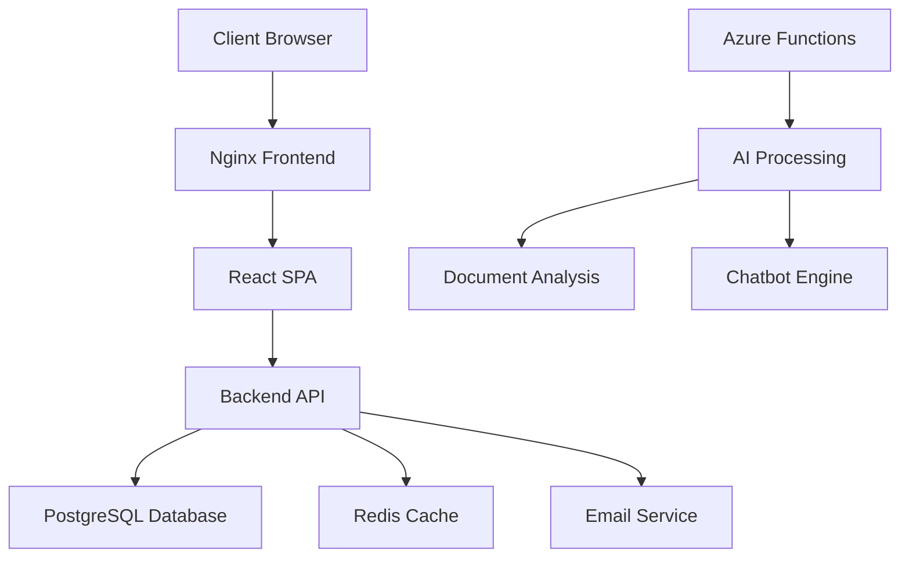

# 🚀 TCDynamics WorkFlowAI - Comprehensive Project Documentation

## 📋 Table of Contents

- [Project Overview](#-project-overview)
- [Architecture & Structure](#-architecture--structure)
- [Technology Stack](#-technology-stack)
- [Features & Functionality](#-features--functionality)
- [Development Setup](#-development-setup)
- [Deployment & Infrastructure](#-deployment--infrastructure)
- [Security & Compliance](#-security--compliance)
- [Testing Strategy](#-testing-strategy)
- [Performance & Monitoring](#-performance--monitoring)
- [Git History - Major Commits](#-git-history---major-commits)
- [Team & Support](#-team--support)

## 🎯 Project Overview

**TCDynamics WorkFlowAI** is an intelligent automation platform designed specifically for French SMEs (Small and Medium Enterprises). The solution automates business processes, intelligently processes documents, and enhances customer service through AI-powered chatbots.

### 🏆 Key Value Propositions

- **🤖 AI-Powered Document Processing**: Automatic invoice and contract processing with 99.7% accuracy
- **💬 24/7 AI Customer Service**: Intelligent chatbots for continuous customer support
- **📊 Real-time Business Analytics**: AI-powered dashboards with predictive insights
- **🔒 GDPR Compliance**: France-based hosting with banking-grade security
- **⚡ Productivity Boost**: Save 10+ hours per week through automation

### 📈 Project Status

- **Phase**: Active development and optimization
- **Version**: 1.0.0 (Frontend & Backend)
- **Code Quality**: 75%+ test coverage target
- **Security**: Comprehensive security scanning and compliance

## 🏗️ Architecture & Structure

### Project Structure

```
TCDynamics/
├── 📁 src/                          # Frontend React/TypeScript
│   ├── components/                  # Reusable UI components
│   │   ├── ui/                     # shadcn/ui component library
│   │   ├── __tests__/              # Component tests
│   │   ├── Contact.tsx             # Contact form
│   │   ├── AIChatbot.tsx           # AI chatbot interface
│   │   ├── AIDemo.tsx              # AI demo component
│   │   ├── DocumentProcessor.tsx   # Document processing UI
│   │   └── ...
│   ├── hooks/                      # Custom React hooks
│   ├── lib/                        # Utility libraries
│   ├── utils/                      # Helper functions
│   ├── pages/                      # Route components
│   └── api/                        # API service layer
├── 📁 backend/                     # Node.js/Express API
│   ├── src/
│   │   ├── config/                 # Configuration files
│   │   ├── middleware/             # Express middleware
│   │   ├── routes/                 # API routes
│   │   ├── utils/                  # Backend utilities
│   │   └── server.js              # Main server file
│   ├── logs/                       # Application logs
│   └── Dockerfile                  # Backend container
├── 📁 TCDynamics/                  # Azure Functions (Python)
│   ├── function_app.py            # Azure Functions app
│   ├── requirements.txt           # Python dependencies
│   └── local.settings.json        # Local development settings
├── 📁 docs/                        # Documentation
│   ├── api/                        # OpenAPI specifications
│   └── md/                         # Project documentation
├── 📁 dist/                       # Production build output
└── 📁 scripts/                     # Development scripts
```

### System Architecture



## 🛠️ Technology Stack

### Frontend Technologies

| Component            | Technology     | Version | Purpose                           |
| -------------------- | -------------- | ------- | --------------------------------- |
| **Framework**        | React          | 18.3.1  | UI framework with TypeScript      |
| **Build Tool**       | Vite           | 7.1.7   | Fast build and development server |
| **Language**         | TypeScript     | 5.8.3   | Type-safe JavaScript              |
| **Styling**          | TailwindCSS    | 3.4.17  | Utility-first CSS framework       |
| **UI Library**       | Radix UI       | Latest  | Accessible component library      |
| **State Management** | TanStack Query | 5.90.2  | Server state management           |
| **Routing**          | React Router   | 6.30.1  | Client-side routing               |
| **Testing**          | Vitest         | 3.2.4   | Unit testing framework            |
| **Icons**            | Lucide React   | 0.544.0 | Beautiful icon library            |

### Backend Technologies

| Component         | Technology         | Version | Purpose                   |
| ----------------- | ------------------ | ------- | ------------------------- |
| **Runtime**       | Node.js            | 18+     | JavaScript runtime        |
| **Framework**     | Express.js         | 4.21.2  | Web application framework |
| **Database**      | PostgreSQL         | 15      | Primary data storage      |
| **Cache**         | Redis              | 7       | Session and cache storage |
| **Email**         | Nodemailer         | 6.10.1  | Email delivery service    |
| **Validation**    | Joi                | 17.13.3 | Input validation          |
| **Security**      | Helmet             | 8.1.0   | Security headers          |
| **CORS**          | cors               | 2.8.5   | Cross-origin requests     |
| **Rate Limiting** | express-rate-limit | 7.5.1   | API protection            |

### AI & Azure Services

| Component           | Technology         | Purpose                    |
| ------------------- | ------------------ | -------------------------- |
| **Azure Functions** | Python 3.x         | Serverless AI processing   |
| **Azure Cosmos DB** | NoSQL Database     | Document storage           |
| **Azure AI Vision** | Computer Vision    | Image analysis             |
| **OpenAI API**      | GPT Models         | Text processing & chatbots |
| **Stripe**          | Payment Processing | Subscription management    |

### DevOps & Infrastructure

| Component             | Technology           | Purpose                       |
| --------------------- | -------------------- | ----------------------------- |
| **Containerization**  | Docker               | Application packaging         |
| **Orchestration**     | Docker Compose       | Local development             |
| **Web Server**        | Nginx                | Reverse proxy & static files  |
| **Process Manager**   | PM2                  | Production process management |
| **CI/CD**             | GitHub Actions       | Automated pipelines           |
| **Monitoring**        | Prometheus + Grafana | Performance monitoring        |
| **Security Scanning** | Trivy + Snyk         | Vulnerability detection       |

## ✨ Features & Functionality

### Core Features

#### 🤖 AI Document Processing

- **Invoice Processing**: Automatic extraction of invoice data with 99.7% accuracy
- **Contract Analysis**: Intelligent contract review and key term extraction
- **Receipt Processing**: Automated expense categorization and reporting
- **Document Classification**: AI-powered document type detection

#### 💬 AI Customer Service

- **24/7 Chatbot**: Intelligent conversational AI for customer support
- **Multi-language Support**: French primary, English secondary
- **Context Awareness**: Maintains conversation context across sessions
- **Integration**: Seamless handoff to human agents when needed

#### 📊 Business Analytics

- **Real-time Dashboards**: Live business metrics and KPIs
- **Predictive Analytics**: AI-powered forecasting and trend analysis
- **Custom Reports**: Flexible reporting for different business needs
- **Export Functionality**: PDF/Excel export capabilities

#### 🔒 Security & Compliance

- **GDPR Compliance**: Full compliance with EU data protection regulations
- **Data Encryption**: End-to-end encryption for sensitive data
- **Access Control**: Role-based access control (RBAC)
- **Audit Logging**: Comprehensive audit trails for compliance

### Advanced Features

#### 🚀 Performance Features

- **Progressive Web App (PWA)**: Offline functionality and app-like experience
- **Lazy Loading**: Component and image lazy loading for faster page loads
- **Caching Strategy**: Intelligent caching with Redis and service workers
- **Code Splitting**: Automatic route-based code splitting

#### 🔧 Developer Experience

- **Hot Reload**: Instant updates during development
- **TypeScript**: Full type safety across the application
- **Testing Suite**: Comprehensive test coverage with Vitest
- **Linting**: ESLint with custom rules for code quality

## 💻 Development Setup

### Prerequisites

- **Node.js**: 18+ and npm 9+
- **Python**: 3.8+ (for Azure Functions)
- **Docker**: For containerized development
- **Git**: Version control system

### Local Development Setup

#### 1. Clone and Install Frontend Dependencies

```bash
git clone <repository-url>
cd TCDynamics
npm install
```

#### 2. Setup Backend Dependencies

```bash
cd backend
npm install
cd ..
```

#### 3. Configure Environment Variables

**Frontend (.env)**:

```bash
cp env.example .env
# Edit .env with your configuration
```

**Backend (backend/.env)**:

```bash
cp backend/env.example backend/.env
# Edit backend/.env with your values
```

#### 4. Start Development Servers

**Terminal 1 - Frontend:**

```bash
npm run dev
# Accessible at http://localhost:8080
```

**Terminal 2 - Backend:**

```bash
cd backend
npm run dev
# API at http://localhost:3001
```

### Available Scripts

#### Frontend Scripts

- `npm run dev` - Development server
- `npm run build` - Production build
- `npm run test` - Run tests
- `npm run test:coverage` - Tests with coverage
- `npm run lint` - Code linting
- `npm run format` - Code formatting

#### Backend Scripts

- `npm run start` - Production server
- `npm run dev` - Development with auto-reload
- `npm run test` - Integration tests

## 🚀 Deployment & Infrastructure

### Production Deployment

#### Build Process

```bash
# Build frontend for production
npm run build
# Files generated in ./dist
```

#### Docker Deployment

```bash
# Start all services
docker-compose up -d

# With monitoring
docker-compose --profile monitoring up -d

# With backup service
docker-compose --profile backup up -d
```

### Infrastructure Components

#### Services Architecture

- **Frontend**: Nginx serving React SPA
- **Backend**: Node.js/Express API server
- **Database**: PostgreSQL 15 with automated backups
- **Cache**: Redis 7 for session and application cache
- **Monitoring**: Prometheus metrics + Grafana dashboards

#### Environment Configuration

**Required Environment Variables:**

| Variable            | Description       | Example              |
| ------------------- | ----------------- | -------------------- |
| `FRONTEND_PORT`     | Frontend port     | `80`                 |
| `BACKEND_PORT`      | Backend API port  | `3001`               |
| `POSTGRES_DB`       | Database name     | `tcdynamics`         |
| `POSTGRES_USER`     | Database user     | `tcdynamics`         |
| `POSTGRES_PASSWORD` | Database password | `secure_password`    |
| `REDIS_PORT`        | Redis port        | `6379`               |
| `EMAIL_HOST`        | SMTP host         | `smtp.zoho.com`      |
| `EMAIL_USER`        | Email username    | `contact@domain.com` |
| `EMAIL_PASS`        | Email password    | `app_password`       |

### OVHcloud Deployment

#### Server Setup

```bash
# Clone repository
git clone <repository-url>
cd TCDynamics

# Install dependencies
npm install --production

# Setup SSL certificates
# Configure Nginx reverse proxy
# Start with PM2
```

#### Nginx Configuration Example

```nginx
server {
    listen 80;
    server_name your-domain.com www.your-domain.com;

    # Frontend
    location / {
        root /var/www/your-app/dist;
        try_files $uri $uri/ /index.html;
    }

    # Backend API
    location /api {
        proxy_pass http://localhost:3001;
        proxy_http_version 1.1;
        proxy_set_header Upgrade $http_upgrade;
        proxy_set_header Connection 'upgrade';
        proxy_set_header Host $host;
    }
}
```

## 🔒 Security & Compliance

### Security Measures

#### Implemented Security Features

- ✅ **Helmet.js**: Security headers for HTTP responses
- ✅ **Rate Limiting**: 5 requests per 15 minutes per IP
- ✅ **Input Validation**: Joi schema validation for all inputs
- ✅ **CORS Configuration**: Properly configured cross-origin requests
- ✅ **Environment Variables**: Sensitive data in .env files
- ✅ **HTTPS Enforcement**: SSL/TLS in production environments

#### Authentication & Authorization

- **JWT Tokens**: Stateless authentication
- **Role-Based Access Control (RBAC)**: User permissions system
- **Password Hashing**: Secure password storage
- **Session Management**: Redis-based session storage

#### Data Protection

- **Encryption at Rest**: Database encryption for sensitive data
- **Encryption in Transit**: TLS 1.3 for all communications
- **GDPR Compliance**: Data processing agreements and consent management
- **Data Retention**: Configurable data retention policies

### Security Auditing

#### Vulnerability Scanning

```bash
# Check for vulnerabilities
npm audit

# Automatic fixes
npm audit fix

# Security scanning with Snyk
npx snyk test

# Container security with Trivy
trivy image your-image:tag
```

## 🧪 Testing Strategy

### Test Coverage Goals

| Component     | Target Coverage | Current Status              |
| ------------- | --------------- | --------------------------- |
| **Frontend**  | 75%+            | ~15% (improving)            |
| **Backend**   | 70%+            | Integration tests available |
| **E2E Tests** | 60%+            | Planned                     |

### Testing Stack

#### Frontend Testing

- **Unit Tests**: Vitest for component and utility testing
- **Integration Tests**: React Testing Library for component integration
- **E2E Tests**: Playwright for user journey testing
- **Performance Tests**: Lighthouse CI for performance metrics

#### Backend Testing

- **Integration Tests**: Custom test suite for API endpoints
- **Load Testing**: Artillery for API performance testing
- **Security Tests**: Automated security scanning

### Test Commands

```bash
# Unit tests
npm run test

# UI testing mode
npm run test:ui

# Coverage reports
npm run test:coverage

# Backend integration tests
cd backend && node test-integration.js
```

## 📊 Performance & Monitoring

### Performance Optimizations

#### Frontend Performance

- **Code Splitting**: Route-based code splitting with React.lazy()
- **Image Optimization**: Next-gen image formats and lazy loading
- **Bundle Optimization**: Tree shaking and dead code elimination
- **Caching**: Service worker for offline functionality

#### Backend Performance

- **Database Optimization**: Query optimization and indexing
- **Caching Strategy**: Redis for session and application cache
- **Horizontal Scaling**: Docker container scaling capabilities
- **CDN Integration**: Static asset delivery optimization

### Monitoring Setup

#### Metrics Collection

- **Application Metrics**: Response times, error rates, throughput
- **System Metrics**: CPU, memory, disk usage
- **Business Metrics**: User engagement, conversion rates
- **Custom Metrics**: Feature usage and performance indicators

#### Grafana Dashboards

- **System Overview**: Infrastructure health and performance
- **Application Performance**: API response times and error rates
- **Business Analytics**: User behavior and conversion metrics
- **Security Monitoring**: Failed login attempts and suspicious activity

### Logging Strategy

#### Log Levels

- **Error**: Application errors and exceptions
- **Warn**: Deprecated features and potential issues
- **Info**: General application events
- **Debug**: Detailed debugging information

#### Log Destinations

- **Console**: Development logging
- **Files**: Production file-based logging
- **External Services**: Centralized logging service integration

## 📝 Git History - Major Commits

Here are the last 5 major commits that shaped the project:

### 🏗️ Major Features & Updates

1. **`aa97cb8` - feat: update project configuration and components**
   - Updated project configuration files
   - Enhanced component architecture
   - Improved development experience

2. **`9896bc3` - feat: major project updates**
   - Significant project-wide improvements
   - Architecture enhancements
   - Feature additions and optimizations

3. **`e357747` - Simplify to Node.js backend: Remove Azure Functions, add environment config, organize docs**
   - **Major Architecture Change**: Simplified backend from Azure Functions to Node.js/Express
   - Added comprehensive environment configuration
   - Reorganized documentation structure
   - Improved maintainability and development workflow

4. **`c95514a` - Fix: Resolve CI/CD pipeline failures**
   - Resolved continuous integration pipeline issues
   - Improved deployment reliability
   - Enhanced development workflow stability

5. **`27673a1` - feat: Add coverage reporting and navigation (#20)**
   - **New Feature**: Comprehensive test coverage reporting
   - Enhanced navigation system
   - Improved code quality metrics

### 📈 Development Trends

The commit history shows:

- **Active Development**: Regular feature additions and improvements
- **Architecture Evolution**: Transition from Azure Functions to Node.js backend
- **Quality Focus**: Emphasis on testing and coverage
- **CI/CD Maturity**: Continuous improvement of deployment pipelines

## 👥 Team & Support

### Development Team

- **Primary Developer**: Solo founder development approach
- **Technical Expertise**: Full-stack development with DevOps focus
- **Location**: France-based development

### Support Structure

#### Contact Information

- **Email Support**: contact@your-domain.com
- **Local Support**: Available for French businesses
- **Issue Tracking**: GitHub Issues for bug reports and features

#### Support Channels

1. **Email Support**: Direct communication for business inquiries
2. **GitHub Issues**: Technical issues and feature requests
3. **Documentation**: Comprehensive setup and troubleshooting guides

### Community & Resources

#### Documentation Resources

- **README.md**: Primary project documentation
- **Deployment Guide**: Step-by-step deployment instructions
- **API Documentation**: OpenAPI specifications in `/docs/api/`
- **Development Docs**: Additional guides in `/docs/md/`

#### External Resources

- **React Documentation**: https://reactjs.org/
- **Node.js Documentation**: https://nodejs.org/
- **Docker Documentation**: https://docs.docker.com/
- **Azure Functions**: https://docs.microsoft.com/en-us/azure/azure-functions/

## 🎯 Future Roadmap

### Planned Enhancements

#### Phase 1 (Current)

- [ ] Increase test coverage to 75%+
- [ ] Implement end-to-end testing suite
- [ ] Enhanced error monitoring and alerting
- [ ] Performance optimization and caching improvements

#### Phase 2 (Next Quarter)

- [ ] Advanced AI features for document processing
- [ ] Multi-tenant architecture support
- [ ] Advanced analytics and reporting
- [ ] Mobile application development

#### Phase 3 (Future)

- [ ] International expansion support
- [ ] Advanced integrations with third-party services
- [ ] Machine learning model improvements
- [ ] Enterprise-grade security enhancements

## 📄 License & Legal

**Copyright © 2024 TCDynamics. All rights reserved.**

This software is proprietary and confidential. Any reproduction or distribution without authorization is strictly prohibited.

---

<div align="center">
  <p>Made with ❤️ in France 🇫🇷</p>
  <p>
    <strong>TCDynamics WorkFlowAI</strong> - Intelligent Automation for French Businesses
  </p>
</div>

---

**Last Updated**: October 7, 2025
**Version**: 1.0.0
**Status**: Active Development
