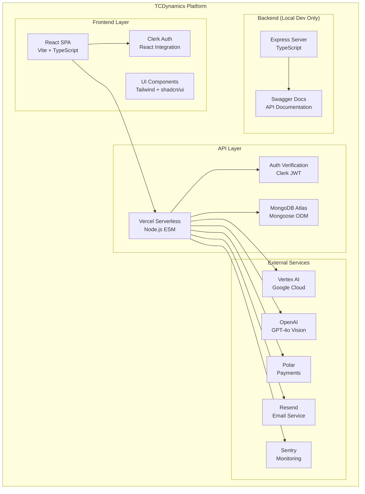

# TCDynamics WorkFlowAI - Project Visualization

**Generated**: January 27, 2026
**Purpose**: Comprehensive project overview and visualization

## 🎯 Project Overview

**TCDynamics WorkFlowAI** is an AI-powered automation platform designed specifically for French SMEs (Small and Medium Enterprises). The platform combines intelligent document processing, customer support automation, and business analytics with a focus on RGPD compliance and user-friendly French-first design.

### Key Value Propositions

- **Time-to-value**: <10 minutes to first automation
- **AI-powered**: 99.7% accuracy in document processing
- **24/7 Multilingual Support**: AI chatbots for customer service
- **RGPD Compliant**: Built-in data protection and privacy
- **French-first UX**: Localized for French business needs

## 🏗️ Architecture Overview

### Hybrid Serverless Architecture



### Key Architectural Decisions

1. **Monorepo Structure**: npm workspaces for frontend, backend, and API
2. **Serverless-First**: API deployed as Vercel serverless functions
3. **Multi-Tenancy**: All data linked via `clerkId` for user isolation
4. **Separation of Concerns**: Clear boundaries between UI, business logic, and data

## 🛠️ Technology Stack

### Frontend Technologies

- **React 18.3.1** + **Vite 7.3.0** - Modern React SPA framework
- **TypeScript 5.8.3** - Type safety throughout
- **Tailwind CSS 3.4.19** + **shadcn/ui** - Utility-first styling with accessible components
- **React Router 6.30.3** - Client-side routing (30+ pages)
- **TanStack Query 5.90.20** - Server state management
- **Clerk React 5.59.6** - Authentication and user management
- **Sentry Browser 8.0.0** - Frontend error monitoring

### Backend & API Technologies

- **Node.js 20.x** - Runtime environment
- **Express 4.22.1** - Backend server (local development only)
- **Vercel Serverless Functions** - Production API deployment
- **MongoDB Atlas** - Cloud database hosting
- **Mongoose 9.1.1** - Object Document Mapper
- **Clerk Backend 1.0.0** - Backend authentication
- **Resend 6.4.2** - Transactional email service
- **Polar SDK 0.42.1** - Payment processing

### AI & Machine Learning

- **Vertex AI** - Google Cloud AI platform for chat and embeddings
- **OpenAI GPT-4o** - Advanced language model with vision capabilities
- **Azure Vision API** - Image analysis (archived, migration planned)

### Development & DevOps

- **GitHub Actions** - CI/CD pipelines with quality gates
- **Vercel** - Frontend hosting and serverless function deployment
- **Docker** - Local development environment
- **ESLint + Prettier** - Code quality and formatting
- **Husky + Commitlint** - Git hooks and commit message validation

## 📁 Project Structure

```
TCDynamics/
├── apps/
│   ├── frontend/              # React SPA (Production)
│   │   ├── src/
│   │   │   ├── pages/         # 30+ route components
│   │   │   ├── components/    # 64+ React components
│   │   │   │   ├── ui/        # 20 shadcn/ui components
│   │   │   │   └── app/       # App-specific components
│   │   │   ├── hooks/         # Custom React hooks
│   │   │   ├── api/           # API client functions
│   │   │   ├── utils/         # Utility functions
│   │   │   └── config/        # Configuration files
│   │   └── public/            # Static assets
│   │
│   └── backend/               # Express server (Local Dev Only)
│       ├── src/
│       │   ├── routes/        # API routes
│       │   ├── middleware/    # Express middleware
│       │   └── services/      # Business logic
│       └── package.json       # Backend dependencies
│
├── api/                       # Vercel Serverless Functions
│   ├── _lib/                  # Shared library code
│   │   ├── models/            # 10 Mongoose schemas
│   │   ├── auth.js            # Clerk authentication
│   │   ├── mongodb.js         # Database connection
│   │   └── vertex.js          # Vertex AI integration
│   ├── analytics.js           # Analytics tracking
│   ├── chat.js                # AI chat endpoint
│   ├── files.js               # File management
│   ├── forms.js               # Form submissions
│   ├── polar/                 # Payment endpoints
│   └── app/api-keys/          # API key management
│
├── docs/                      # Comprehensive documentation
│   ├── architecture/          # Architecture diagrams
│   ├── development/           # Development guides
│   ├── deployment/            # CI/CD documentation
│   ├── security/              # Security best practices
│   └── testing/               # Testing strategies
│
├── tests/                     # E2E tests
│   └── e2e/                   # Playwright test suite
│
├── scripts/                   # Deployment scripts
├── tools/                     # Development utilities
└── .github/                   # GitHub Actions workflows
```

## 🚀 Key Features

### Frontend Features

- **Multi-page SPA**: 30+ pages with comprehensive routing
- **AI Chatbot**: Real-time conversational AI interface
- **Document Processor**: Upload and AI-powered document analysis
- **Analytics Dashboard**: Business intelligence and KPIs
- **Settings Management**: User preferences and API key management
- **Responsive Design**: Mobile-first with accessibility compliance
- **PWA Support**: Progressive web app capabilities

### API Features

- **Authentication**: Clerk JWT verification
- **Rate Limiting**: Per-endpoint protection
- **File Management**: GridFS for large file storage
- **AI Integration**: Vertex AI and OpenAI endpoints
- **Payment Processing**: Polar integration for subscriptions
- **Webhook Support**: Clerk user lifecycle events
- **Analytics**: Custom event tracking

### Business Features

- **Subscription Plans**: Starter, Professional, Enterprise tiers
- **Multi-tenancy**: User isolation and data security
- **RGPD Compliance**: Built-in privacy and data protection
- **Real-time Analytics**: Usage tracking and business insights

## 🔧 Development Workflow

### Development Commands

```bash
npm run dev              # Start frontend + API (recommended)
npm run dev:all          # Start all three services
npm run build            # Build for production
npm run test             # Run all tests
npm run lint             # Code linting
npm run type-check       # TypeScript validation
npm run format           # Code formatting
```

### Git Workflow

- **Main Branch**: Production deployment
- **Feature Branches**: For new features
- **Git Worktrees**: Parallel development support
- **Quality Gates**: Pre-commit and pre-push hooks
- **Automated Testing**: CI/CD with coverage requirements

### Deployment Strategy

- **Frontend**: Vercel CDN with static assets
- **API**: Vercel serverless functions
- **Database**: MongoDB Atlas (cloud-hosted)
- **CI/CD**: GitHub Actions with quality gates
- **Environment Variables**: Secure configuration management

## 📊 Project Statistics

- **Total Files**: ~400+ source files
- **Lines of Code**: ~30,000+ (estimated)
- **Languages**: TypeScript, JavaScript, Python, SQL, Markdown
- **Workspaces**: 2 (frontend, backend)
- **Monorepo**: Yes (npm workspaces)
- **Test Coverage**: 60% minimum requirement
- **Deployment**: Vercel (production ready)

## 🎨 UI/UX Highlights

### Design System

- **Component Library**: 20+ shadcn/ui components
- **Theme Support**: Dark/light mode switching
- **Accessibility**: WCAG 2.1 AA compliance
- **Responsive**: Mobile-first design approach

### Key Pages

- **Landing Page**: Hero section with features overview
- **Features**: Detailed feature modules with demos
- **Pricing**: Subscription plan comparison
- **Dashboard**: User workspace with analytics
- **Chat Interface**: Real-time AI conversation
- **File Manager**: Upload and document processing

## 🔒 Security Features

- **Authentication**: Clerk JWT-based auth
- **API Keys**: Secure server-to-server access
- **Rate Limiting**: Per-endpoint request limits
- **PII Protection**: SHA-256 hashing for sensitive data
- **CORS**: Proper cross-origin resource sharing
- **Security Headers**: Comprehensive CSP and HSTS
- **Input Validation**: Sanitization and validation

## 🌐 External Integrations

- **Clerk**: Authentication and user management
- **MongoDB Atlas**: Database hosting and management
- **Polar**: Payment processing and subscription management
- **Resend**: Transactional email delivery
- **Vertex AI**: Google Cloud AI services
- **OpenAI**: GPT-4o language model
- **Sentry**: Error tracking and monitoring
- **Cloudflare Turnstile**: CAPTCHA protection

## 📈 Performance Optimizations

- **Code Splitting**: Lazy loading of components
- **Caching**: React Query for API caching
- **CDN**: Vercel global content delivery
- **Bundle Optimization**: Tree shaking and minification
- **Image Optimization**: Next-gen formats and compression
- **Monitoring**: Performance tracking and analytics

## 🔄 Future Roadmap

### Short-term Goals

- Enhanced workflow automation capabilities
- Mobile app development
- Advanced analytics and reporting
- Multi-language support expansion

### Medium-term Goals

- Enterprise features and security
- Advanced AI capabilities
- Integration marketplace
- API ecosystem development

### Long-term Vision

- Become the leading AI automation platform for French SMEs
- Expand to European markets with localized solutions
- Develop comprehensive workflow automation suite
- Build thriving developer ecosystem

---

**Project Repository**: [lawmight/TCDynamics](https://github.com/lawmight/TCDynamics)
**Documentation**: [docs/README.md](docs/README.md)
**Last Updated**: January 27, 2026

_This visualization provides a comprehensive overview of the TCDynamics WorkFlowAI project architecture, technology stack, and development practices._
