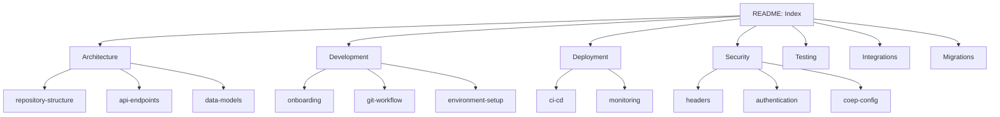

# TCDynamics Documentation Index

**Last Updated**: 2026-02-07
**Status**: Active
**Pulse**: Workflow verified 2026-01-25

Welcome to the TCDynamics WorkFlowAI documentation. This index provides navigation to all project documentation organized by category.

### Documentation Map



## Getting Started

New to the project? Start here:

1. **[Quick Reference Guide](AGENTS.md)** - Build/test/lint commands, architecture overview
2. **[Onboarding Guide](development/onboarding.md)** - Comprehensive React SPA patterns and development guide
3. **[Environment Setup](development/environment-setup.md)** - Setting up your development environment

## Documentation by Category

### Architecture

- **[Architecture Overview](architecture/architecture-overview.md)** - Comprehensive architecture documentation including project overview, full-stack graphs, and visualization guidance
- **[Repository Structure](architecture/repository-structure.md)** - Monorepo structure, technology stack, and data flow diagrams
- **[API Endpoints](architecture/api-endpoints.md)** - Complete catalog of Vercel serverless function endpoints
- **[Data Models](architecture/data-models.md)** - MongoDB schema documentation and model relationships

### Development

- **[Onboarding Guide](development/onboarding.md)** - React SPA patterns, Vite configuration, and development practices
- **[Git Workflow](development/git-workflow.md)** - Git worktree setup for parallel development
- **[Environment Setup](development/environment-setup.md)** - Environment variables and service configuration
- **[CLI Tools](development/cli-tools.md)** - Recommended CLI tools and complete inventory of tools used by scripts
- **[Scripts](development/scripts.md)** - Utility scripts documentation for deployment, monitoring, and development
- **[Vercel React Best Practices](development/vercel-react-best-practices.md)** - Performance optimization guide and audit report
- **[Quick Reference](AGENTS.md)** - Build, test, and lint commands

### Deployment

- **[CI/CD Guide](deployment/ci-cd.md)** - GitHub Actions workflows, Vercel deployment, and quality gates
- **[Monitoring](deployment/monitoring.md)** - Sentry, Vercel Analytics, and observability setup

### Security

- **[Security Headers](security/headers.md)** - CSP hardening, COEP configuration, and security headers
- **[COEP Configuration](security/coep-config.md)** - Cross-Origin-Embedder-Policy rationale (`credentialless` vs `require-corp`)
- **[Authentication](security/authentication.md)** - Clerk authentication, API key auth, and webhook security

### Testing

- **[Testing Guide](TESTING_GUIDE.md)** - API Keys feature testing guide
- **[API Key Testing](testing/api-keys.md)** - Detailed API key management UI testing procedures
- **[Testing Strategy](testing/strategy.md)** - Testing pyramid, patterns, and coverage goals
- **[E2E Testing](testing/e2e.md)** - Playwright E2E testing guide

### Integrations

- **[Clerk Customization](integrations/clerk.md)** - Clerk authentication component theming and customization  
- **MCP**: TCDynamics MCP is configured via Cursor `mcp.json` (HTTP endpoint).

### Migrations

- **[Azure Functions Archive](migrations/azure-functions.md)** - Archived Azure Functions and restoration guide
- **[Azure Vision Migration](migrations/azure-vision.md)** - Azure Vision API migration plan (deadline: September 2026)
- **[Vertex Location Migration](migrations/vertex-location.md)** - Vertex AI location configuration (`us-central1` vs `global`)

### Strategy

- **[MCP Strategy](strategy/mcp-strategy.md)** - Model Context Protocol layer differentiation strategy
- **[Workflow Research](strategy/workflow-research.md)** - Workflow automation platform research and foundational patterns
- **[n8n Workflows Research](strategy/n8n-workflows-research.md)** - Comprehensive analysis of cutting-edge n8n workflows, recent implementations, and bleeding-edge automation patterns
- **[Meta Social Automation](strategy/meta-social-automation.md)** - Instagram and TikTok API automation guides including process guides, automation flows, and API integration
- **[Client Onboarding Strategy](strategy/client-onboarding-strategy.md)** - Comprehensive implementation guide for client onboarding with UX excellence, French SME personalization, and RGPD compliance

### Research

- **[Obsidian Vault Integration](research/obsidian-vault-integration.md)** - Analysis of Obsidian setup and changelog data for integration planning
- **[Vitesse Analysis](research/vitesse-analysis.md)** - Repository analysis of Vitesse by Anthony Fu (Vue 3 starter template)

### Reference

- **[Git Status](GIT_STATUS.md)** - Git remotes and branch management status

## Documentation Structure

The documentation is organized into the following categories:

```
docs/
├── README.md                          # This file - documentation index
├── architecture/                      # Architecture and system design
│   └── architecture-overview.md       # Comprehensive architecture overview
├── development/                       # Development guides and setup
│   ├── cli-tools.md                  # CLI tools documentation
│   ├── scripts.md                    # Utility scripts documentation
│   └── vercel-react-best-practices.md # Performance optimization guide
├── deployment/                        # CI/CD and deployment
├── security/                          # Security configuration and practices
├── testing/                           # Testing guides and strategies
├── integrations/                      # Third-party service integrations
├── migrations/                        # Migration guides and plans
├── strategy/                          # Strategic planning documents
│   ├── n8n-workflows-research.md      # n8n workflows research
│   ├── meta-social-automation.md     # Instagram & TikTok automation
│   └── client-onboarding-strategy.md # Client onboarding guide
├── research/                          # Research and analysis documents
│   ├── obsidian-vault-integration.md # Obsidian integration analysis
│   └── vitesse-analysis.md            # Vitesse template analysis
├── workflows/                         # n8n workflow templates
│   └── README.md                      # Workflow implementation guide
└── archive/                           # Historical documentation
```

## Quick Links

### For New Developers

1. Read the [Onboarding Guide](development/onboarding.md)
2. Set up your [Development Environment](development/environment-setup.md)
3. Review the [Repository Structure](architecture/repository-structure.md)
4. Check the [Quick Reference](AGENTS.md) for common commands

### For Deployment

1. Review [CI/CD Guide](deployment/ci-cd.md)
2. Check [Vercel Configuration](deployment/ci-cd.md#vercel-deployment-configuration)
3. Understand [Security Headers](security/headers.md)
4. Monitor with [Monitoring Setup](deployment/monitoring.md)

### For Testing

1. Review [Testing Strategy](testing/strategy.md)
2. Run [E2E Tests](testing/e2e.md)
3. Check [Feature Testing Guides](TESTING_GUIDE.md)

## Contributing to Documentation

When adding or updating documentation:

1. Use the [Documentation Template](.template.md) for consistency
2. Update the "Last Updated" date to YYYY-MM-DD format
3. Add cross-references to related documentation
4. Update this index if adding new categories or major files

## Documentation Standards

- **Date Format**: ISO 8601 (YYYY-MM-DD)
- **File Naming**: kebab-case for new files (e.g., `api-endpoints.md`)
- **Structure**: Use consistent headers with metadata section
- **Links**: Use relative paths for internal documentation links

## Related Documentation

- Root [README.md](../README.md) - Project overview and quick start
- [Environment Setup](development/environment-setup.md) - Environment variables and service configuration
- [DOCS_ANALYSIS (archived)](archive/DOCS_ANALYSIS.md) - Documentation analysis report (historical; structure since implemented)

---

**Need Help?** If you can't find what you're looking for, check the [Quick Reference](AGENTS.md) or review the [Onboarding Guide](development/onboarding.md) for detailed development patterns.
