# TCDynamics Advanced Full-Stack Architecture

**Platform**: AI-powered automation for French SMEs (WorkFlowAI)
**Last Updated**: 2026-01-25
**Visualization Type**: Advanced Mermaid Architecture Diagrams

---

## 🏗️ Architecture Overview

### Multi-Layer System Architecture

```mermaid
graph TB
    subgraph "🌐 Presentation Layer"
        direction TB
        Browser[Browser Environment]
        SPA[React SPA<br/>Vite 7 • TypeScript 5]
        Router[React Router v7]
        State[Global State<br/>TanStack Query v5]
        Theme[ThemeProvider<br/>shadcn/ui]
        AuthUI[Clerk Auth UI<br/>ThemedClerkProvider]

        Browser --> SPA
        SPA --> Router
        SPA --> State
        SPA --> Theme
        SPA --> AuthUI
    end

    subgraph "🔧 Application Layer"
        direction TB
        Pages[Pages & Routes<br/>Lazy Loading]
        Components[Component Library<br/>15+ shadcn/ui]
        Hooks[Custom Hooks<br/>useAuth • useApiKeys • useFormSubmit]
        Services[Service Layer<br/>API Clients • Error Handling]
        Utils[Utilities<br/>logger • helpers • formatters]

        Theme --> Pages
        AuthUI --> Hooks
        Pages --> Components
        Pages --> Services
        Components --> Utils
        Hooks --> Services
    end

    subgraph "📡 API Gateway Layer"
        direction TB
        Edge[Vercel Edge<br/>Global CDN]
        Serverless[Vercel Serverless<br/>Node.js ESM]
        Security[Security Headers<br/>CORS • Rate Limiting]
        AuthMiddleware[Auth Middleware<br/>Clerk JWT • API Keys]

        Edge --> Serverless
        Serverless --> Security
        Serverless --> AuthMiddleware
    end

    subgraph "⚙️ Service Layer"
        direction TB
        Analytics[Analytics Service<br/>POST /api/analytics]
        Chat[Chat Service<br/>POST /api/ai?provider=openai&action=chat • /api/ai?provider=vertex&action=chat]
        Files[File Service<br/>POST /api/files • GridFS]
        Forms[Forms Service<br/>POST /api/forms]
        Payments[Payments Service<br/>POST /api/polar/*]
        Vision[Vision Service<br/>POST /api/ai?provider=openai&action=vision]
        App[App Service<br/>POST /api/app/*]
        Webhooks[Webhook Handlers<br/>POST /api/webhooks/*]

        AuthMiddleware --> Analytics
        AuthMiddleware --> Chat
        AuthMiddleware --> Files
        AuthMiddleware --> Forms
        AuthMiddleware --> Payments
        AuthMiddleware --> Vision
        AuthMiddleware --> App
        AuthMiddleware --> Webhooks
    end

    subgraph "🗄️ Data Layer"
        direction TB
        Mongo[MongoDB Atlas<br/>Mongoose ODM]
        GridFS[GridFS Storage<br/>File Blobs]
        Cache[In-Memory Cache<br/>LRU • Rate Limiting]

        Analytics --> Mongo
        Chat --> Mongo
        Files --> Mongo
        Files --> GridFS
        Forms --> Mongo
        Payments --> Mongo
        Vision --> Mongo
        App --> Mongo
        Webhooks --> Mongo
        Serverless --> Cache
    end

    subgraph "🚀 External Integrations"
        direction TB
        Clerk[Clerk Authentication<br/>JWT • Webhooks • User Mgmt]
        Polar[Polar Payments<br/>Checkout • Subscriptions • Webhooks]
        Vertex[Google Vertex AI<br/>Chat • Embeddings • LLM]
        OpenAI[OpenAI GPT-4o<br/>Vision • Image Analysis]
        Azure[Azure OpenAI<br/>GPT-3.5-turbo • Chat]
        Resend[Resend Email<br/>Transactional • Notifications]
        Sentry[Sentry Monitoring<br/>Error Tracking • Performance]
        Turnstile[Cloudflare Turnstile<br/>CAPTCHA • Bot Protection]

        Chat --> Vertex
        Vision --> OpenAI
        App --> Azure
        Forms --> Resend
        Serverless --> Sentry
        Pages --> Sentry
        Forms --> Turnstile
        Webhooks --> Clerk
        Webhooks --> Polar
    end

    %% Styling
    classDef presentation fill:#e11d48,stroke:#7f1d1d,color:#ffffff
    classDef application fill:#22c55e,stroke:#14532d,color:#ffffff
    classDef gateway fill:#3b82f6,stroke:#1e3a8a,color:#ffffff
    classDef service fill:#f59e0b,stroke:#7c2d12,color:#ffffff
    classDef data fill:#8b5cf6,stroke:#5b21b6,color:#ffffff
    classDef external fill:#64748b,stroke:#334155,color:#ffffff

    class Browser,SPA,Router,State,Theme,AuthUI presentation
    class Pages,Components,Hooks,Services,Utils application
    class Edge,Serverless,Security,AuthMiddleware gateway
    class Analytics,Chat,Files,Forms,Payments,Vision,App,Webhooks service
    class Mongo,GridFS,Cache data
    class Clerk,Polar,Vertex,OpenAI,Azure,Resend,Sentry,Turnstile external
```

---

## 🔄 Data Flow Architecture

### Frontend to Backend Communication Flow

---

## 🎨 Component Architecture

### Frontend Component Hierarchy

```mermaid
graph TD
    subgraph "🎯 Root Level"
        App[App.tsx<br/>ThemeProvider<br/>ErrorBoundary<br/>Router Setup]
        Provider[Global Providers<br/>Clerk • QueryClient • Tooltip]
    end

    subgraph "🛡️ Layout Components"
        Layout[AppLayout.tsx<br/>Header • Sidebar • Footer]
        Protected[ProtectedRoute.tsx<br/>Auth Check • Loading]
        ErrorBoundary[ErrorBoundary.tsx<br/>Error Handling]
        Offline[OfflineIndicator.tsx<br/>Network Status]
        Performance[PerformanceMonitor.tsx<br/>Metrics]
        Scroll[ScrollToTop.tsx<br/>Navigation]
    end

    subgraph "📱 Page Components"
        Index[Index.tsx<br/>Marketing Pages]
        Dashboard[Dashboard.tsx<br/>Overview]
        ChatPage[Chat.tsx<br/>AI Chat Interface]
        FilesPage[Files.tsx<br/>File Management]
        AnalyticsPage[Analytics.tsx<br/>Data Visualization]
        Settings[Settings.tsx<br/>User Preferences]
    end

    subgraph "🧩 Feature Components"
        Navigation[SimpleNavigation.tsx<br/>Main Navigation]
        Chatbot[LazyAIChatbot.tsx<br/>Floating Chat Widget]
        ChatInterface[ChatApp.tsx<br/>Chat UI]
        FileList[FileList.tsx<br/>File Browser]
        AnalyticsChart[AnalyticsChart.tsx<br/>Charts & Graphs]
    end

    subgraph "🔧 Utility Components"
        Loader[PageLoader.tsx<br/>Loading States]
        Toaster[Toaster.tsx<br/>Toast Notifications]
        Sonner[Sonner.tsx<br/>Enhanced Toasts]
        Tooltip[TooltipProvider.tsx<br/>Tooltips]
        Form[Form Components<br/>Contact • Demo]
    end

    App --> Provider
    App --> Layout
    Provider --> Protected
    Protected --> Index
    Protected --> Dashboard
    Protected --> ChatPage
    Protected --> FilesPage
    Protected --> AnalyticsPage
    Protected --> Settings

    Layout --> Navigation
    Layout --> Chatbot

    Dashboard --> ChatInterface
    Dashboard --> FileList
    Dashboard --> AnalyticsChart

    %% Styling
    classDef root fill:#ef4444,stroke:#7f1d1d,color:#ffffff
    classDef layout fill:#10b981,stroke:#065f46,color:#ffffff
    classDef page fill:#3b82f6,stroke:#1e3a8a,color:#ffffff
    classDef feature fill:#f59e0b,stroke:#7c2d12,color:#ffffff
    classDef utility fill:#8b5cf6,stroke:#5b21b6,color:#ffffff

    class App,Provider root
    class Layout,Protected,ErrorBoundary,Offline,Performance,Scroll layout
    class Index,Dashboard,ChatPage,FilesPage,AnalyticsPage,Settings page
    class Navigation,Chatbot,ChatInterface,FileList,AnalyticsChart feature
    class Loader,Toaster,Sonner,Tooltip,Form utility
```

---

## 🔄 State Management Architecture

### Global State Flow with TanStack Query

```mermaid
graph LR
    subgraph "📡 Server State (TanStack Query)"
        QueryClient[TanStack Query Client<br/>v5 • Caching • Revalidation]
        AnalyticsQuery[Analytics Queries<br/>useAnalytics • useEventTracking]
        ApiKeyQuery[API Key Queries<br/>useApiKeys • useApiKeyManagement]
        FormQuery[Form Queries<br/>useContactForm • useDemoForm]
        ChatQuery[Chat Queries<br/>useChatState • useConversation]
        FileQuery[File Queries<br/>useFiles • useFileUpload]

        QueryClient --> AnalyticsQuery
        QueryClient --> ApiKeyQuery
        QueryClient --> FormQuery
        QueryClient --> ChatQuery
        QueryClient --> FileQuery
    end

    subgraph "⚛️ Client State (React)"
        AuthState[Auth State<br/>useAuth Hook]
        UIState[UI State<br/>Local Component State]
        FormState[Form State<br/>Formik/Zod Validation]
        LoadingState[Loading State<br/>Suspense Boundaries]

        AnalyticsQuery --> AuthState
        ApiKeyQuery --> AuthState
        FormQuery --> FormState
        ChatQuery --> UIState
        FileQuery --> UIState
    end

    subgraph "💾 Persistence"
        LocalStorage[LocalStorage<br/>User Preferences]
        SessionStorage[SessionStorage<br/>Temporary Data]
        Cookies[Cookies<br/>Auth Tokens]

        AuthState --> LocalStorage
        UIState --> SessionStorage
        FormState --> Cookies
    end

    %% Styling
    classDef server fill:#22c55e,stroke:#14532d,color:#ffffff
    classDef client fill:#3b82f6,stroke:#1e3a8a,color:#ffffff
    classDef persistence fill:#8b5cf6,stroke:#5b21b6,color:#ffffff

    class QueryClient,AnalyticsQuery,ApiKeyQuery,FormQuery,ChatQuery,FileQuery server
    class AuthState,UIState,FormState,LoadingState client
    class LocalStorage,SessionStorage,Cookies persistence
```

---

## 🤖 AI Service Integration Architecture

### Multi-Provider AI Strategy

```mermaid
graph TB
    subgraph "🌐 Frontend AI Integration"
        ChatWidget[AI Chat Widget<br/>LazyAIChatbot.tsx]
        ChatComponent[Chat Component<br/>AIChatbot.tsx]
        VisionComponent[Vision Component<br/>Image Analysis]

        ChatWidget --> ChatComponent
        VisionComponent --> VisionComponent
    end

    subgraph "🔌 API Gateway"
        VertexAPI[Vertex AI Gateway<br/>POST /api/ai?provider=vertex&action=chat]
        OpenAIAPI[OpenAI Gateway<br/>POST /api/ai?provider=openai&action=vision]
        AzureAPI[Azure Gateway<br/>POST /api/azure]

        ChatComponent --> VertexAPI
        ChatComponent --> AzureAPI
        VisionComponent --> OpenAIAPI
    end

    subgraph "🤖 AI Providers"
        GoogleVertex[Google Vertex AI<br/>Chat Models • Embeddings]
        OpenAI_GPT[OpenAI GPT-4o<br/>Vision • Multimodal]
        AzureOpenAI[Azure OpenAI<br/>GPT-3.5-turbo • Enterprise]

        VertexAPI --> GoogleVertex
        OpenAIAPI --> OpenAI_GPT
        AzureAPI --> AzureOpenAI
    end

    subgraph "💾 Context & Memory"
        MongoContext[MongoDB Context<br/>ChatConversation]
        EmbeddingStore[Embedding Store<br/>Vector Similarity]
        UserMemory[User Preferences<br/>Personalization]

        GoogleVertex --> EmbeddingStore
        OpenAI_GPT --> EmbeddingStore
        AzureOpenAI --> UserMemory
        ChatAPI --> MongoContext
    end

    %% Styling
    classDef frontend fill:#ef4444,stroke:#7f1d1d,color:#ffffff
    classDef gateway fill:#3b82f6,stroke:#1e3a8a,color:#ffffff
    classDef providers fill:#f59e0b,stroke:#7c2d12,color:#ffffff
    classDef memory fill:#8b5cf6,stroke:#5b21b6,color:#ffffff

    class ChatWidget,ChatComponent,VisionComponent frontend
    class VertexAPI,OpenAIAPI,AzureAPI gateway
    class GoogleVertex,OpenAI_GPT,AzureOpenAI providers
    class MongoContext,EmbeddingStore,UserMemory memory
```

---

## 🛡️ Security & Authentication Architecture

### Multi-Layer Security Model

```mermaid
graph TB
    subgraph "🌐 Client Security"
        CSP[Content Security Policy<br/>Strict CSP Headers]
        HSTS[HTTP Strict Transport Security<br/>SSL Enforcement]
        CSRF[CSRF Protection<br/>SameSite Cookies]
        XFrame[X-Frame-Options<br/>Clickjacking Protection]

        CSP --> HSTS
        CSP --> CSRF
        CSP --> XFrame
    end

    subgraph "🔑 Authentication"
        ClerkClient[Clerk Client SDK<br/>Frontend Auth]
        JWT[JWT Tokens<br/>Session Management]
        ProtectedRoutes[Protected Routes<br/>Auth Guards]

        ClerkClient --> JWT
        ProtectedRoutes --> JWT
        JWT --> ProtectedRoutes
    end

    subgraph "🛡️ API Security"
        AuthMiddleware[Auth Middleware<br/>JWT Validation]
        APIKeys[API Key Authentication<br/>Server-to-Server]
        RateLimit[Rate Limiting<br/>LRU Cache • IP Tracking]
        CORS[CORS Headers<br/>Origin Validation]

        AuthMiddleware --> APIKeys
        AuthMiddleware --> RateLimit
        AuthMiddleware --> CORS
    end

    subgraph "🔒 Data Security"
        Encryption[Data Encryption<br/>TLS/SSL • Field Level]
        Validation[Input Validation<br/>Zod Schemas • Sanitization]
        Audit[Audit Logging<br/>Sentry • Event Tracking]

        Encryption --> Validation
        Validation --> Audit
    end

    %% Styling
    classDef clientSecurity fill:#ef4444,stroke:#7f1d1d,color:#ffffff
    classDef auth fill:#22c55e,stroke:#14532d,color:#ffffff
    classDef apiSecurity fill:#3b82f6,stroke:#1e3a8a,color:#ffffff
    classDef dataSecurity fill:#8b5cf6,stroke:#5b21b6,color:#ffffff

    class CSP,HSTS,CSRF,XFrame clientSecurity
    class ClerkClient,JWT,ProtectedRoutes auth
    class AuthMiddleware,APIKeys,RateLimit,CORS apiSecurity
    class Encryption,Validation,Audit dataSecurity
```

---

## 📊 Monitoring & Observability

### Comprehensive Monitoring Stack

```mermaid
graph TB
    subgraph "🔍 Frontend Monitoring"
        ErrorTracking[Error Tracking<br/>Sentry Browser SDK]
        Performance[Performance Monitoring<br/>Web Vitals • LCP/FID/CLS]
        UserAnalytics[User Analytics<br/>Event Tracking • Funnel Analysis]
        NetworkMonitoring[Network Monitoring<br/>Request/Response Times]

        ErrorTracking --> Performance
        Performance --> UserAnalytics
        UserAnalytics --> NetworkMonitoring
    end

    subgraph "🔧 API Monitoring"
        APITracing[API Tracing<br/>Request/Response Logging]
        ErrorLogging[Error Logging<br/>Sentry Node SDK]
        RateLimitMonitoring[Rate Limit Monitoring<br/>LRU Cache Metrics]
        ExternalAPIMonitoring[External API Monitoring<br/>Vertex/OpenAI/Polar]

        APITracing --> ErrorLogging
        ErrorLogging --> RateLimitMonitoring
        RateLimitMonitoring --> ExternalAPIMonitoring
    end

    subgraph "💾 Database Monitoring"
        MongoMonitoring[MongoDB Monitoring<br/>Query Performance • Index Usage]
        GridFSMonitoring[GridFS Monitoring<br/>File Upload/Download Metrics]
        ConnectionPooling[Connection Pool Monitoring<br/>Pool Size • Wait Times]

        MongoMonitoring --> GridFSMonitoring
        GridFSMonitoring --> ConnectionPooling
    end

    subgraph "🌐 Infrastructure Monitoring"
        VercelMonitoring[Vercel Monitoring<br/>Function Execution • Cold Starts]
        CDNMonitoring[CDN Monitoring<br/>Edge Performance • Cache Hit Rates]
        SecurityMonitoring[Security Monitoring<br/>Auth Failures • Suspicious Activity]

        VercelMonitoring --> CDNMonitoring
        CDNMonitoring --> SecurityMonitoring
    end

    %% Styling
    classDef frontendMon fill:#ef4444,stroke:#7f1d1d,color:#ffffff
    classDef apiMon fill:#3b82f6,stroke:#1e3a8a,color:#ffffff
    classDef dbMon fill:#8b5cf6,stroke:#5b21b6,color:#ffffff
    classDef infraMon fill:#f59e0b,stroke:#7c2d12,color:#ffffff

    class ErrorTracking,Performance,UserAnalytics,NetworkMonitoring frontendMon
    class APITracing,ErrorLogging,RateLimitMonitoring,ExternalAPIMonitoring apiMon
    class MongoMonitoring,GridFSMonitoring,ConnectionPooling dbMon
    class VercelMonitoring,CDNMonitoring,SecurityMonitoring infraMon
```

---

## 🚀 Deployment Architecture

### Multi-Environment Deployment Strategy

---

## 🔗 Integration Points

### External Service Integration Matrix

| Integration              | Purpose                        | Endpoint                                | Authentication  | Rate Limits |
| ------------------------ | ------------------------------ | --------------------------------------- | --------------- | ----------- |
| **Clerk**                | User Authentication            | `/api/webhooks/clerk`                   | Webhook Secret  | 1000/min    |
| **Polar**                | Payments & Subscriptions       | `/api/polar/*`                          | API Key         | 500/min     |
| **Vertex AI**            | AI Chat & Embeddings           | `/api/ai?provider=vertex&action=chat`   | Service Account | 60/min      |
| **OpenAI**               | Vision & Image Analysis        | `/api/ai?provider=openai&action=vision` | API Key         | 60/min      |
| **Azure OpenAI**         | Chat (GPT-3.5-turbo)           | `/api/azure`                            | API Key         | 60/min      |
| **Resend**               | Email Notifications            | `/api/forms`                            | API Key         | 100/min     |
| **Sentry**               | Error & Performance Monitoring | Client SDKs                             | DSN Token       | N/A         |
| **Cloudflare Turnstile** | Bot Protection                 | Forms                                   | Site Key        | 10/min      |

---

## 📈 Performance Optimization

### Frontend Performance Strategy

```mermaid
graph LR
    subgraph "⚡ Bundle Optimization"
        TreeShaking[Tree Shaking<br/>Unused Code Elimination]
        CodeSplitting[Code Splitting<br/>Route-based + Component-based]
        BundleAnalysis[Bundle Analysis<br/>Webpack Bundle Analyzer]
        ImageOptimization[Image Optimization<br/>WebP • Lazy Loading]

        TreeShaking --> CodeSplitting
        CodeSplitting --> BundleAnalysis
        BundleAnalysis --> ImageOptimization
    end

    subgraph "🚀 Runtime Performance"
        Virtualization[Virtualization<br/>React Virtualized • List Optimization]
        Memoization[Component Memoization<br/>React.memo • useMemo • useCallback]
        StateOptimization[State Optimization<br/>Local vs Global State]
        CachingStrategy[Caching Strategy<br/>TanStack Query • LRU Cache]

        Virtualization --> Memoization
        Memoization --> StateOptimization
        StateOptimization --> CachingStrategy
    end

    subgraph "🌐 Network Optimization"
        CDN[CDN Usage<br/>Vercel Edge • Static Assets]
        Prefetching[Data Prefetching<br/>Route-based • Predictive]
        Compression[Compression<br/>Gzip • Brotli]
        ConnectionPooling[Connection Pooling<br/>Keep-Alive • HTTP/2]

        CDN --> Prefetching
        Prefetching --> Compression
        Compression --> ConnectionPooling
    end

    %% Styling
    classDef bundle fill:#ef4444,stroke:#7f1d1d,color:#ffffff
    classDef runtime fill:#3b82f6,stroke:#1e3a8a,color:#ffffff
    classDef network fill:#8b5cf6,stroke:#5b21b6,color:#ffffff

    class TreeShaking,CodeSplitting,BundleAnalysis,ImageOptimization bundle
    class Virtualization,Memoization,StateOptimization,CachingStrategy runtime
    class CDN,Prefetching,Compression,ConnectionPooling network
```

---

## 📋 Architecture Decisions

### Key Technical Decisions

1. **Monorepo Structure**: Using npm workspaces for code sharing and consistent tooling
2. **Serverless Architecture**: Vercel serverless functions for scalability and cost efficiency
3. **TypeScript**: Full TypeScript implementation for type safety and developer experience
4. **React Ecosystem**: Modern React patterns with hooks, context, and component composition
5. **TanStack Query**: Server state management with caching, synchronization, and background updates
6. **Shadcn/ui**: Component library for consistent UI and accessibility
7. **Clerk Authentication**: Third-party auth provider for secure user management
8. **MongoDB Atlas**: Managed database with GridFS for file storage
9. **Multi-AI Provider Strategy**: Leveraging different AI services for optimal performance and cost
10. **Comprehensive Monitoring**: Sentry for error tracking and performance monitoring

---

## 🔄 Future Architecture Evolution

### Planned Enhancements

- **Microservices Migration**: Breaking down monolithic API into microservices
- **GraphQL API**: Adding GraphQL layer for flexible data fetching
- **Real-time Features**: WebSocket integration for real-time collaboration
- **Edge Computing**: Enhanced edge functionality with Vercel Edge Functions
- **AI Model Optimization**: Fine-tuning AI models for domain-specific use cases
- **Performance Monitoring**: Enhanced observability with custom metrics and alerts
- **Security Hardening**: Advanced security measures including rate limiting and DDoS protection
- **Internationalization**: Multi-language support for global expansion

---

## 📚 Related Documentation

- [Repository Structure](./repository-structure.md)
- [API Endpoints](./api-endpoints.md)
- [Data Models](./data-models.md)
- [Security Guidelines](../security/authentication.md)
- [Deployment Guide](../deployment/ci-cd.md)
- [Testing Strategy](../testing/strategy.md)
