# TCDynamics Architecture Overview

**Last Updated**: 2026-02-07
**Status**: Active

Comprehensive architecture documentation including project overview, full-stack architecture graphs, advanced multi-layer diagrams, and visualization enhancement guidance.

---

## Table of Contents

1. [Project Overview](#project-overview)
2. [Full-Stack Architecture Graph](#full-stack-architecture-graph)
3. [Advanced Full-Stack Architecture](#advanced-full-stack-architecture)
4. [Visualization Enhancements](#visualization-enhancements)

---

## Project Overview

**Generated**: January 27, 2026
**Purpose**: Comprehensive project overview and visualization

### 🎯 Project Overview

**TCDynamics WorkFlowAI** is an AI-powered automation platform designed specifically for French SMEs (Small and Medium Enterprises). The platform combines intelligent document processing, customer support automation, and business analytics with a focus on RGPD compliance and user-friendly French-first design.

### Key Value Propositions

- **Time-to-value**: <10 minutes to first automation
- **AI-powered**: 99.7% accuracy in document processing
- **24/7 Multilingual Support**: AI chatbots for customer service
- **RGPD Compliant**: Built-in data protection and privacy
- **French-first UX**: Localized for French business needs

### 🏗️ Architecture Overview

#### Hybrid Serverless Architecture


### Key Architectural Decisions

1. **Monorepo Structure**: npm workspaces for frontend, backend, and API
2. **Serverless-First**: API deployed as Vercel serverless functions
3. **Multi-Tenancy**: All data linked via `clerkId` for user isolation
4. **Separation of Concerns**: Clear boundaries between UI, business logic, and data

### 🛠️ Technology Stack

#### Frontend Technologies

- **React 18.3.1** + **Vite 7.3.0** - Modern React SPA framework
- **TypeScript 5.8.3** - Type safety throughout
- **Tailwind CSS 3.4.19** + **shadcn/ui** - Utility-first styling with accessible components
- **React Router 6.30.3** - Client-side routing (30+ pages)
- **TanStack Query 5.90.20** - Server state management
- **Clerk React 5.59.6** - Authentication and user management
- **Sentry Browser 8.0.0** - Frontend error monitoring

#### Backend & API Technologies

- **Node.js 20.x** - Runtime environment
- **Express 4.22.1** - Backend server (local development only)
- **Vercel Serverless Functions** - Production API deployment
- **MongoDB Atlas** - Cloud database hosting
- **Mongoose 9.1.1** - Object Document Mapper
- **Clerk Backend 1.0.0** - Backend authentication
- **Resend 6.4.2** - Transactional email service
- **Polar SDK 0.42.1** - Payment processing

#### AI & Machine Learning

- **Vertex AI** - Google Cloud AI platform for chat and embeddings
- **OpenAI GPT-4o** - Advanced language model with vision capabilities
- **Azure Vision API** - Image analysis (archived, migration planned)

#### Development & DevOps

- **GitHub Actions** - CI/CD pipelines with quality gates
- **Vercel** - Frontend hosting and serverless function deployment
- **Docker** - Local development environment
- **ESLint + Prettier** - Code quality and formatting
- **Husky + Commitlint** - Git hooks and commit message validation

### 📁 Project Structure

```
TCDynamics/
├── apps/
│   ├── frontend/              # React SPA (Production)
│   │   ├── src/
│   │   │   ├── pages/         # 30+ route components
│   │   │   ├── components/    # 64+ React components
│   │   │   │   ├── ui/        # 20 shadcn/ui components
│   │   │   │   └── app/       # App-specific components
│   │   │   ├── hooks/         # Custom React hooks
│   │   │   ├── api/           # API client functions
│   │   │   ├── utils/         # Utility functions
│   │   │   └── config/        # Configuration files
│   │   └── public/            # Static assets
│   │
│   └── backend/               # Express server (Local Dev Only)
│       ├── src/
│       │   ├── routes/        # API routes
│       │   ├── middleware/    # Express middleware
│       │   └── services/      # Business logic
│       └── package.json       # Backend dependencies
│
├── api/                       # Vercel Serverless Functions
│   ├── _lib/                  # Shared library code
│   │   ├── models/            # 10 Mongoose schemas
│   │   ├── auth.js            # Clerk authentication
│   │   ├── mongodb.js         # Database connection
│   │   └── vertex.js          # Vertex AI integration
│   ├── analytics.js           # Analytics tracking
│   ├── chat.js                # AI chat endpoint
│   ├── files.js               # File management
│   ├── forms.js               # Form submissions
│   ├── polar/                 # Payment endpoints
│   └── app/api-keys/          # API key management
│
├── docs/                      # Comprehensive documentation
│   ├── architecture/          # Architecture diagrams
│   ├── development/           # Development guides
│   ├── deployment/            # CI/CD documentation
│   ├── security/              # Security best practices
│   └── testing/               # Testing strategies
│
├── tests/                     # E2E tests
│   └── e2e/                   # Playwright test suite
│
├── scripts/                   # Deployment scripts
├── tools/                     # Development utilities
└── .github/                   # GitHub Actions workflows
```

### 🚀 Key Features

#### Frontend Features

- **Multi-page SPA**: 30+ pages with comprehensive routing
- **AI Chatbot**: Real-time conversational AI interface
- **Document Processor**: Upload and AI-powered document analysis
- **Analytics Dashboard**: Business intelligence and KPIs
- **Settings Management**: User preferences and API key management
- **Responsive Design**: Mobile-first with accessibility compliance
- **PWA Support**: Progressive web app capabilities

#### API Features

- **Authentication**: Clerk JWT verification
- **Rate Limiting**: Per-endpoint protection
- **File Management**: GridFS for large file storage
- **AI Integration**: Vertex AI and OpenAI endpoints
- **Payment Processing**: Polar integration for subscriptions
- **Webhook Support**: Clerk user lifecycle events
- **Analytics**: Custom event tracking

#### Business Features

- **Subscription Plans**: Starter, Professional, Enterprise tiers
- **Multi-tenancy**: User isolation and data security
- **RGPD Compliance**: Built-in privacy and data protection
- **Real-time Analytics**: Usage tracking and business insights

### 🔧 Development Workflow

#### Development Commands

```bash
npm run dev              # Start frontend + API (recommended)
npm run dev:all          # Start all three services
npm run build            # Build for production
npm run test             # Run all tests
npm run lint             # Code linting
npm run type-check       # TypeScript validation
npm run format           # Code formatting
```

#### Git Workflow

- **Main Branch**: Production deployment
- **Feature Branches**: For new features
- **Git Worktrees**: Parallel development support
- **Quality Gates**: Pre-commit and pre-push hooks
- **Automated Testing**: CI/CD with coverage requirements

#### Deployment Strategy

- **Frontend**: Vercel CDN with static assets
- **API**: Vercel serverless functions
- **Database**: MongoDB Atlas (cloud-hosted)
- **CI/CD**: GitHub Actions with quality gates
- **Environment Variables**: Secure configuration management

### 📊 Project Statistics

- **Total Files**: ~400+ source files
- **Lines of Code**: ~30,000+ (estimated)
- **Languages**: TypeScript, JavaScript, Python, SQL, Markdown
- **Workspaces**: 2 (frontend, backend)
- **Monorepo**: Yes (npm workspaces)
- **Test Coverage**: 60% minimum requirement
- **Deployment**: Vercel (production ready)

### 🎨 UI/UX Highlights

#### Design System

- **Component Library**: 20+ shadcn/ui components
- **Theme Support**: Dark/light mode switching
- **Accessibility**: WCAG 2.1 AA compliance
- **Responsive**: Mobile-first design approach

#### Key Pages

- **Landing Page**: Hero section with features overview
- **Features**: Detailed feature modules with demos
- **Pricing**: Subscription plan comparison
- **Dashboard**: User workspace with analytics
- **Chat Interface**: Real-time AI conversation
- **File Manager**: Upload and document processing

### 🔒 Security Features

- **Authentication**: Clerk JWT-based auth
- **API Keys**: Secure server-to-server access
- **Rate Limiting**: Per-endpoint request limits
- **PII Protection**: SHA-256 hashing for sensitive data
- **CORS**: Proper cross-origin resource sharing
- **Security Headers**: Comprehensive CSP and HSTS
- **Input Validation**: Sanitization and validation

### 🌐 External Integrations

- **Clerk**: Authentication and user management
- **MongoDB Atlas**: Database hosting and management
- **Polar**: Payment processing and subscription management
- **Resend**: Transactional email delivery
- **Vertex AI**: Google Cloud AI services
- **OpenAI**: GPT-4o language model
- **Sentry**: Error tracking and monitoring
- **Cloudflare Turnstile**: CAPTCHA protection

### 📈 Performance Optimizations

- **Code Splitting**: Lazy loading of components
- **Caching**: React Query for API caching
- **CDN**: Vercel global content delivery
- **Bundle Optimization**: Tree shaking and minification
- **Image Optimization**: Next-gen formats and compression
- **Monitoring**: Performance tracking and analytics

### 🔄 Future Roadmap

#### Short-term Goals

- Enhanced workflow automation capabilities
- Mobile app development
- Advanced analytics and reporting
- Multi-language support expansion

#### Medium-term Goals

- Enterprise features and security
- Advanced AI capabilities
- Integration marketplace
- API ecosystem development

#### Long-term Vision

- Become the leading AI automation platform for French SMEs
- Expand to European markets with localized solutions
- Develop comprehensive workflow automation suite
- Build thriving developer ecosystem

---

**Project Repository**: [lawmight/TCDynamics](https://github.com/lawmight/TCDynamics)
**Documentation**: [docs/README.md](../README.md)
**Last Updated**: January 27, 2026

_This visualization provides a comprehensive overview of the TCDynamics WorkFlowAI project architecture, technology stack, and development practices._

---

## Full-Stack Architecture Graph

**Platform**: AI-powered automation for French SMEs (WorkFlowAI)
**Last Updated**: 2026-01-25

---

### 1. Full-Stack Overview (Production)

```mermaid
flowchart TB
    subgraph Users["👤 Users"]
        Browser[Browser]
    end

    subgraph Vercel["Vercel (tcdynamics.fr)"]
        CDN[Vercel CDN / Edge]
        SPA[React SPA<br/>Vite • React Router • TanStack Query]
        API[Serverless API<br/>Node.js ESM • /api/*]
    end

    subgraph Data["Data & Storage"]
        Mongo[(MongoDB Atlas)]
        GridFS[(GridFS<br/>File blobs)]
    end

    subgraph External["External Services"]
        Clerk[Clerk<br/>Auth • JWT • Webhooks]
        Polar[Polar<br/>Payments • Checkout • Webhooks]
        Vertex[Vertex AI<br/>Chat • Embeddings]
        OpenAI[OpenAI GPT-4o<br/>Vision]
        Resend[Resend<br/>Email]
        Sentry[Sentry<br/>Errors • Node + Browser]
        Turnstile[Cloudflare Turnstile<br/>CAPTCHA]
    end

    Browser --> CDN
    CDN --> SPA
    SPA -->|REST / fetch| API
    API --> Mongo
    API --> GridFS
    API --> Clerk
    API --> Polar
    API --> Vertex
    API --> OpenAI
    API --> Resend
    API --> Sentry
    SPA --> Sentry
    SPA --> Turnstile
    Clerk -.->|user.created/updated/deleted| API
    Polar -.->|checkout, subscription| API
```



---

### 2. Frontend → API → Data Flow

```mermaid
flowchart LR
    subgraph Frontend["apps/frontend (React + Vite)"]
        Pages[Pages<br/>Index • About • Features • Pricing<br/>Contact • Demo • Dashboard • Chat • Files<br/>Checkout • Login • Settings • etc.]
        Hooks[Hooks<br/>useAuth • useApiKeys • useContactForm<br/>useDemoForm • useFormSubmit]
        APIClients[API Clients<br/>analytics • apiKeys • files • ai]
        UI[shadcn/ui • Tailwind]
    end

    subgraph API["api/ (Vercel Serverless)"]
        E_Analytics[/api/analytics]
        E_Chat[/api/ai?provider=openai&action=chat]
        E_Files[/api/files]
        E_Forms[/api/forms]
        E_Vertex[/api/ai?provider=vertex&action=chat]
        E_Vision[/api/ai?provider=openai&action=vision]
        E_App[/api/app/api-keys]
        E_Polar[/api/polar/*]
        E_Webhooks[/api/webhooks/clerk]
    end

    subgraph DB["MongoDB (api/_lib/models)"]
        User[User]
        Contact[Contact]
        DemoRequest[DemoRequest]
        ApiKey[ApiKey]
        ChatConv[ChatConversation]
        KnowledgeFile[KnowledgeFile]
        AnalyticsEvent[AnalyticsEvent]
        UsageLog[UsageLog]
        Feedback[Feedback]
        PolarEvent[PolarEvent]
    end

    Pages --> Hooks
    Hooks --> APIClients
    APIClients --> E_Analytics
    APIClients --> E_Chat
    APIClients --> E_Files
    APIClients --> E_Vertex
    Pages --> E_Forms
    Pages --> E_App
    Pages --> E_Polar

    E_Analytics --> AnalyticsEvent
    E_Chat --> ChatConv
    E_Files --> KnowledgeFile
    E_Files --> GridFS
    E_Forms --> Contact
    E_Forms --> DemoRequest
    E_Vertex --> ChatConv
    E_Vision --> OpenAI
    E_App --> ApiKey
    E_App --> User
    E_Polar --> PolarEvent
    E_Polar --> User
    E_Webhooks --> User
```

---

### 3. External Integrations


---

### 4. Deployment Modes

```mermaid
flowchart TB
    subgraph Production["Production (Vercel)"]
        VercelBuild[npm run build:frontend]
        VercelBuild --> Static[apps/frontend/dist]
        VercelBuild --> Functions[api/*.js → Serverless]
        Static --> VercelCDN[Vercel CDN]
        Functions --> VercelEdge[Vercel Edge / Serverless]
        VercelEdge --> MongoProd[(MongoDB Atlas)]
    end

    subgraph Docker["Docker / Self-Hosted (Optional)"]
        Nginx[Nginx<br/>Static + SSL]
        Express[apps/backend<br/>Express + TypeScript]
        Postgres[(PostgreSQL)]
        Redis[(Redis)]
        Nginx --> Express
        Express --> Postgres
        Express --> Redis
    end

    subgraph CI["CI/CD"]
        GitHub[GitHub]
        Quality[quality-gate.yml]
        Deploy[deploy-mvp.yml]
        GitHub --> Quality
        GitHub --> Deploy
        Deploy --> VercelBuild
    end
```



---

### 5. Stack Summary

| Layer                 | Technology                      | Notes                                   |
| --------------------- | ------------------------------- | --------------------------------------- |
| **Frontend**          | React 18, Vite 7, TypeScript    | SPA, React Router, TanStack Query       |
| **UI**                | Tailwind, shadcn/ui             | 20+ UI components                       |
| **Auth (client)**     | Clerk React                     | JWT, protected routes                   |
| **Hosting**           | Vercel                          | CDN, serverless, rewrites to index.html |
| **API**               | Vercel Serverless (Node ESM)    | /api/\*, rate limits, CORS              |
| **Database**          | MongoDB Atlas                   | Mongoose, 10 models                     |
| **Files**             | MongoDB GridFS                  | Via /api/files                          |
| **Auth (server)**     | Clerk JWT, API Keys             | verifyClerkAuth, bcrypt for keys       |
| **Payments**          | Polar                           | Checkout, webhooks, plans               |
| **AI**                | Vertex AI, OpenAI GPT-4o        | Chat, embeddings, vision                |
| **Email**             | Resend                          | Forms, notifications                    |
| **CAPTCHA**           | Cloudflare Turnstile            | Forms only                              |
| **Monitoring**        | Sentry                          | Node + Browser                          |
| **Cache (API)**       | LRU in-memory                   | Rate limit, Polar dedupe, Vertex client |
| **Docker (optional)** | Nginx, Express, Postgres, Redis | Prometheus, Grafana, backup profiles    |

---

### 6. Key Routes and Entry Points

```mermaid
flowchart TB
    subgraph Public["Public"]
        Index[/]
        About[/about]
        Features[/features]
        Pricing[/pricing]
        Contact[/contact]
        Demo[/demo]
        GetStarted[/get-started]
    end

    subgraph AuthRoutes["Auth"]
        Login[/login]
        Waitlist[/waitlist]
        WaitlistSuccess[/waitlist-success]
    end

    subgraph App["App (protected)"]
        Dashboard[/dashboard]
        Chat[/app/chat]
        Files[/app/files]
        Analytics[/app/analytics]
        Settings[/settings]
    end

    subgraph Checkout["Checkout"]
        CheckoutPage[/checkout]
        CheckoutEnterprise[/checkout-enterprise]
        CheckoutSuccess[/checkout-success]
    end

    subgraph Other["Other"]
        Diagnostics[/diagnostics]
        Security[/security]
        Recommendations[/recommendations]
        NotFound[404]
    end

    Index --> About
    Index --> Features
    Index --> Pricing
    Index --> Contact
    Index --> Demo
    Index --> GetStarted
    Index --> Login
    Index --> Dashboard
    Login --> Dashboard
    Dashboard --> Chat
    Dashboard --> Files
    Dashboard --> Analytics
    Dashboard --> Settings
    Dashboard --> CheckoutPage
    CheckoutPage --> CheckoutSuccess
```

---

### 7. Data Model Relationships (High Level)


---

### Related Docs

- [Repository structure](./repository-structure.md)
- [API endpoints](./api-endpoints.md)
- [Data models](./data-models.md)
- [Deployment / CI-CD](../deployment/ci-cd.md)

---

## Advanced Full-Stack Architecture

**Platform**: AI-powered automation for French SMEs (WorkFlowAI)
**Last Updated**: 2026-01-25
**Visualization Type**: Advanced Mermaid Architecture Diagrams

---

### 🏗️ Architecture Overview

#### Multi-Layer System Architecture

```mermaid
graph TB
    subgraph "🌐 Presentation Layer"
        direction TB
        Browser[Browser Environment]
        SPA[React SPA<br/>Vite 7 • TypeScript 5]
        Router[React Router v7]
        State[Global State<br/>TanStack Query v5]
        Theme[ThemeProvider<br/>shadcn/ui]
        AuthUI[Clerk Auth UI<br/>ThemedClerkProvider]

        Browser --> SPA
        SPA --> Router
        SPA --> State
        SPA --> Theme
        SPA --> AuthUI
    end

    subgraph "🔧 Application Layer"
        direction TB
        Pages[Pages & Routes<br/>Lazy Loading]
        Components[Component Library<br/>15+ shadcn/ui]
        Hooks[Custom Hooks<br/>useAuth • useApiKeys • useFormSubmit]
        Services[Service Layer<br/>API Clients • Error Handling]
        Utils[Utilities<br/>logger • helpers • formatters]

        Theme --> Pages
        AuthUI --> Hooks
        Pages --> Components
        Pages --> Services
        Components --> Utils
        Hooks --> Services
    end

    subgraph "📡 API Gateway Layer"
        direction TB
        Edge[Vercel Edge<br/>Global CDN]
        Serverless[Vercel Serverless<br/>Node.js ESM]
        Security[Security Headers<br/>CORS • Rate Limiting]
        AuthMiddleware[Auth Middleware<br/>Clerk JWT • API Keys]

        Edge --> Serverless
        Serverless --> Security
        Serverless --> AuthMiddleware
    end

    subgraph "⚙️ Service Layer"
        direction TB
        Analytics[Analytics Service<br/>POST /api/analytics]
        Chat[Chat Service<br/>POST /api/ai?provider=openai&action=chat • /api/ai?provider=vertex&action=chat]
        Files[File Service<br/>POST /api/files • GridFS]
        Forms[Forms Service<br/>POST /api/forms]
        Payments[Payments Service<br/>POST /api/polar/*]
        Vision[Vision Service<br/>POST /api/ai?provider=openai&action=vision]
        App[App Service<br/>POST /api/app/*]
        Webhooks[Webhook Handlers<br/>POST /api/webhooks/*]

        AuthMiddleware --> Analytics
        AuthMiddleware --> Chat
        AuthMiddleware --> Files
        AuthMiddleware --> Forms
        AuthMiddleware --> Payments
        AuthMiddleware --> Vision
        AuthMiddleware --> App
        AuthMiddleware --> Webhooks
    end

    subgraph "🗄️ Data Layer"
        direction TB
        Mongo[MongoDB Atlas<br/>Mongoose ODM]
        GridFS[GridFS Storage<br/>File Blobs]
        Cache[In-Memory Cache<br/>LRU • Rate Limiting]

        Analytics --> Mongo
        Chat --> Mongo
        Files --> Mongo
        Files --> GridFS
        Forms --> Mongo
        Payments --> Mongo
        Vision --> Mongo
        App --> Mongo
        Webhooks --> Mongo
        Serverless --> Cache
    end

    subgraph "🚀 External Integrations"
        direction TB
        Clerk[Clerk Authentication<br/>JWT • Webhooks • User Mgmt]
        Polar[Polar Payments<br/>Checkout • Subscriptions • Webhooks]
        Vertex[Google Vertex AI<br/>Chat • Embeddings • LLM]
        OpenAI[OpenAI GPT-4o<br/>Vision • Image Analysis]
        Azure[Azure OpenAI<br/>GPT-3.5-turbo • Chat]
        Resend[Resend Email<br/>Transactional • Notifications]
        Sentry[Sentry Monitoring<br/>Error Tracking • Performance]
        Turnstile[Cloudflare Turnstile<br/>CAPTCHA • Bot Protection]

        Chat --> Vertex
        Vision --> OpenAI
        App --> Azure
        Forms --> Resend
        Serverless --> Sentry
        Pages --> Sentry
        Forms --> Turnstile
        Webhooks --> Clerk
        Webhooks --> Polar
    end

    %% Styling
    classDef presentation fill:#e11d48,stroke:#7f1d1d,color:#ffffff
    classDef application fill:#22c55e,stroke:#14532d,color:#ffffff
    classDef gateway fill:#3b82f6,stroke:#1e3a8a,color:#ffffff
    classDef service fill:#f59e0b,stroke:#7c2d12,color:#ffffff
    classDef data fill:#8b5cf6,stroke:#5b21b6,color:#ffffff
    classDef external fill:#64748b,stroke:#334155,color:#ffffff

    class Browser,SPA,Router,State,Theme,AuthUI presentation
    class Pages,Components,Hooks,Services,Utils application
    class Edge,Serverless,Security,AuthMiddleware gateway
    class Analytics,Chat,Files,Forms,Payments,Vision,App,Webhooks service
    class Mongo,GridFS,Cache data
    class Clerk,Polar,Vertex,OpenAI,Azure,Resend,Sentry,Turnstile external
```



---

### 🔄 Data Flow Architecture

#### Frontend to Backend Communication Flow


---

### 🎨 Component Architecture

#### Frontend Component Hierarchy

```mermaid
graph TD
    subgraph "🎯 Root Level"
        App[App.tsx<br/>ThemeProvider<br/>ErrorBoundary<br/>Router Setup]
        Provider[Global Providers<br/>Clerk • QueryClient • Tooltip]
    end

    subgraph "🛡️ Layout Components"
        Layout[AppLayout.tsx<br/>Header • Sidebar • Footer]
        Protected[ProtectedRoute.tsx<br/>Auth Check • Loading]
        ErrorBoundary[ErrorBoundary.tsx<br/>Error Handling]
        Offline[OfflineIndicator.tsx<br/>Network Status]
        Performance[PerformanceMonitor.tsx<br/>Metrics]
        Scroll[ScrollToTop.tsx<br/>Navigation]
    end

    subgraph "📱 Page Components"
        Index[Index.tsx<br/>Marketing Pages]
        Dashboard[Dashboard.tsx<br/>Overview]
        ChatPage[Chat.tsx<br/>AI Chat Interface]
        FilesPage[Files.tsx<br/>File Management]
        AnalyticsPage[Analytics.tsx<br/>Data Visualization]
        Settings[Settings.tsx<br/>User Preferences]
    end

    subgraph "🧩 Feature Components"
        Navigation[SimpleNavigation.tsx<br/>Main Navigation]
        Chatbot[LazyAIChatbot.tsx<br/>Floating Chat Widget]
        ChatInterface[ChatApp.tsx<br/>Chat UI]
        FileList[FileList.tsx<br/>File Browser]
        AnalyticsChart[AnalyticsChart.tsx<br/>Charts & Graphs]
    end

    subgraph "🔧 Utility Components"
        Loader[PageLoader.tsx<br/>Loading States]
        Toaster[Toaster.tsx<br/>Toast Notifications]
        Sonner[Sonner.tsx<br/>Enhanced Toasts]
        Tooltip[TooltipProvider.tsx<br/>Tooltips]
        Form[Form Components<br/>Contact • Demo]
    end

    App --> Provider
    App --> Layout
    Provider --> Protected
    Protected --> Index
    Protected --> Dashboard
    Protected --> ChatPage
    Protected --> FilesPage
    Protected --> AnalyticsPage
    Protected --> Settings

    Layout --> Navigation
    Layout --> Chatbot

    Dashboard --> ChatInterface
    Dashboard --> FileList
    Dashboard --> AnalyticsChart

    %% Styling
    classDef root fill:#ef4444,stroke:#7f1d1d,color:#ffffff
    classDef layout fill:#10b981,stroke:#065f46,color:#ffffff
    classDef page fill:#3b82f6,stroke:#1e3a8a,color:#ffffff
    classDef feature fill:#f59e0b,stroke:#7c2d12,color:#ffffff
    classDef utility fill:#8b5cf6,stroke:#5b21b6,color:#ffffff

    class App,Provider root
    class Layout,Protected,ErrorBoundary,Offline,Performance,Scroll layout
    class Index,Dashboard,ChatPage,FilesPage,AnalyticsPage,Settings page
    class Navigation,Chatbot,ChatInterface,FileList,AnalyticsChart feature
    class Loader,Toaster,Sonner,Tooltip,Form utility
```



---

### 🔄 State Management Architecture

#### Global State Flow with TanStack Query

```mermaid
graph LR
    subgraph "📡 Server State (TanStack Query)"
        QueryClient[TanStack Query Client<br/>v5 • Caching • Revalidation]
        AnalyticsQuery[Analytics Queries<br/>useAnalytics • useEventTracking]
        ApiKeyQuery[API Key Queries<br/>useApiKeys • useApiKeyManagement]
        FormQuery[Form Queries<br/>useContactForm • useDemoForm]
        ChatQuery[Chat Queries<br/>useChatState • useConversation]
        FileQuery[File Queries<br/>useFiles • useFileUpload]

        QueryClient --> AnalyticsQuery
        QueryClient --> ApiKeyQuery
        QueryClient --> FormQuery
        QueryClient --> ChatQuery
        QueryClient --> FileQuery
    end

    subgraph "⚛️ Client State (React)"
        AuthState[Auth State<br/>useAuth Hook]
        UIState[UI State<br/>Local Component State]
        FormState[Form State<br/>Formik/Zod Validation]
        LoadingState[Loading State<br/>Suspense Boundaries]

        AnalyticsQuery --> AuthState
        ApiKeyQuery --> AuthState
        FormQuery --> FormState
        ChatQuery --> UIState
        FileQuery --> UIState
    end

    subgraph "💾 Persistence"
        LocalStorage[LocalStorage<br/>User Preferences]
        SessionStorage[SessionStorage<br/>Temporary Data]
        Cookies[Cookies<br/>Auth Tokens]

        AuthState --> LocalStorage
        UIState --> SessionStorage
        FormState --> Cookies
    end

    %% Styling
    classDef server fill:#22c55e,stroke:#14532d,color:#ffffff
    classDef client fill:#3b82f6,stroke:#1e3a8a,color:#ffffff
    classDef persistence fill:#8b5cf6,stroke:#5b21b6,color:#ffffff

    class QueryClient,AnalyticsQuery,ApiKeyQuery,FormQuery,ChatQuery,FileQuery server
    class AuthState,UIState,FormState,LoadingState client
    class LocalStorage,SessionStorage,Cookies persistence
```



---

### 🤖 AI Service Integration Architecture

#### Multi-Provider AI Strategy

```mermaid
graph TB
    subgraph "🌐 Frontend AI Integration"
        ChatWidget[AI Chat Widget<br/>LazyAIChatbot.tsx]
        ChatComponent[Chat Component<br/>AIChatbot.tsx]
        VisionComponent[Vision Component<br/>Image Analysis]

        ChatWidget --> ChatComponent
        VisionComponent --> VisionComponent
    end

    subgraph "🔌 API Gateway"
        VertexAPI[Vertex AI Gateway<br/>POST /api/ai?provider=vertex&action=chat]
        OpenAIAPI[OpenAI Gateway<br/>POST /api/ai?provider=openai&action=vision]
        AzureAPI[Azure Gateway<br/>POST /api/azure]

        ChatComponent --> VertexAPI
        ChatComponent --> AzureAPI
        VisionComponent --> OpenAIAPI
    end

    subgraph "🤖 AI Providers"
        GoogleVertex[Google Vertex AI<br/>Chat Models • Embeddings]
        OpenAI_GPT[OpenAI GPT-4o<br/>Vision • Multimodal]
        AzureOpenAI[Azure OpenAI<br/>GPT-3.5-turbo • Enterprise]

        VertexAPI --> GoogleVertex
        OpenAIAPI --> OpenAI_GPT
        AzureAPI --> AzureOpenAI
    end

    subgraph "💾 Context & Memory"
        MongoContext[MongoDB Context<br/>ChatConversation]
        EmbeddingStore[Embedding Store<br/>Vector Similarity]
        UserMemory[User Preferences<br/>Personalization]

        GoogleVertex --> EmbeddingStore
        OpenAI_GPT --> EmbeddingStore
        AzureOpenAI --> UserMemory
        ChatAPI --> MongoContext
    end

    %% Styling
    classDef frontend fill:#ef4444,stroke:#7f1d1d,color:#ffffff
    classDef gateway fill:#3b82f6,stroke:#1e3a8a,color:#ffffff
    classDef providers fill:#f59e0b,stroke:#7c2d12,color:#ffffff
    classDef memory fill:#8b5cf6,stroke:#5b21b6,color:#ffffff

    class ChatWidget,ChatComponent,VisionComponent frontend
    class VertexAPI,OpenAIAPI,AzureAPI gateway
    class GoogleVertex,OpenAI_GPT,AzureOpenAI providers
    class MongoContext,EmbeddingStore,UserMemory memory
```



---

### 🛡️ Security & Authentication Architecture

#### Multi-Layer Security Model

```mermaid
graph TB
    subgraph "🌐 Client Security"
        CSP[Content Security Policy<br/>Strict CSP Headers]
        HSTS[HTTP Strict Transport Security<br/>SSL Enforcement]
        CSRF[CSRF Protection<br/>SameSite Cookies]
        XFrame[X-Frame-Options<br/>Clickjacking Protection]

        CSP --> HSTS
        CSP --> CSRF
        CSP --> XFrame
    end

    subgraph "🔑 Authentication"
        ClerkClient[Clerk Client SDK<br/>Frontend Auth]
        JWT[JWT Tokens<br/>Session Management]
        ProtectedRoutes[Protected Routes<br/>Auth Guards]

        ClerkClient --> JWT
        ProtectedRoutes --> JWT
        JWT --> ProtectedRoutes
    end

    subgraph "🛡️ API Security"
        AuthMiddleware[Auth Middleware<br/>JWT Validation]
        APIKeys[API Key Authentication<br/>Server-to-Server]
        RateLimit[Rate Limiting<br/>LRU Cache • IP Tracking]
        CORS[CORS Headers<br/>Origin Validation]

        AuthMiddleware --> APIKeys
        AuthMiddleware --> RateLimit
        AuthMiddleware --> CORS
    end

    subgraph "🔒 Data Security"
        Encryption[Data Encryption<br/>TLS/SSL • Field Level]
        Validation[Input Validation<br/>Zod Schemas • Sanitization]
        Audit[Audit Logging<br/>Sentry • Event Tracking]

        Encryption --> Validation
        Validation --> Audit
    end

    %% Styling
    classDef clientSecurity fill:#ef4444,stroke:#7f1d1d,color:#ffffff
    classDef auth fill:#22c55e,stroke:#14532d,color:#ffffff
    classDef apiSecurity fill:#3b82f6,stroke:#1e3a8a,color:#ffffff
    classDef dataSecurity fill:#8b5cf6,stroke:#5b21b6,color:#ffffff

    class CSP,HSTS,CSRF,XFrame clientSecurity
    class ClerkClient,JWT,ProtectedRoutes auth
    class AuthMiddleware,APIKeys,RateLimit,CORS apiSecurity
    class Encryption,Validation,Audit dataSecurity
```



---

### 📊 Monitoring & Observability

#### Comprehensive Monitoring Stack

```mermaid
graph TB
    subgraph "🔍 Frontend Monitoring"
        ErrorTracking[Error Tracking<br/>Sentry Browser SDK]
        Performance[Performance Monitoring<br/>Web Vitals • LCP/FID/CLS]
        UserAnalytics[User Analytics<br/>Event Tracking • Funnel Analysis]
        NetworkMonitoring[Network Monitoring<br/>Request/Response Times]

        ErrorTracking --> Performance
        Performance --> UserAnalytics
        UserAnalytics --> NetworkMonitoring
    end

    subgraph "🔧 API Monitoring"
        APITracing[API Tracing<br/>Request/Response Logging]
        ErrorLogging[Error Logging<br/>Sentry Node SDK]
        RateLimitMonitoring[Rate Limit Monitoring<br/>LRU Cache Metrics]
        ExternalAPIMonitoring[External API Monitoring<br/>Vertex/OpenAI/Polar]

        APITracing --> ErrorLogging
        ErrorLogging --> RateLimitMonitoring
        RateLimitMonitoring --> ExternalAPIMonitoring
    end

    subgraph "💾 Database Monitoring"
        MongoMonitoring[MongoDB Monitoring<br/>Query Performance • Index Usage]
        GridFSMonitoring[GridFS Monitoring<br/>File Upload/Download Metrics]
        ConnectionPooling[Connection Pool Monitoring<br/>Pool Size • Wait Times]

        MongoMonitoring --> GridFSMonitoring
        GridFSMonitoring --> ConnectionPooling
    end

    subgraph "🌐 Infrastructure Monitoring"
        VercelMonitoring[Vercel Monitoring<br/>Function Execution • Cold Starts]
        CDNMonitoring[CDN Monitoring<br/>Edge Performance • Cache Hit Rates]
        SecurityMonitoring[Security Monitoring<br/>Auth Failures • Suspicious Activity]

        VercelMonitoring --> CDNMonitoring
        CDNMonitoring --> SecurityMonitoring
    end

    %% Styling
    classDef frontendMon fill:#ef4444,stroke:#7f1d1d,color:#ffffff
    classDef apiMon fill:#3b82f6,stroke:#1e3a8a,color:#ffffff
    classDef dbMon fill:#8b5cf6,stroke:#5b21b6,color:#ffffff
    classDef infraMon fill:#f59e0b,stroke:#7c2d12,color:#ffffff

    class ErrorTracking,Performance,UserAnalytics,NetworkMonitoring frontendMon
    class APITracing,ErrorLogging,RateLimitMonitoring,ExternalAPIMonitoring apiMon
    class MongoMonitoring,GridFSMonitoring,ConnectionPooling dbMon
    class VercelMonitoring,CDNMonitoring,SecurityMonitoring infraMon
```



---

### 🚀 Deployment Architecture

#### Multi-Environment Deployment Strategy


---

### 🔗 Integration Points

#### External Service Integration Matrix

| Integration              | Purpose                        | Endpoint                                | Authentication  | Rate Limits |
| ------------------------ | ------------------------------ | --------------------------------------- | --------------- | ----------- |
| **Clerk**                | User Authentication            | `/api/webhooks/clerk`                   | Webhook Secret  | 1000/min    |
| **Polar**                | Payments & Subscriptions       | `/api/polar/*`                          | API Key         | 500/min     |
| **Vertex AI**            | AI Chat & Embeddings           | `/api/ai?provider=vertex&action=chat`   | Service Account | 60/min      |
| **OpenAI**               | Vision & Image Analysis        | `/api/ai?provider=openai&action=vision` | API Key         | 60/min      |
| **Azure OpenAI**         | Chat (GPT-3.5-turbo)           | `/api/azure`                            | API Key         | 60/min      |
| **Resend**               | Email Notifications            | `/api/forms`                            | API Key         | 100/min     |
| **Sentry**               | Error & Performance Monitoring | Client SDKs                             | DSN Token       | N/A         |
| **Cloudflare Turnstile** | Bot Protection                 | Forms                                   | Site Key        | 10/min      |

---

### 📈 Performance Optimization

#### Frontend Performance Strategy

```mermaid
graph LR
    subgraph "⚡ Bundle Optimization"
        TreeShaking[Tree Shaking<br/>Unused Code Elimination]
        CodeSplitting[Code Splitting<br/>Route-based + Component-based]
        BundleAnalysis[Bundle Analysis<br/>Webpack Bundle Analyzer]
        ImageOptimization[Image Optimization<br/>WebP • Lazy Loading]

        TreeShaking --> CodeSplitting
        CodeSplitting --> BundleAnalysis
        BundleAnalysis --> ImageOptimization
    end

    subgraph "🚀 Runtime Performance"
        Virtualization[Virtualization<br/>React Virtualized • List Optimization]
        Memoization[Component Memoization<br/>React.memo • useMemo • useCallback]
        StateOptimization[State Optimization<br/>Local vs Global State]
        CachingStrategy[Caching Strategy<br/>TanStack Query • LRU Cache]

        Virtualization --> Memoization
        Memoization --> StateOptimization
        StateOptimization --> CachingStrategy
    end

    subgraph "🌐 Network Optimization"
        CDN[CDN Usage<br/>Vercel Edge • Static Assets]
        Prefetching[Data Prefetching<br/>Route-based • Predictive]
        Compression[Compression<br/>Gzip • Brotli]
        ConnectionPooling[Connection Pooling<br/>Keep-Alive • HTTP/2]

        CDN --> Prefetching
        Prefetching --> Compression
        Compression --> ConnectionPooling
    end

    %% Styling
    classDef bundle fill:#ef4444,stroke:#7f1d1d,color:#ffffff
    classDef runtime fill:#3b82f6,stroke:#1e3a8a,color:#ffffff
    classDef network fill:#8b5cf6,stroke:#5b21b6,color:#ffffff

    class TreeShaking,CodeSplitting,BundleAnalysis,ImageOptimization bundle
    class Virtualization,Memoization,StateOptimization,CachingStrategy runtime
    class CDN,Prefetching,Compression,ConnectionPooling network
```



---

### 📋 Architecture Decisions

#### Key Technical Decisions

1. **Monorepo Structure**: Using npm workspaces for code sharing and consistent tooling
2. **Serverless Architecture**: Vercel serverless functions for scalability and cost efficiency
3. **TypeScript**: Full TypeScript implementation for type safety and developer experience
4. **React Ecosystem**: Modern React patterns with hooks, context, and component composition
5. **TanStack Query**: Server state management with caching, synchronization, and background updates
6. **Shadcn/ui**: Component library for consistent UI and accessibility
7. **Clerk Authentication**: Third-party auth provider for secure user management
8. **MongoDB Atlas**: Managed database with GridFS for file storage
9. **Multi-AI Provider Strategy**: Leveraging different AI services for optimal performance and cost
10. **Comprehensive Monitoring**: Sentry for error tracking and performance monitoring

---

### 🔄 Future Architecture Evolution

#### Planned Enhancements

- **Microservices Migration**: Breaking down monolithic API into microservices
- **GraphQL API**: Adding GraphQL layer for flexible data fetching
- **Real-time Features**: WebSocket integration for real-time collaboration
- **Edge Computing**: Enhanced edge functionality with Vercel Edge Functions
- **AI Model Optimization**: Fine-tuning AI models for domain-specific use cases
- **Performance Monitoring**: Enhanced observability with custom metrics and alerts
- **Security Hardening**: Advanced security measures including rate limiting and DDoS protection
- **Internationalization**: Multi-language support for global expansion

---

### 📚 Related Documentation

- [Repository Structure](./repository-structure.md)
- [API Endpoints](./api-endpoints.md)
- [Data Models](./data-models.md)
- [Security Guidelines](../security/authentication.md)
- [Deployment Guide](../deployment/ci-cd.md)
- [Testing Strategy](../testing/strategy.md)

---

## Visualization Enhancements

This document provides guidance on enhancing the visual presentation of the architecture diagrams and making them more interactive and engaging.

### 🎨 Visual Enhancement Techniques

#### 1. Color Coding Strategy

The advanced architecture diagrams use a sophisticated color coding system:

- **🔴 Red (#ef4444)**: Presentation Layer - User-facing components
- **🟢 Green (#22c55e)**: Application Layer - Business logic and components
- **🔵 Blue (#3b82f6)**: Gateway/Service Layer - API and middleware
- **🟡 Orange (#f59e0b)**: Service Layer - Backend services
- **🟣 Purple (#8b5cf6)**: Data Layer - Storage and persistence
- **⚫ Gray (#64748b)**: External Integrations - Third-party services

#### 2. Interactive Diagram Features

To make diagrams more interactive, consider these enhancements:

##### Hover Effects


##### Subgraph Collapsing


#### 3. Advanced Styling Options

##### Custom CSS Classes
```mermaid
classDef critical fill:#ef4444,stroke:#7f1d1d,color:#ffffff,stroke-width:3px
classDef optional fill:#e5e7eb,stroke:#9ca3af,color:#111827,stroke-dasharray: 5 5
classDef deprecated fill:#fca5a5,stroke:#b91c1c,color:#1f2937,text-decoration:line-through

critical[Critical Service] --> optional[Optional Service]
optional --> deprecated[Deprecated Service]
```

##### Animation Support
For enhanced user experience, diagrams can include:
- Loading animations
- Progressive reveal animations
- Interactive state changes

#### 4. Accessibility Enhancements

##### ARIA Labels


##### High Contrast Mode
Consider creating alternative color schemes for users with visual impairments.

### 📊 Dynamic Data Integration

#### 1. Real-time Metrics Display

Architecture diagrams can be enhanced with real-time metrics:

```mermaid
graph TB
    subgraph "Services"
        A[Web Server]:::active
        B[API Gateway]:::warning
        C[Database]:::error
    end

    classDef active fill:#22c55e,stroke:#14532d,color:#ffffff
    classDef warning fill:#f59e0b,stroke:#7c2d12,color:#ffffff
    classDef error fill:#ef4444,stroke:#7f1d1d,color:#ffffff
```

#### 2. Status Indicators

Use color coding to show:
- Service health status
- Performance metrics
- Error rates
- Uptime percentages

### 🔧 Implementation Tools

#### 1. Mermaid Live Editor
- Use the [Mermaid Live Editor](https://mermaid.live/) for testing and prototyping
- Export diagrams as SVG, PNG, or PDF
- Generate embeddable HTML code

#### 2. VS Code Extensions
- **Markdown Preview Mermaid Support**: Preview Mermaid diagrams in VS Code
- **Mermaid Markdown Preview**: Enhanced preview with theming support

#### 3. Documentation Platforms
- **GitBook**: Native Mermaid support with theming
- **Notion**: Built-in Mermaid diagram support
- **Confluence**: Mermaid plugin for enhanced diagrams

### 🎯 Best Practices

#### 1. Diagram Complexity
- Keep diagrams focused on specific aspects
- Use multiple smaller diagrams instead of one large complex diagram
- Provide zoom functionality for detailed views

#### 2. Consistency
- Maintain consistent color schemes across all diagrams
- Use standard shapes and symbols
- Follow naming conventions

#### 3. Documentation
- Add legends for color coding and symbols
- Include tooltips for complex components
- Provide alternative text descriptions

#### 4. Performance
- Optimize diagram loading times
- Use lazy loading for large diagrams
- Consider pagination for very complex architectures

### 🚀 Advanced Features

#### 1. Interactive Dashboards
Combine multiple architecture diagrams into an interactive dashboard with:
- Clickable components that show detailed views
- Real-time status updates
- Drill-down capabilities

#### 2. Version Control Integration
- Track changes to architecture diagrams
- Compare different versions
- Maintain architecture history

#### 3. Automated Updates
- Generate diagrams from code or configuration
- Keep diagrams in sync with actual infrastructure
- Use infrastructure-as-code tools for diagram generation

### 📱 Mobile Optimization

#### 1. Responsive Design
- Ensure diagrams scale properly on mobile devices
- Use horizontal scrolling for wide diagrams
- Implement touch-friendly interactions

#### 2. Simplified Views
- Create mobile-specific simplified diagrams
- Focus on essential components
- Use larger touch targets

### 🔍 Future Enhancements

#### 1. AI-Powered Diagram Generation
- Automatically generate architecture diagrams from code
- Use AI to suggest optimal layouts
- Generate documentation from diagrams

#### 2. 3D Visualization
- Explore 3D architecture visualization
- Interactive 3D models of system architecture
- Virtual reality walkthroughs of infrastructure

#### 3. Integration with Monitoring Tools
- Real-time integration with monitoring dashboards
- Automatic diagram updates based on system state
- Alert integration for critical component failures

The items below are future enhancements, not prerequisites for using the current architecture diagrams.

---

## Implementation Checklist

- [ ] Choose appropriate color scheme for each diagram type
- [ ] Implement consistent styling across all diagrams
- [ ] Add accessibility features (ARIA labels, alt text)
- [ ] Test diagrams on different devices and screen sizes
- [ ] Create interactive versions for key diagrams
- [ ] Set up real-time metrics integration where applicable
- [ ] Document diagram conventions and color coding
- [ ] Establish maintenance process for keeping diagrams updated

This enhanced approach to architecture visualization provides a more engaging, informative, and accessible way to understand and communicate the system architecture.

---

**Last Updated**: 2026-02-07
