# TCDynamics Full-Stack Architecture Graph

**Platform**: AI-powered automation for French SMEs (WorkFlowAI)
**Last Updated**: 2026-01-25

---

## 1. Full-Stack Overview (Production)

```mermaid
flowchart TB
    subgraph Users["👤 Users"]
        Browser[Browser]
    end

    subgraph Vercel["Vercel (tcdynamics.fr)"]
        CDN[Vercel CDN / Edge]
        SPA[React SPA<br/>Vite • React Router • TanStack Query]
        API[Serverless API<br/>Node.js ESM • /api/*]
    end

    subgraph Data["Data & Storage"]
        Mongo[(MongoDB Atlas)]
        GridFS[(GridFS<br/>File blobs)]
    end

    subgraph External["External Services"]
        Clerk[Clerk<br/>Auth • JWT • Webhooks]
        Polar[Polar<br/>Payments • Checkout • Webhooks]
        Vertex[Vertex AI<br/>Chat • Embeddings]
        OpenAI[OpenAI GPT-4o<br/>Vision]
        Resend[Resend<br/>Email]
        Sentry[Sentry<br/>Errors • Node + Browser]
        Turnstile[Cloudflare Turnstile<br/>CAPTCHA]
    end

    Browser --> CDN
    CDN --> SPA
    SPA -->|REST / fetch| API
    API --> Mongo
    API --> GridFS
    API --> Clerk
    API --> Polar
    API --> Vertex
    API --> OpenAI
    API --> Resend
    API --> Sentry
    SPA --> Sentry
    SPA --> Turnstile
    Clerk -.->|user.created/updated/deleted| API
    Polar -.->|checkout, subscription| API
```



---

## 2. Frontend → API → Data Flow

```mermaid
flowchart LR
    subgraph Frontend["apps/frontend (React + Vite)"]
        Pages[Pages<br/>Index • About • Features • Pricing<br/>Contact • Demo • Dashboard • Chat • Files<br/>Checkout • Login • Settings • etc.]
        Hooks[Hooks<br/>useAuth • useApiKeys • useContactForm<br/>useDemoForm • useFormSubmit]
        APIClients[API Clients<br/>analytics • apiKeys • files • vertex]
        UI[shadcn/ui • Tailwind]
    end

    subgraph API["api/ (Vercel Serverless)"]
        E_Analytics[/api/analytics]
        E_Chat[/api/chat]
        E_Files[/api/files]
        E_Forms[/api/forms]
        E_Vertex[/api/vertex]
        E_Vision[/api/vision]
        E_App[/api/app/api-keys]
        E_Polar[/api/polar/*]
        E_Webhooks[/api/webhooks/clerk]
    end

    subgraph DB["MongoDB (api/_lib/models)"]
        User[User]
        Contact[Contact]
        DemoRequest[DemoRequest]
        ApiKey[ApiKey]
        ChatConv[ChatConversation]
        KnowledgeFile[KnowledgeFile]
        AnalyticsEvent[AnalyticsEvent]
        UsageLog[UsageLog]
        Feedback[Feedback]
        PolarEvent[PolarEvent]
    end

    Pages --> Hooks
    Hooks --> APIClients
    APIClients --> E_Analytics
    APIClients --> E_Chat
    APIClients --> E_Files
    APIClients --> E_Vertex
    Pages --> E_Forms
    Pages --> E_App
    Pages --> E_Polar

    E_Analytics --> AnalyticsEvent
    E_Chat --> ChatConv
    E_Files --> KnowledgeFile
    E_Files --> GridFS
    E_Forms --> Contact
    E_Forms --> DemoRequest
    E_Vertex --> ChatConv
    E_Vision --> OpenAI
    E_App --> ApiKey
    E_App --> User
    E_Polar --> PolarEvent
    E_Polar --> User
    E_Webhooks --> User
```

---

## 3. External Integrations


---

## 4. Deployment Modes

```mermaid
flowchart TB
    subgraph Production["Production (Vercel)"]
        VercelBuild[npm run build:frontend]
        VercelBuild --> Static[apps/frontend/dist]
        VercelBuild --> Functions[api/*.js → Serverless]
        Static --> VercelCDN[Vercel CDN]
        Functions --> VercelEdge[Vercel Edge / Serverless]
        VercelEdge --> MongoProd[(MongoDB Atlas)]
    end

    subgraph Docker["Docker / Self-Hosted (Optional)"]
        Nginx[Nginx<br/>Static + SSL]
        Express[apps/backend<br/>Express + TypeScript]
        Postgres[(PostgreSQL)]
        Redis[(Redis)]
        Nginx --> Express
        Express --> Postgres
        Express --> Redis
    end

    subgraph CI["CI/CD"]
        GitHub[GitHub]
        Quality[quality-gate.yml]
        Deploy[deploy-mvp.yml]
        GitHub --> Quality
        GitHub --> Deploy
        Deploy --> VercelBuild
    end
```



---

## 5. Stack Summary

| Layer | Technology | Notes |
|-------|------------|-------|
| **Frontend** | React 18, Vite 7, TypeScript | SPA, React Router, TanStack Query |
| **UI** | Tailwind, shadcn/ui | 20+ UI components |
| **Auth (client)** | Clerk React | JWT, protected routes |
| **Hosting** | Vercel | CDN, serverless, rewrites to index.html |
| **API** | Vercel Serverless (Node ESM) | /api/*, rate limits, CORS |
| **Database** | MongoDB Atlas | Mongoose, 10 models |
| **Files** | MongoDB GridFS | Via /api/files |
| **Auth (server)** | Clerk JWT, API Keys | verifyClerkAuth, bcrypt for keys |
| **Payments** | Polar | Checkout, webhooks, plans |
| **AI** | Vertex AI, OpenAI GPT-4o | Chat, embeddings, vision |
| **Email** | Resend | Forms, notifications |
| **CAPTCHA** | Cloudflare Turnstile | Forms only |
| **Monitoring** | Sentry | Node + Browser |
| **Cache (API)** | LRU in-memory | Rate limit, Polar dedupe, Vertex client |
| **Docker (optional)** | Nginx, Express, Postgres, Redis | Prometheus, Grafana, backup profiles |

---

## 6. Key Routes and Entry Points

```mermaid
flowchart TB
    subgraph Public["Public"]
        Index[/]
        About[/about]
        Features[/features]
        Pricing[/pricing]
        Contact[/contact]
        Demo[/demo]
        GetStarted[/get-started]
    end

    subgraph AuthRoutes["Auth"]
        Login[/login]
        Waitlist[/waitlist]
        WaitlistSuccess[/waitlist-success]
    end

    subgraph App["App (protected)"]
        Dashboard[/dashboard]
        Chat[/app/chat]
        Files[/app/files]
        Analytics[/app/analytics]
        Settings[/settings]
    end

    subgraph Checkout["Checkout"]
        CheckoutPage[/checkout]
        CheckoutEnterprise[/checkout-enterprise]
        CheckoutSuccess[/checkout-success]
    end

    subgraph Other["Other"]
        Diagnostics[/diagnostics]
        Security[/security]
        Recommendations[/recommendations]
        NotFound[404]
    end

    Index --> About
    Index --> Features
    Index --> Pricing
    Index --> Contact
    Index --> Demo
    Index --> GetStarted
    Index --> Login
    Index --> Dashboard
    Login --> Dashboard
    Dashboard --> Chat
    Dashboard --> Files
    Dashboard --> Analytics
    Dashboard --> Settings
    Dashboard --> CheckoutPage
    CheckoutPage --> CheckoutSuccess
```

---

## 7. Data Model Relationships (High Level)


---

## Related Docs

- [Repository structure](./repository-structure.md)
- [API endpoints](./api-endpoints.md)
- [Data models](./data-models.md)
- [Deployment / CI-CD](../deployment/ci-cd.md)
