# TCDynamics Repository Graph Tree

**Repository**: `lawmight/TCDynamics`
**Type**: Monorepo (npm workspaces)
**Platform**: AI-powered automation platform for French SMEs
**Architecture**: Hybrid (Vercel serverless API + React frontend)

---

## Repository Structure Overview

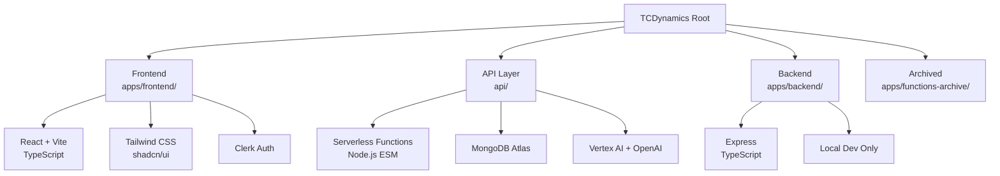

---

## Root Directory Structure

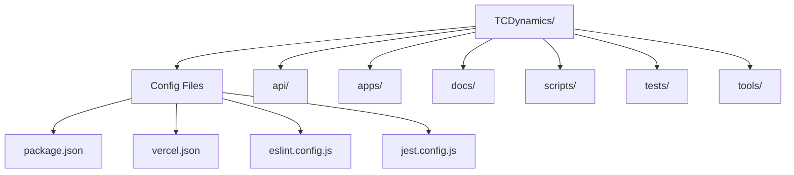

---

## Frontend Application Structure

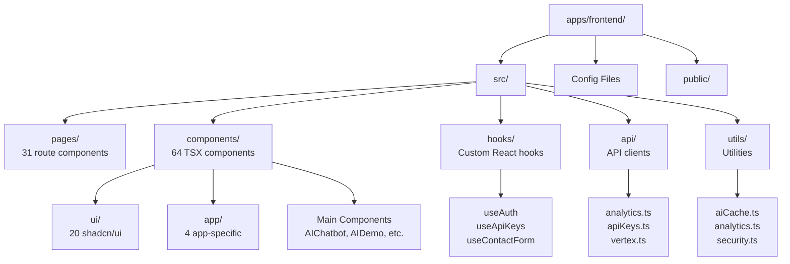

---

## API Layer Structure

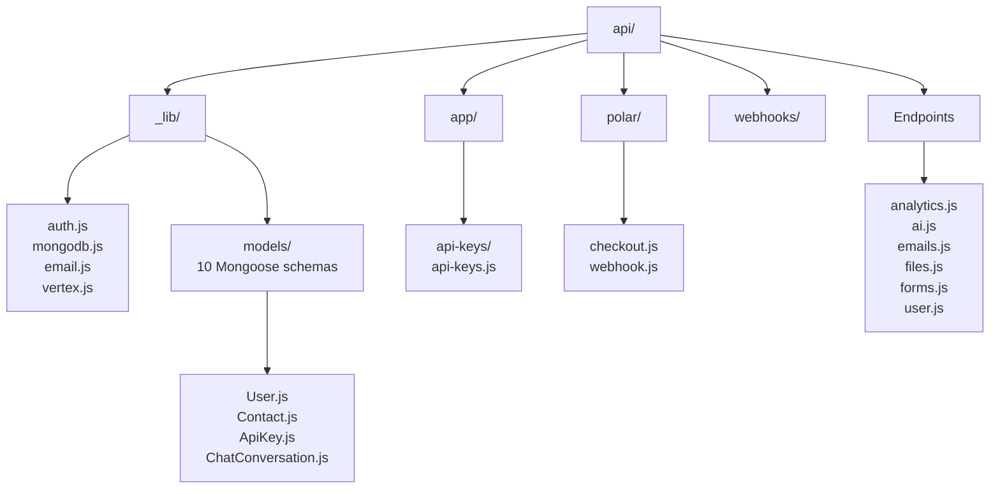

### API Endpoints

```mermaid
flowchart LR
    Endpoints[API Endpoints] --> Analytics[/api/analytics]
    Endpoints --> Chat[/api/ai?provider=openai&action=chat]
    Endpoints --> Files[/api/files]
    Endpoints --> Forms[/api/forms]
    Endpoints --> Vertex[/api/ai?provider=vertex&action=chat]
    Endpoints --> APIKeys[/api/app/api-keys]
    Endpoints --> Polar[/api/polar/*]
    Endpoints --> ClerkWebhook[/api/webhooks/clerk]
```

---

## Backend Server Structure

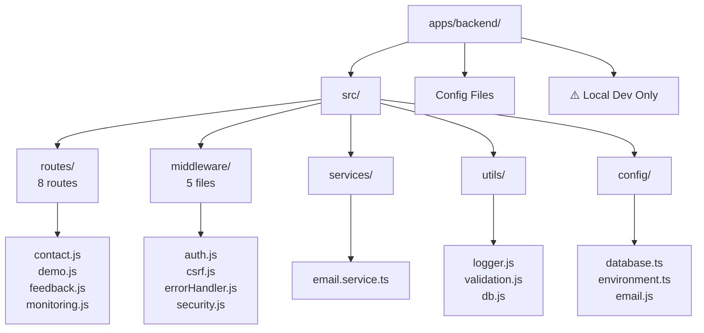

---

## Technology Stack

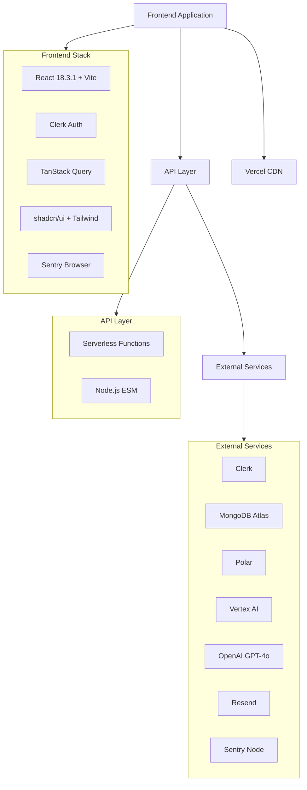

---

## Data Flow

### User Request Flow

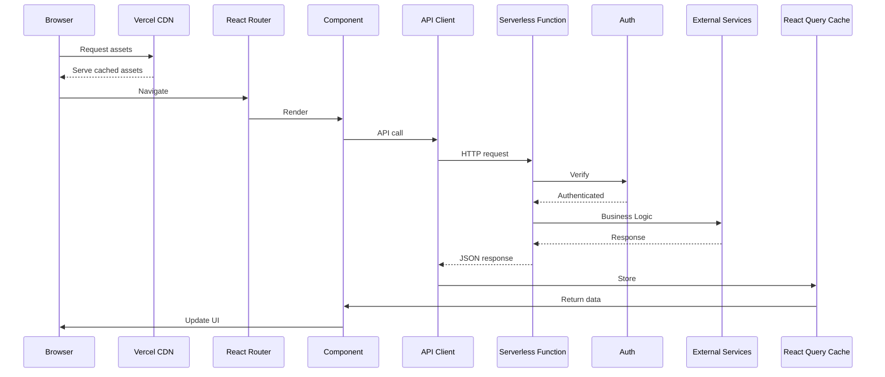

### External Service Flow

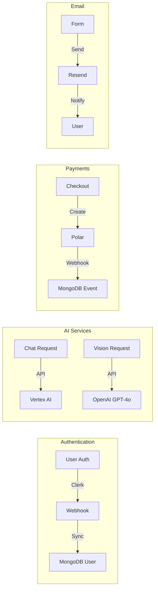

---

## Deployment Architecture

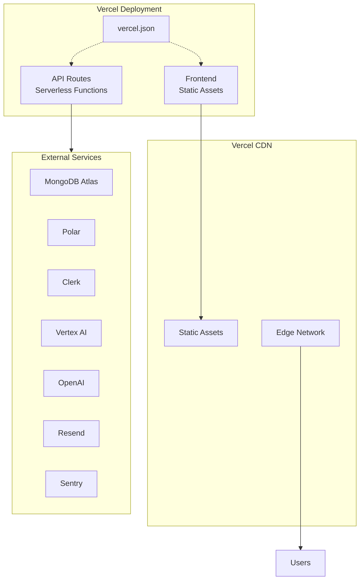

---

## Dependency Graph

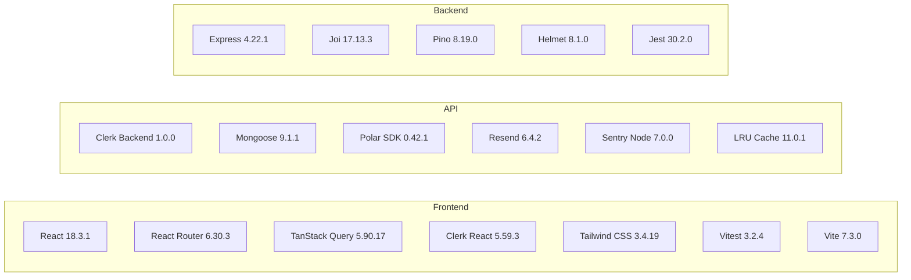

---

## Repository Statistics

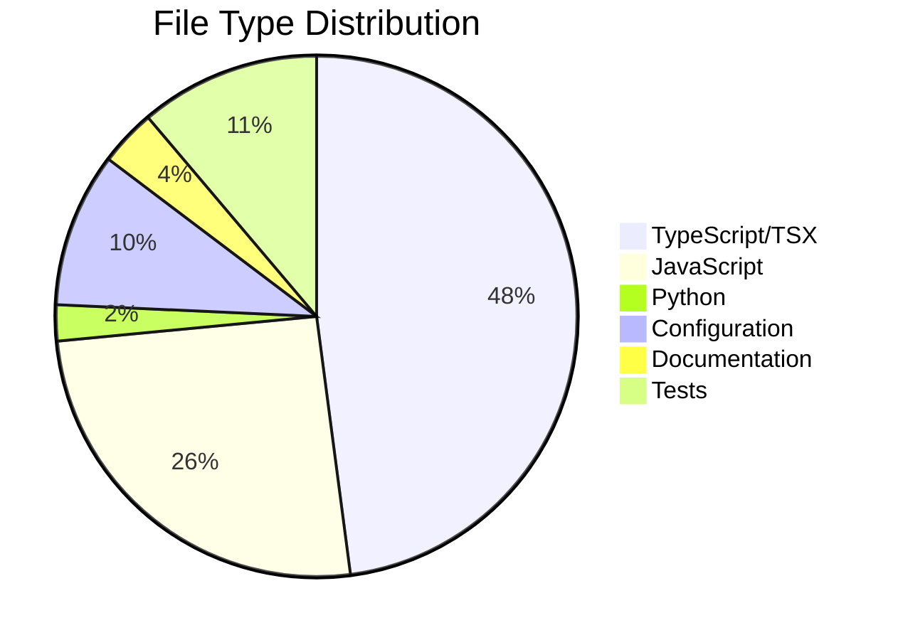

### Statistics Summary

- **Total Files**: ~400+ source files
- **Lines of Code**: ~30,000+ (estimated)
- **Languages**: TypeScript, JavaScript, Python, SQL, Markdown
- **Workspaces**: 2 (frontend, backend)
- **Monorepo**: Yes (npm workspaces)
- **Deployment**: Vercel (production)
- **Database**: MongoDB Atlas
- **CI/CD**: GitHub Actions (configured)

---

## Key Features

### Frontend Features

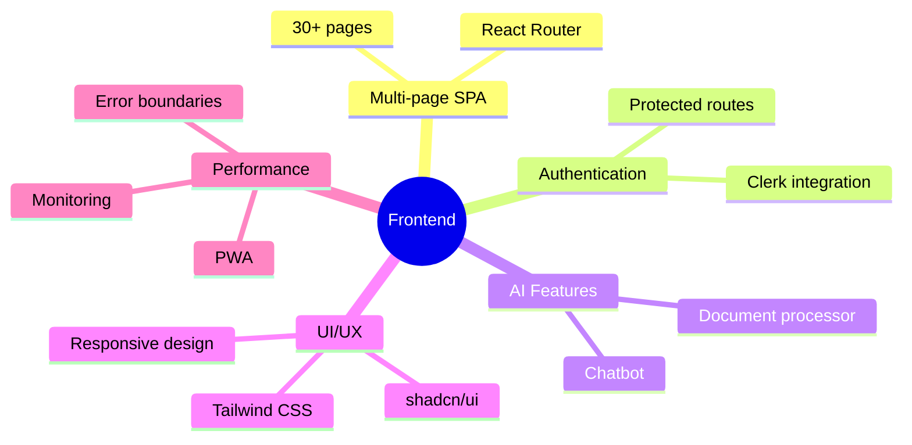

### API Features

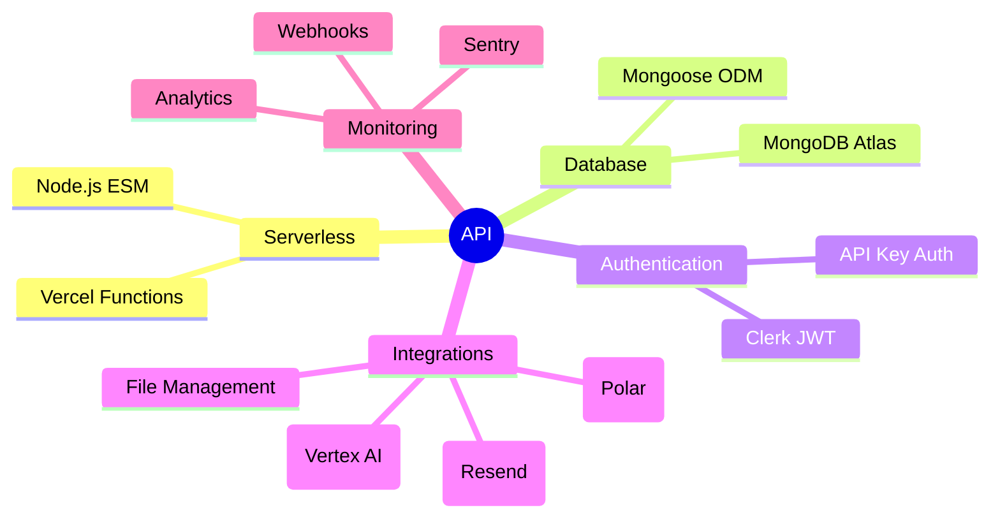

### Backend Features

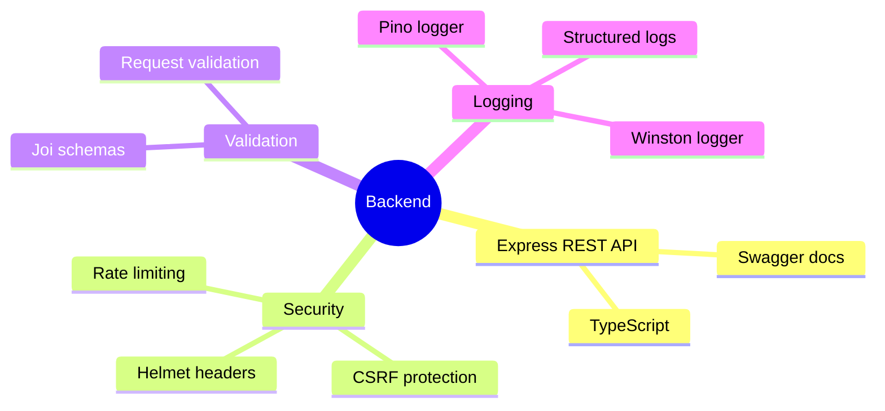

---

**Last Updated**: 2026-01-09
**Repository**: lawmight/TCDynamics
**Documentation Generated**: Using Nia MCP + Local Filesystem Analysis
