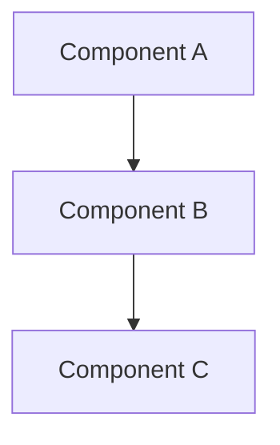
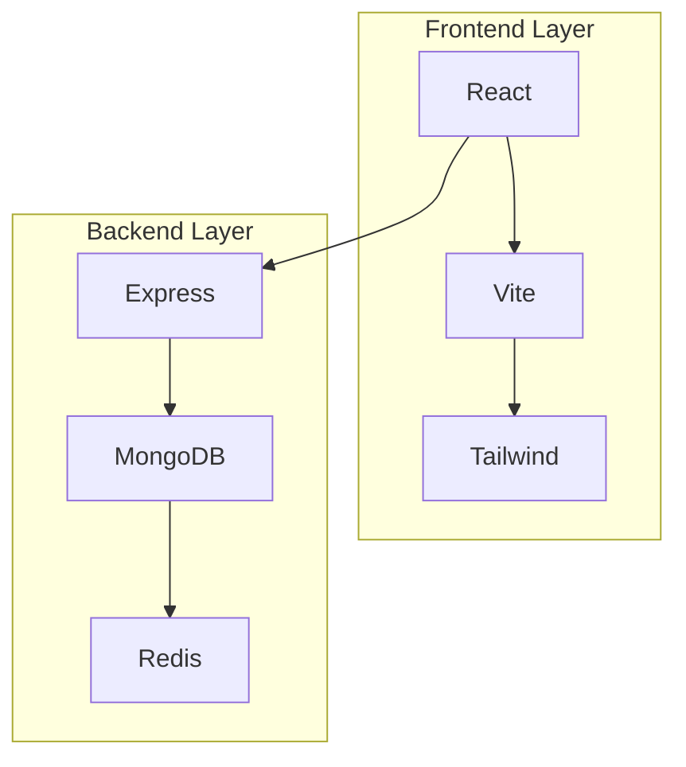
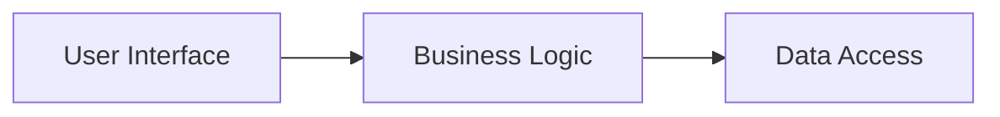
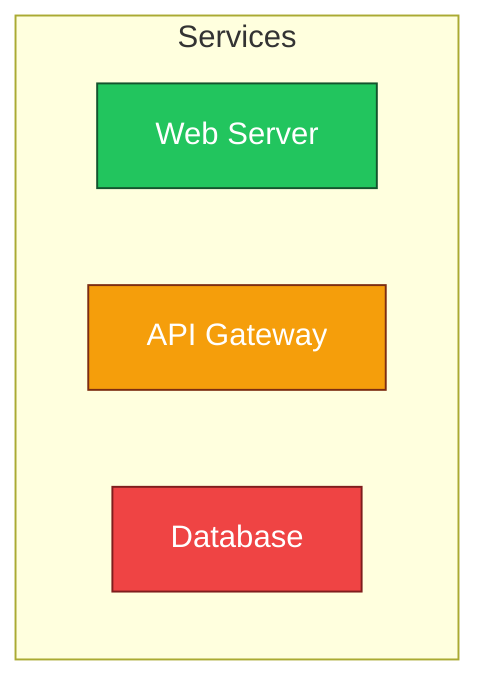

# Advanced Architecture Visualization Enhancements

This document provides guidance on enhancing the visual presentation of the architecture diagrams and making them more interactive and engaging.

## 🎨 Visual Enhancement Techniques

### 1. Color Coding Strategy

The advanced architecture diagrams use a sophisticated color coding system:

- **🔴 Red (#ef4444)**: Presentation Layer - User-facing components
- **🟢 Green (#22c55e)**: Application Layer - Business logic and components
- **🔵 Blue (#3b82f6)**: Gateway/Service Layer - API and middleware
- **🟡 Orange (#f59e0b)**: Service Layer - Backend services
- **🟣 Purple (#8b5cf6)**: Data Layer - Storage and persistence
- **⚫ Gray (#64748b)**: External Integrations - Third-party services

### 2. Interactive Diagram Features

To make diagrams more interactive, consider these enhancements:

#### Hover Effects


#### Subgraph Collapsing


### 3. Advanced Styling Options

#### Custom CSS Classes
```mermaid
classDef critical fill:#ef4444,stroke:#7f1d1d,color:#ffffff,stroke-width:3px
classDef optional fill:#e5e7eb,stroke:#9ca3af,color:#111827,stroke-dasharray: 5 5
classDef deprecated fill:#fca5a5,stroke:#b91c1c,color:#1f2937,text-decoration:line-through

critical[Critical Service] --> optional[Optional Service]
optional --> deprecated[Deprecated Service]
```

#### Animation Support
For enhanced user experience, diagrams can include:
- Loading animations
- Progressive reveal animations
- Interactive state changes

### 4. Accessibility Enhancements

#### ARIA Labels


#### High Contrast Mode
Consider creating alternative color schemes for users with visual impairments.

## 📊 Dynamic Data Integration

### 1. Real-time Metrics Display

Architecture diagrams can be enhanced with real-time metrics:



### 2. Status Indicators

Use color coding to show:
- Service health status
- Performance metrics
- Error rates
- Uptime percentages

## 🔧 Implementation Tools

### 1. Mermaid Live Editor
- Use the [Mermaid Live Editor](https://mermaid.live/) for testing and prototyping
- Export diagrams as SVG, PNG, or PDF
- Generate embeddable HTML code

### 2. VS Code Extensions
- **Markdown Preview Mermaid Support**: Preview Mermaid diagrams in VS Code
- **Mermaid Markdown Preview**: Enhanced preview with theming support

### 3. Documentation Platforms
- **GitBook**: Native Mermaid support with theming
- **Notion**: Built-in Mermaid diagram support
- **Confluence**: Mermaid plugin for enhanced diagrams

## 🎯 Best Practices

### 1. Diagram Complexity
- Keep diagrams focused on specific aspects
- Use multiple smaller diagrams instead of one large complex diagram
- Provide zoom functionality for detailed views

### 2. Consistency
- Maintain consistent color schemes across all diagrams
- Use standard shapes and symbols
- Follow naming conventions

### 3. Documentation
- Add legends for color coding and symbols
- Include tooltips for complex components
- Provide alternative text descriptions

### 4. Performance
- Optimize diagram loading times
- Use lazy loading for large diagrams
- Consider pagination for very complex architectures

## 🚀 Advanced Features

### 1. Interactive Dashboards
Combine multiple architecture diagrams into an interactive dashboard with:
- Clickable components that show detailed views
- Real-time status updates
- Drill-down capabilities

### 2. Version Control Integration
- Track changes to architecture diagrams
- Compare different versions
- Maintain architecture history

### 3. Automated Updates
- Generate diagrams from code or configuration
- Keep diagrams in sync with actual infrastructure
- Use infrastructure-as-code tools for diagram generation

## 📱 Mobile Optimization

### 1. Responsive Design
- Ensure diagrams scale properly on mobile devices
- Use horizontal scrolling for wide diagrams
- Implement touch-friendly interactions

### 2. Simplified Views
- Create mobile-specific simplified diagrams
- Focus on essential components
- Use larger touch targets

## 🔍 Future Enhancements

### 1. AI-Powered Diagram Generation
- Automatically generate architecture diagrams from code
- Use AI to suggest optimal layouts
- Generate documentation from diagrams

### 2. 3D Visualization
- Explore 3D architecture visualization
- Interactive 3D models of system architecture
- Virtual reality walkthroughs of infrastructure

### 3. Integration with Monitoring Tools
- Real-time integration with monitoring dashboards
- Automatic diagram updates based on system state
- Alert integration for critical component failures

The items below are future enhancements, not prerequisites for using the current architecture diagrams.

---

## Implementation Checklist

- [ ] Choose appropriate color scheme for each diagram type
- [ ] Implement consistent styling across all diagrams
- [ ] Add accessibility features (ARIA labels, alt text)
- [ ] Test diagrams on different devices and screen sizes
- [ ] Create interactive versions for key diagrams
- [ ] Set up real-time metrics integration where applicable
- [ ] Document diagram conventions and color coding
- [ ] Establish maintenance process for keeping diagrams updated

This enhanced approach to architecture visualization provides a more engaging, informative, and accessible way to understand and communicate the system architecture.
