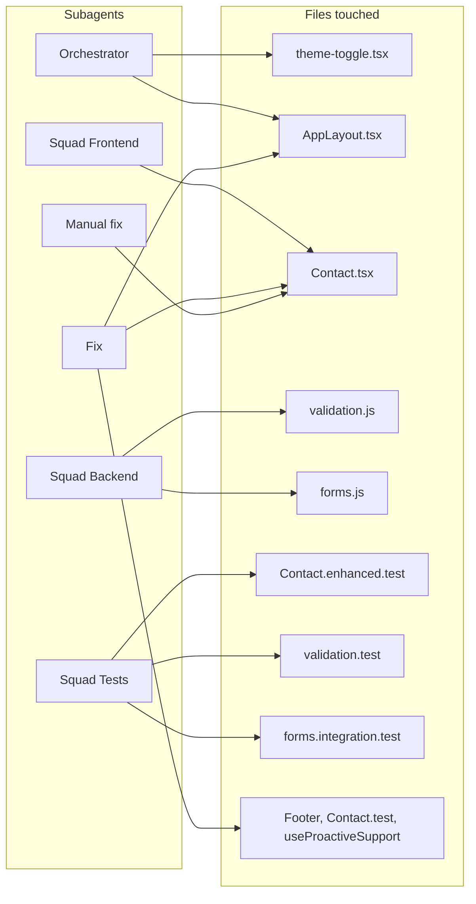
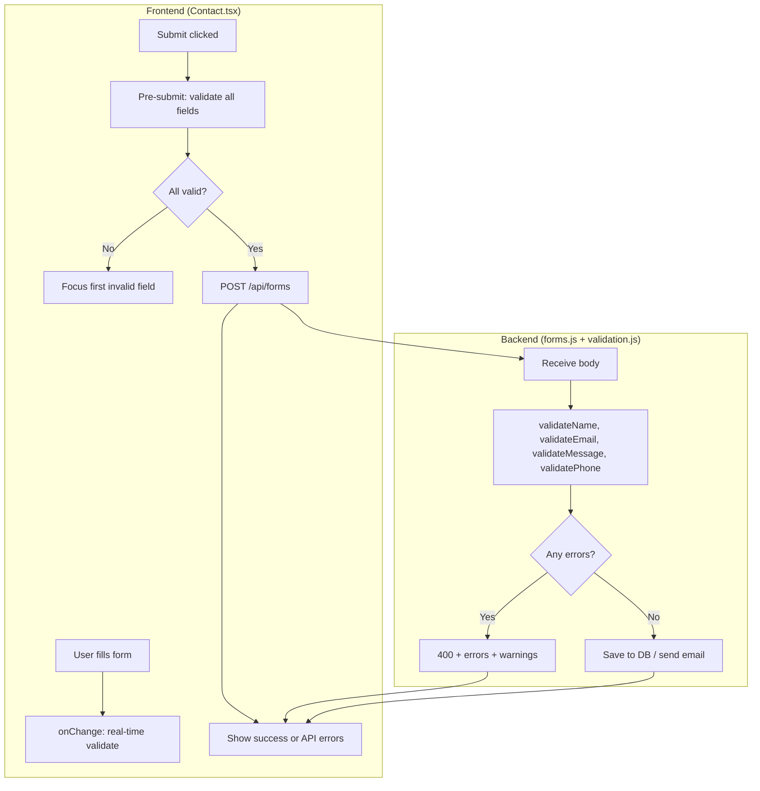
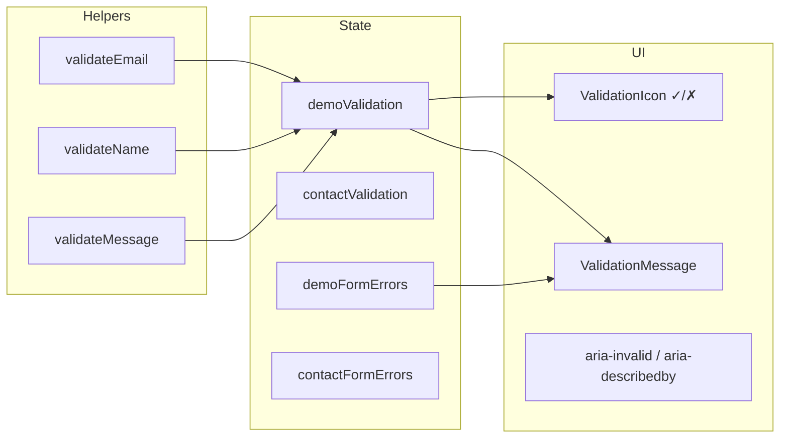
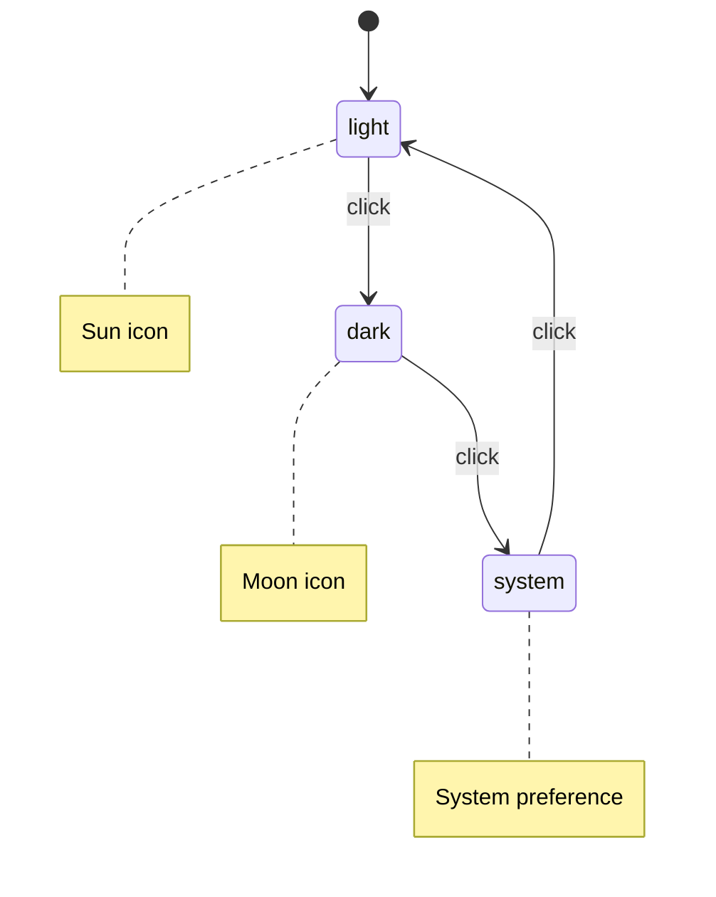
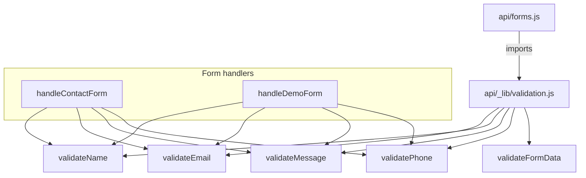
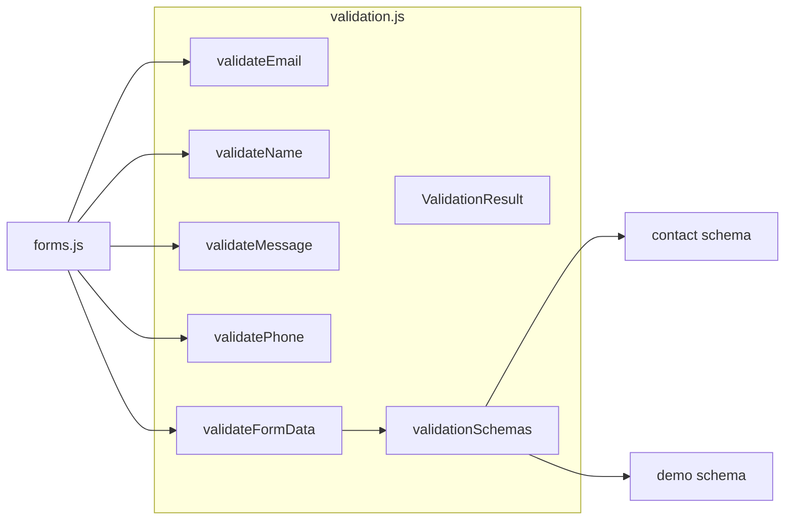
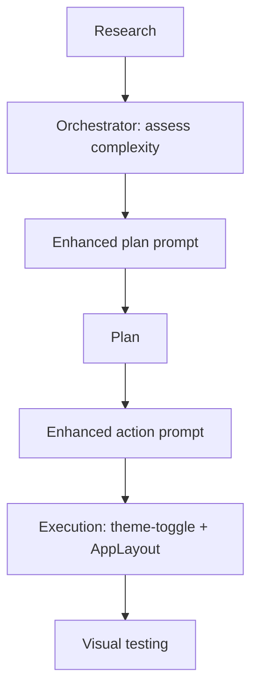
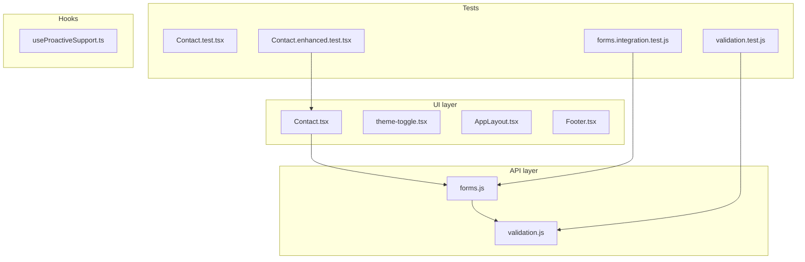

# Detailed Report: Subagent Changes

**Generated:** 2026-02-03
**Scope:** All changes introduced by the subagent runs (all-agents, orchestrator, squad, fix, quick-check) and the subsequent localhost error fix.

This report describes **what was added or changed in each affected file** so you can understand the full impact.

### Overview: who changed what

---

## Summary by source

| Source               | Purpose                           | Files touched                                                                                                                     |
| -------------------- | --------------------------------- | --------------------------------------------------------------------------------------------------------------------------------- |
| **Orchestrator**     | Dark mode toggle workflow         | `theme-toggle.tsx` (new), `AppLayout.tsx`                                                                                         |
| **Squad (frontend)** | Contact/Demo form validation & UX | `Contact.tsx`                                                                                                                     |
| **Squad (backend)**  | API validation layer              | `api/_lib/validation.js` (new), `api/forms.js`                                                                                    |
| **Squad (tests)**    | New tests for validation          | `Contact.enhanced.test.tsx` (new), `api/_lib/__tests__/validation.test.js` (new), `api/__tests__/forms.integration.test.js` (new) |
| **Fix**              | Format + lint:fix + type-check    | `Contact.tsx`, `Footer.tsx`, `Contact.test.tsx`, `AppLayout.tsx`, `useProactiveSupport.ts`                                        |
| **Manual fix**       | Resolve "Building is not defined" | `Contact.tsx` (added Building, Car, Calendar icon imports)                                                                        |

### High-level flow: form validation (Contact + API)

---

## 1. `apps/frontend/src/components/Contact.tsx`

**Modified by:** Squad (frontend specialist), Fix (formatting), Manual fix (icon imports)

### What was added

- **Missing icon imports (manual fix)**
  - `Building`, `Calendar`, `Car` from `~icons/lucide/...` to fix the runtime error `Building is not defined`.

- **Real-time validation state**
  - `demoValidation` and `contactValidation` state objects for per-field validation (valid + message).
  - `demoFormErrors` and `contactFormErrors` for server/API error messages.

- **Validation helpers (in-component)**
  - `validateEmail(email)` – required + format.
  - `validateName(name)` – required, min 2 chars.
  - `validateMessage(message, minLength)` – required, min/max length (max 5000).
  - `ValidationIcon({ valid })` – green check or red X.
  - `ValidationMessage({ message, valid, id })` – inline message with `role="status"` and `aria-live="polite"`.

- **Demo form behavior**
  - `noValidate` on the form.
  - On submit: run all validations, set `demoValidation`, focus first invalid field and scroll into view if invalid, block submit until valid.
  - Inputs use unique IDs (`demo-firstName`, `demo-lastName`, `demo-email`, `demo-needs`), `aria-invalid`, `aria-describedby` for errors.
  - `onChange` on each field updates validation state (real-time feedback).
  - Red border when invalid, `ValidationIcon` and `ValidationMessage` under each field.
  - Character count for “needs” (e.g. “X/5000 caractères”).
  - On success, `demoValidation` is reset; on API errors, `setDemoFormErrors(result.errors)` and a `role="alert"` error block listing errors.

- **Contact form behavior**
  - Same pattern: `noValidate`, pre-submit validation, unique IDs (`contact-*`), `aria-*`, real-time validation, validation icons/messages, focus management, and error display for API errors.

- **Accessibility**
  - Error lists use `role="list"`, list items with a bullet `aria-hidden="true"`.
  - `ValidationMessage` and error blocks use `role="status"` / `role="alert"` and `aria-live="polite"` where appropriate.

### Contact.tsx validation flow

### What was changed

- Form field IDs prefixed with `demo-` or `contact-` for association with error messages.
- Demo form submission now uses `needs` from form data and passes it as `businessNeeds`.
- Formatting/whitespace adjusted by the Fix subagent.

---

## 2. `apps/frontend/src/components/Footer.tsx`

**Modified by:** Fix (formatting)

### What was changed

- **Single change:** Removal of one blank line between the last icon import and `const Footer = () => {` (formatting only).
- No behavior or feature changes.

---

## 3. `apps/frontend/src/components/__tests__/Contact.test.tsx`

**Modified by:** Fix (formatting)

### What was changed

- **Single change:** One assertion reformatted to a single line:
  - Before: `expect(screen.getByText(/Montigny-le-Bretonneux/i)).toBeInTheDocument()` split across multiple lines.
  - After: Same assertion on one line.
- No new tests and no behavior change.

---

## 4. `apps/frontend/src/components/app/AppLayout.tsx`

**Modified by:** Orchestrator (theme toggle integration), Fix (formatting)

### What was added

- **Import:** `ThemeToggle` from `@/components/ui/theme-toggle`.
- **Usage:**
  - Sidebar: `<ThemeToggle className="w-full" />` replacing the previous inline light/dark button.
  - Header: `<ThemeToggle />` (no className) replacing the previous icon-only theme button.

### What was removed

- **Imports:** `Moon`, `Sun` from `~icons/lucide/...`.
- **State/behavior:** `setTheme` from `useTheme()` (only `resolvedTheme` and `theme` kept).
- **Local handler:** `toggleTheme` function.
- **Inline theme UI:** The two previous theme buttons (sidebar with Sun/Moon + text, header icon-only) and their JSX.

### Theme cycle (theme-toggle.tsx)

### Note

- `ThemeToggle` is used with `className="w-full"` in the sidebar, but the current `ThemeToggle` component does **not** accept or forward a `className` prop, so `w-full` has no effect. To get full-width in the sidebar, `ThemeToggle` would need to accept and forward `className` (e.g. to the inner `Button`).

---

## 5. `apps/frontend/src/hooks/useProactiveSupport.ts`

**Modified by:** Fix (formatting)

### What was changed

- **Single change:** Removal of one blank line between the last import and the `interface UseProactiveSupportOptions` declaration.
- No behavior or feature changes.

---

## 6. `api/forms.js`

**Modified by:** Squad (backend specialist)

### What was added

- **Import:**
  `validateFormData`, `validateEmail`, `validateName`, `validateMessage`, `validatePhone` from `./_lib/validation.js`.

- **Contact form handler**
  - Replaces previous ad-hoc checks with:
    - `validateName(name, 'Nom')`, `validateEmail(email)`, `validateMessage(message, 10, 5000, 'Message')`, `validatePhone(phone)`, and optionally `validateName(company, 'Entreprise')`.
  - Collects `validationErrors` and `validationWarnings` from each validator.
  - If any errors: responds with `400`, `error: 'Validation échouée'`, `message: '...'`, `errors`, optional `warnings`, and `requestId`.
  - Uses sanitized email/message from validation when valid.

- **Demo form handler**
  - Same idea: validators for name, email, company, businessNeeds, phone, and optionally jobTitle, industry, useCase.
  - Aggregates errors and warnings; on error returns the same structure as contact.
  - Uses sanitized email and businessNeeds when valid.

### What was removed

- **Contact:** Inline checks for required fields, email regex, and message length (10–5000).
- **Demo:** Inline required-field checks, businessNeeds type/length checks, and email regex.
- All of that logic is now delegated to `api/_lib/validation.js`.

### API validation dependency

---

## 7. `apps/frontend/src/components/ui/theme-toggle.tsx` (NEW FILE)

**Added by:** Orchestrator (execution phase)

### What it does

- **Purpose:** Single control to cycle theme: **light → dark → system → light** (replacing the previous binary light/dark only in AppLayout).

- **Implementation:**
  - Uses `useTheme()` from `@/components/ThemeProvider` (`theme`, `setTheme`, `resolvedTheme`).
  - Uses `Moon` and `Sun` from `lucide-react` (not `~icons/lucide/...`).
  - Renders a `Button` (from `./button`) with:
    - `onClick` / `onKeyDown` (Enter/Space) to cycle theme.
    - `aria-label` describing current and next theme.
    - `aria-pressed` / `aria-checked`, `role="switch"`.
    - Icon (Sun/Moon) and visible label (e.g. “Light”, “Dark”, “Light (System)” / “Dark (System)”).
  - Optional: `className` is **not** in the props; if you pass `className="w-full"` from AppLayout, it is not applied (see AppLayout section).

- **Accessibility:** Keyboard support, ARIA, and (in comments) reduced-motion awareness.
- **JSDoc:** Brief description and example usage.

---

## 8. `api/_lib/validation.js` (NEW FILE)

**Added by:** Squad (backend specialist)

### What it does

- **Purpose:** Shared validation for contact and demo forms: email, name, message, phone, and schema-based form validation.

- **Exports (conceptually):**
  - `ValidationResult`: `{ valid, errors[], warnings[] }`.
  - `validateEmail(email)` – required, format, length/domain, optional disposable-email warning.
  - `validateName(name, fieldName)` – required, trim, length 2–100, optional “suspicious” pattern warnings.
  - `validateMessage(message, min, max, fieldName)` – required, length, optional spam-like pattern warnings.
  - `validatePhone(phone)` – optional; if present, basic format/length.
  - `validationSchemas` – `contact` and `demo` field-to-validator maps.
  - `validateFormData(formData, schema)` – runs the chosen schema and returns a single aggregated `ValidationResult`.

- **Important:** The file is named `.js` but contains **TypeScript** (e.g. `export interface ValidationResult`, type annotations like `(email: string): ValidationResult`). In a plain Node/Vercel ESM environment this can fail at runtime. You may need to:
  - Rename to `validation.ts` and ensure the API is built/run with TypeScript, or
  - Convert it to plain JavaScript (JSDoc types only, no `interface` or `: Type` syntax).

### validation.js exports (conceptual)

---

## 9. `apps/frontend/src/components/__tests__/Contact.enhanced.test.tsx` (NEW FILE)

**Added by:** Squad (test-runner)

### What it does

- **Purpose:** Extra tests for the **enhanced validation** behavior in `Contact.tsx` (demo and contact forms).

- **Setup:** Same as existing Contact tests: `QueryClientProvider` wrapper, optional `console.warn` mock.

- **Demo form:**
  - Required fields: submit without filling shows “Ce champ est requis”.
  - Name length: e.g. “A” shows “Le nom doit contenir au moins 2 caractères”.
  - Email: invalid value shows “Veuillez entrer une adresse email valide”.
  - Message length: validation for min (and likely max) length.
  - Plus any other demo validation cases added in the file.

- **Contact form:**
  - Similar cases for required fields, name length, email format, message length, and any other contact-specific validation.

- **Style:** Uses `render`, `screen`, `fireEvent` / `userEvent`, `waitFor` / `act` from React Testing Library.

---

## 10. `api/_lib/__tests__/validation.test.js` (NEW FILE)

**Added by:** Squad (test-runner)

### What it does

- **Purpose:** Unit tests for `api/_lib/validation.js` (or `validation.ts` if you rename it).

- **Likely coverage:**
  - `validateEmail` – missing, empty, invalid format, valid, possibly disposable warning.
  - `validateName` – missing, short, long, valid.
  - `validateMessage` – length and limits.
  - `validatePhone` – optional, invalid format.
  - Possibly `validateFormData` with `contact` / `demo` schemas.

- **Note:** If `validation.js` is kept as TypeScript-in-.js, test runner must support that (e.g. ts-node or Jest with TS support for .js).

---

## 11. `api/__tests__/forms.integration.test.js` (NEW FILE)

**Added by:** Squad (test-runner)

### What it does

- **Purpose:** Integration tests for the form API (contact and/or demo).

- **Likely coverage:**
  - Valid payloads return success (e.g. 200 or 201).
  - Invalid or missing fields return 400 with the new error shape (`errors`, optional `warnings`, `requestId`).
  - Validation messages in French.

---

## 12. `.cursor/plans/` (workflow artifacts)

**Added by:** Orchestrator

- **workflow_status.plan.md** – Tracks workflow progress (research → plan → action → execution → visual testing).
- **enhanced_plan_prompt.plan.md** – Scope and requirements for the theme toggle.
- **enhanced_action_prompt.plan.md** – Step-by-step implementation instructions.

These are for orchestration/planning only; they do not affect runtime or production build.

### Orchestrator workflow (theme toggle)

---

## Quick reference: “the 8 modified files”

If by “8 modified files” you mean the set that appear in `git status` as **modified** (M) plus **new** (??) code files (excluding plans and test dirs), a minimal list is:

1. **api/forms.js** – New validation integration.
2. **apps/frontend/src/components/Contact.tsx** – Validation UX + icon fix.
3. **apps/frontend/src/components/Footer.tsx** – One blank line removed.
4. **apps/frontend/src/components/**tests**/Contact.test.tsx** – One line reformat.
5. **apps/frontend/src/components/app/AppLayout.tsx** – ThemeToggle integration.
6. **apps/frontend/src/hooks/useProactiveSupport.ts** – One blank line removed.
7. **apps/frontend/src/components/ui/theme-toggle.tsx** – New (orchestrator).
8. **api/\_lib/validation.js** – New (squad).

The **new test files** (Contact.enhanced.test.tsx, validation.test.js, forms.integration.test.js) are additional and not in the “6 modified” list from `git status`.

### Files by layer

---

## Recommendations

1. **ThemeToggle:** Add a `className?: string` prop and forward it to the root `Button` so `className="w-full"` in AppLayout works.
2. **api/\_lib/validation.js:** Convert to plain JS (or rename to `.ts` and ensure API build supports it) to avoid runtime syntax errors.
3. **Contact.tsx:** Consider moving validation helpers and small subcomponents into a shared module or a separate file if you want to reuse or test them independently.
4. **Tests:** Run the new test files (Contact.enhanced, validation, forms.integration) in CI and fix any failures related to validation.js being TS-in-.js or environment (e.g. mocks for MongoDB/Resend).
