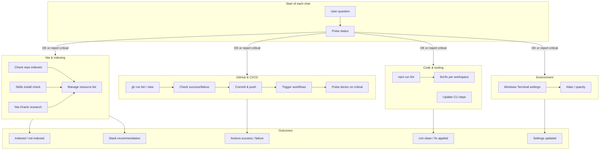
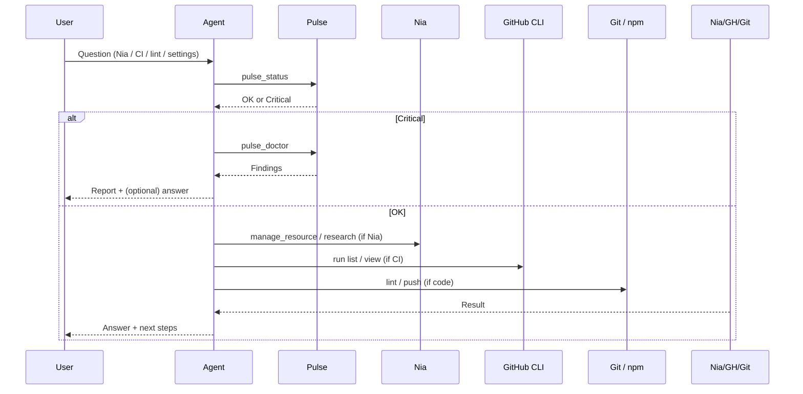
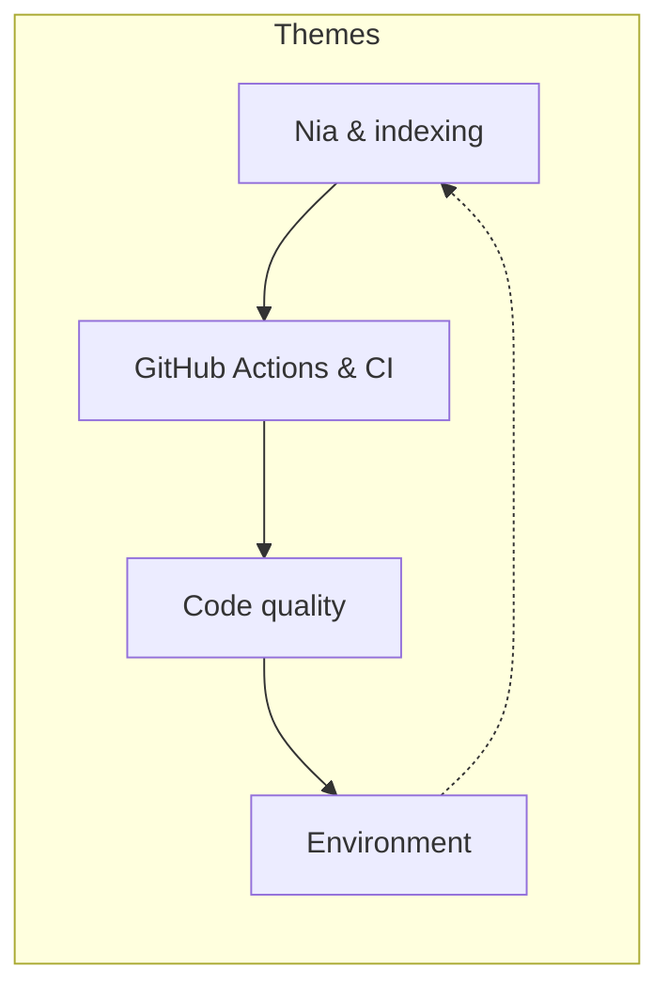

# Recent Chats: Categories & Flow

Summary of recent agent chats, categorized by topic, with a Mermaid graph of the steps we went through.

---

## 1. Categories of Last Chats

### Nia & indexing
- **[Is BMAD-METHOD indexed in Nia?](1a8e48d3-b414-432d-b865-7c6f0af7d9c7)** — Check if repo `bmad-code-org/BMAD-METHOD` is indexed in Nia; Pulse status/doctor; confirm indexed.
- **[Nia skills installed?](cc24d197-b068-4354-8d6f-cc042cbcbc61)** — Verify `npx skills add nozomio-labs/nia-skill` for Cursor CLI/IDE; check `.cursor`, package.json, skills config.
- **[Nia Oracle: perfect stack for TCDynamics](87f3bfa7-4591-484d-b3d4-55acbc6253aa)** — Oracle research for ideal tech stack (frontend, backend, DB, auth, deployment, workflow engine) for WorkFlowAI / SMEs.

### GitHub & CI/CD
- **[Any pull request?](c0a8c5b4-5a26-402a-9671-223a6b68b2df)** — Check for open PRs; Pulse critical (mass delete, PROD_URL, big changeset); main behind origin.
- **[Dev dependency run this morning – result?](16760506-9e21-4a94-a257-bef429609e80)** — `gh run list` / `gh run view` for “Bump dev dependencies”; confirm success.
- **[Last 5 GitHub Actions – state, success or why not](898501d1-1e9e-4f04-a598-6d189becdab7)** — List last 5 runs; all succeeded; Pulse note on mass deletes.
- **[Why did Dependabot updates run twice?](898501d1-1e9e-4f04-a598-6d189becdab7)** — Explain two Dependabot runs (different update IDs / events).
- **[Last actions – were they successful?](4b392840-4adc-4591-97a8-13607af70507)** — Check last runs; report success/failure; no fixes.
- **[Last failed actions – info only](8f26a616-1af0-48eb-b9d4-349dab87b88d)** — `gh run list --status failure`; get details, no fixing.
- **[Check GitHub Actions in CLI](d7156c3b-c23c-4b07-a050-7d8d948427ab)** — Use `gh run list` / `gh run view`; report recent failure (e.g. Deploy MVP).
- **[Check commit 6522af3 & workflows](0d3b6e14-0eca-4cb5-a954-7539f8103af7)** — Verify fix (test-exclude pin); Bump dev deps Verify step; Deploy MVP on push to main.
- **[Push and start dependencies GitHub actions](309fe214-0081-448b-b74c-56b8ed401c90)** — Git push; trigger/confirm bump-dev-deps workflow; Pulse doctor then proceed.

### Code quality & tooling
- **[Run ESLint](828eda6a-a16b-4ba9-9857-a878c6173e08)** — `npm run lint`; then “run it!” → `lint:fix` (script discovery per workspace).

### Environment & settings
- **[Windows Terminal: Atlas Engine & opacity](7350d60d-3ca2-4baf-aadb-5ed9d0f12461)** — Add `useAtlasEngine`, disable acrylic, fixed opacity in Windows Terminal `settings.json`.
- **[Update the CLI to last version](aa110f9c-bafd-4958-a214-559e88a1fc6d)** — Update Vercel/commitlint/dotenv-cli to latest.

---

## 2. Mermaid Graph: Steps We Went Through

High-level flow across these chats (Pulse → user question → tools → answer; CI and Nia as recurring themes).

### Simplified sequence (user → agent → tools → result)

### Theme flow (conceptual)

---

## 3. Illustrations

Generated figures:

1. **Chat categories** — Four topic areas: Nia & indexing, GitHub/CI, Code quality, Environment.  
   `assets/chat-categories.png`
2. **Step flow** — Flowchart: User question → Pulse status → Nia / GitHub CLI / Lint / Settings → outcomes.  
   `assets/step-flow.png`
3. **CI loop** — Push → Bump dev deps, Quality Gate, Deploy MVP → success/failure → developer checks.  
   `assets/ci-loop.png`

*(Images are in the project `assets` folder; paths may be under the Cursor project directory.)*
