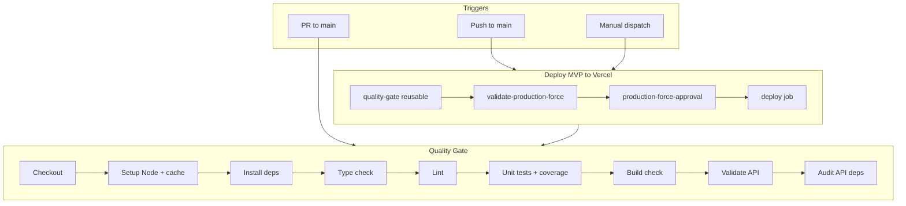
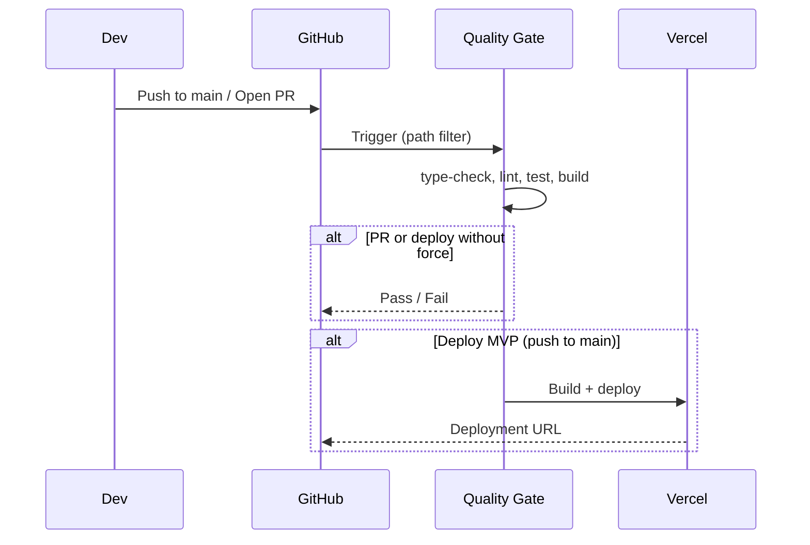
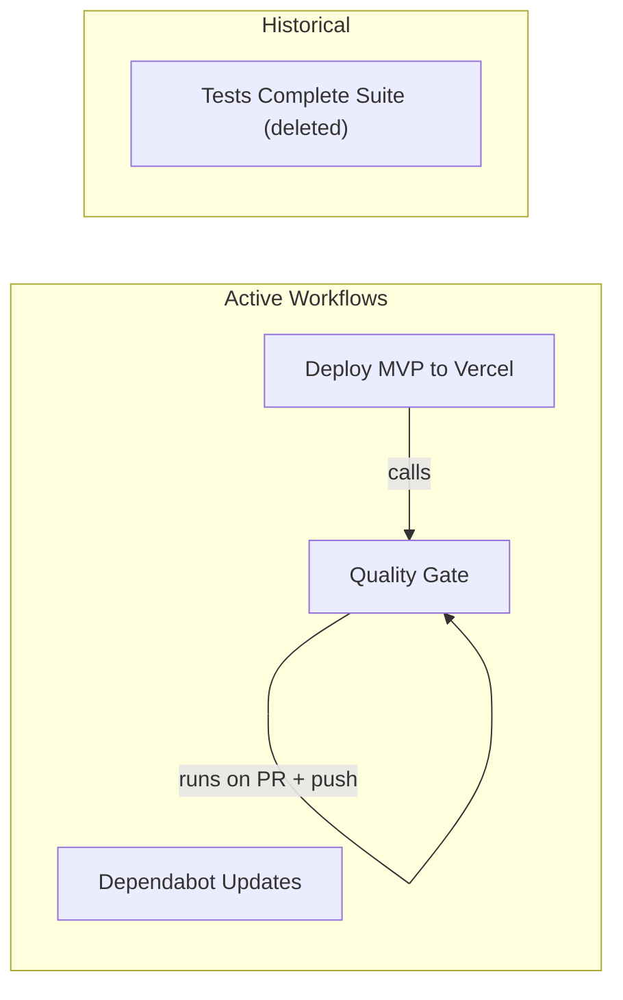

# Deployment & CI/CD Documentation

This document covers GitHub Actions workflows, Vercel deployment configuration, and deployment troubleshooting.

## Workflow Overview



### Pipeline Flow



---

## GitHub Actions Workflows

### Summary

You have **4 workflows** showing in GitHub Actions:

1. ✅ **Dependabot Updates** - Auto-generated from `.github/dependabot.yml`
2. ✅ **Deploy MVP to Vercel** - Active (`.github/workflows/deploy-mvp.yml`)
3. ✅ **Quality Gate** - Active (`.github/workflows/quality-gate.yml`)
4. ⚠️ **Tests Complete Suite** - **DELETED** but still showing in GitHub UI (was `.github/workflows/tests.yml`)

---

## Workflow 1: Dependabot Updates

**Source**: `.github/dependabot.yml` (configuration file, not a workflow file)

### Purpose

Automatically creates pull requests to update dependencies across your project.

### Configuration Areas

1. **Frontend dependencies** (npm, root directory)
   - Daily schedule (06:00 UTC)
   - Groups minor/patch updates
   - Ignores major version updates
   - Limit: 10 open PRs

2. **Backend dependencies** (npm, `/apps/backend`)
   - Daily schedule (06:00 UTC)
   - Same grouping and limits

3. **GitHub Actions** (github-actions ecosystem)
   - Weekly schedule (Monday 09:00 UTC)
   - Limit: 5 open PRs

4. **Docker dependencies**
   - Weekly schedule (Monday 09:00 UTC)
   - Limit: 5 open PRs

5. **Python Functions** (commented out - archived)

### Key Features

- ✅ Automated dependency updates
- ✅ Grouped updates to reduce PR noise
- ✅ Major version updates ignored (manual control)
- ✅ Auto-assignment to you (@Tomco)

---

## Workflow 2: Deploy MVP to Vercel

**File**: `.github/workflows/deploy-mvp.yml`
**Status**: ✅ **ACTIVE**

### Purpose

Deploys the frontend application to Vercel (production or staging environments).

### Triggers

- **Push to `main` branch** (when paths change: `apps/frontend/**`, `api/**`, or the workflow file itself)
- **Manual workflow dispatch** with inputs:
  - `environment`: production (default) or staging
  - `force`: bypass quality gate (boolean)
  - `confirm_production_force`: requires "FORCE_PRODUCTION_DEPLOY" text for forced production deploys

### Job Flow

1. **quality-gate** - Calls the Quality Gate workflow (reusable workflow)
2. **validate-production-force** - Validates forced production deployments (safety check)
3. **production-force-approval** - Requires manual approval for forced production deploys (uses GitHub environments)
4. **deploy** - Main deployment job that:
   - Runs quality gate first (unless force=true)
   - Sets up Node.js with caching
   - Installs dependencies (frontend + API)
   - Lints frontend (non-blocking, continues on error)
   - Copies API directory to frontend for Vercel serverless functions
   - Builds frontend
   - Deploys to Vercel (production or staging based on input)
   - Generates deployment summary

### Key Features

- ✅ Quality gate enforcement (can be bypassed with force flag)
- ✅ Production deployment protection (requires confirmation for forced deploys)
- ✅ Staging and production environments
- ✅ Manual approval gate for forced production deployments
- ✅ Deployment summary with quality gate status

---

## Workflow 3: Quality Gate

**File**: `.github/workflows/quality-gate.yml`
**Status**: ✅ **ACTIVE**

### Purpose

Runs comprehensive quality checks before deployment (linting, testing, type checking, build validation, security audits).

### Triggers

- **Pull requests to `main` branch** (when paths change: `apps/frontend/**`, `api/**`, or the workflow file)
- **Push to `main` branch** (same path filters)
- **Reusable workflow** (called by deploy-mvp.yml)
- **Manual workflow dispatch** with skip options:
  - `skip_lint`: Skip linting checks
  - `skip_tests`: Skip test execution
  - `skip_build`: Skip build check

### Job: quality-gate

**Matrix strategy**: Tests on Node.js versions 20 and 22

### Steps

1. **Checkout** code
2. **Setup Node.js** with caching (uses custom action)
3. **Install Dependencies** (uses custom action)
4. **Type Check** - Runs `npm run type-check` in frontend
5. **Lint** - Runs `npm run lint` in frontend
6. **Unit Tests** - Runs `npm run test:coverage` with coverage reporting
7. **Assert health endpoint non-cacheable** - Validates `/health` endpoint has proper Cache-Control headers
8. **Check Coverage Threshold** - Enforces 60% code coverage minimum
9. **Build Check** - Verifies frontend builds successfully
10. **Upload Coverage** - Uploads coverage to Codecov
11. **Validate API** - Uses custom action to validate API structure and ESM syntax
12. **Audit API Dependencies** - Runs `npm audit` with moderate severity threshold
13. **Job Summary** - Generates summary with status and coverage

### Key Features

- ✅ Multi-version testing (Node.js 20 & 22)
- ✅ Coverage threshold enforcement (60%)
- ✅ Security auditing (npm audit)
- ✅ API validation (ESM syntax, file structure)
- ✅ Health endpoint cache validation
- ✅ All checks can be skipped via inputs (for manual runs)

---

## Workflow 4: Tests Complete Suite (Historical)

**File**: `.github/workflows/tests.yml`
**Status**: ⚠️ **DELETED** (moved to archive on commit `2b5a683`, Nov 2025)

### Purpose (Historical)

Comprehensive test suite covering frontend, backend, E2E, performance (Lighthouse), security, and Docker builds. Also included staging deployment.

### Why It's Still Showing

GitHub Actions UI continues to show deleted workflows if they have run history. This workflow was archived/deleted when you migrated to the MVP deploy workflow approach.

### Workflow Comparison

| Feature        | Tests Complete Suite (Deleted) | Quality Gate (Active) | Notes                                  |
| -------------- | ------------------------------ | --------------------- | -------------------------------------- |
| Frontend Tests | ✅                             | ✅                    | Quality Gate focuses on frontend only  |
| Backend Tests  | ✅                             | ❌                    | Backend testing removed                |
| E2E Tests      | ✅ (Playwright)                | ❌                    | E2E testing removed                    |
| Performance    | ✅ (Lighthouse)                | ❌                    | Lighthouse CI removed                  |
| Security       | ✅ (npm audit)                 | ✅ (API only)         | Reduced scope                          |
| Docker Build   | ✅                             | ❌                    | Docker verification removed            |
| Staging Deploy | ✅                             | ❌                    | Moved to manual dispatch in Deploy MVP |
| Node Versions  | 18 only                        | 20, 22 (matrix)       | Updated to current LTS                 |
| Coverage       | ✅                             | ✅ (60% threshold)    | Threshold added in Quality Gate        |

---

## Workflow Relationships



- **Dependabot Updates**: Auto-generated from `dependabot.yml`
- **Deploy MVP**: `deploy-mvp.yml` — calls Quality Gate, then deploys to Vercel
- **Quality Gate**: `quality-gate.yml` — standalone on PRs/pushes, or reusable by Deploy MVP
- **Tests Complete Suite**: Deleted (archived); still visible in GitHub UI

---

## Summary Statistics

- **Active Workflows**: 2 (Deploy MVP, Quality Gate)
- **Configuration-based**: 1 (Dependabot Updates)
- **Deleted Workflows**: 1 (Tests Complete Suite - still visible in UI)
- **Custom Actions**: 3 (setup-node-cache, install-dependencies, validate-api)
- **Matrix Strategies**:
  - Quality Gate: Node.js 20, 22
- **Coverage Threshold**: 60% (enforced in Quality Gate)

---

## Vercel Deployment Failures Analysis

### December 28, 2025 Incident

**Analysis Period**: 13:38 - 13:53 CET
**Total Failed Deployments**: 17

#### Executive Summary

Between 13:38 and 13:53 CET on December 28, 2025, 17 consecutive Vercel deployments failed due to configuration issues in `vercel.json`. The failures were caused by multiple attempts to fix the build configuration for the monorepo workspace setup.

#### Root Causes

##### 1. Multiple Rapid Configuration Changes (Primary Cause)

Eleven commits were pushed in rapid succession, each attempting to fix the Vercel build configuration:

| Commit  | Time     | Issue                                  |
| ------- | -------- | -------------------------------------- |
| e68018b | 13:38:21 | Invalid redirect pattern               |
| a9904d5 | 13:39:55 | Header source pattern                  |
| 7af9195 | 13:41:47 | Build command using `cd apps/frontend` |
| 3316a35 | 13:43:27 | Workspace command syntax               |
| 05e3143 | 13:45:23 | Root-level build script                |
| 1c5fccb | 13:46:46 | Build command from frontend directory  |
| 869b83d | 13:48:15 | Subshell for build command             |
| c263ab6 | 13:49:43 | npm workspace flag                     |
| df6c977 | 13:51:48 | Invalid `rootDirectory` property       |
| e1b5136 | 13:53:04 | Missing `tsconfig.e2e.json` file       |

##### 2. Latest Failure: Missing File in Build Context

**Deployment ID**: `dpl_8XxdqZb1wGdY9bDmS8o82HiAjQHm` (most recent)
**Error**:

```
[vite:build-html] parsing /vercel/path0/apps/frontend/tsconfig.e2e.json failed:
Error: ENOENT: no such file or directory, open '/vercel/path0/apps/frontend/tsconfig.e2e.json'
```

**Root Cause**: The file `apps/frontend/tsconfig.e2e.json` is:

- Referenced in `apps/frontend/tsconfig.json` (line 6)
- Excluded from Vercel deployment via `apps/frontend/.vercelignore` (line 42)
- Required by Vite during the build process

**Solution**: Remove `tsconfig.e2e.json` from `.vercelignore` or remove the reference from `tsconfig.json` if not needed for production builds.

##### 3. Earlier Failures: Invalid Configuration Properties

**Deployment ID**: `dpl_FU7xdg5Q4UJLsPRw5G751vp7qEHx` (commit df6c977)
**Error**:

```
Error: No Output Directory named "dist" found after the Build completed.
```

**Root Cause**: The `vercel.json` contained an invalid `rootDirectory` property:

```json
{
  "rootDirectory": "apps/frontend",  // ❌ Invalid in vercel.json v2
  ...
}
```

The `rootDirectory` property is **not valid** in `vercel.json` version 2. It's only valid in:

- Vercel dashboard project settings
- `vercel.json` version 1 (deprecated)

This was correctly fixed in commit e1b5136 by removing the property.

#### Current Configuration Status

##### ✅ Working Build Command (Current)

```json
{
  "buildCommand": "npm install && npm run -w tcdynamics-frontend build",
  "outputDirectory": "apps/frontend/dist"
}
```

This command correctly:

- Installs all workspace dependencies
- Uses npm workspace flag (`-w`) to run the build script in the `tcdynamics-frontend` package
- Outputs to the correct directory (`apps/frontend/dist`)

##### ❌ Outstanding Issue

The `tsconfig.e2e.json` file exclusion in `.vercelignore` is causing build failures because:

1. `tsconfig.json` references it via project references
2. Vite's HTML build plugin tries to parse all TypeScript config files
3. The file is excluded from deployment, causing `ENOENT` error

---

## Recommendations

### Immediate Fix

**Option 1: Include the file in deployment** (Recommended)
Remove line 42 from `apps/frontend/.vercelignore`:

```diff
# Test configs
playwright.config.ts
vitest.config.ts
- tsconfig.e2e.json
```

**Option 2: Remove the reference** (If e2e tests aren't needed for production)
Remove line 6 from `apps/frontend/tsconfig.json`:

```diff
  "references": [
    { "path": "./tsconfig.app.json" },
    { "path": "./tsconfig.node.json" },
-   { "path": "./tsconfig.e2e.json" }
  ],
```

**Option 3: Conditional reference** (Advanced)
Only include the reference if the file exists (requires build script modification).

### Prevent Future Issues

1. **Test build commands locally** before pushing:

   ```bash
   npm install && npm run -w tcdynamics-frontend build
   ```

2. **Validate `vercel.json`** before committing:
   - Use Vercel's schema: `https://openapi.vercel.sh/vercel.json`
   - Test with `vercel build --debug` locally

3. **Avoid rapid-fire commits** for configuration changes:
   - Test each change locally first
   - Use preview deployments to verify fixes
   - Consider using feature branches for experimental configurations

4. **Monitor deployment status**:
   - Set up deployment notifications
   - Check Vercel dashboard after pushes
   - Use `vercel ls` to monitor recent deployments

---

## Verification Commands

```bash
# Check recent deployments
vercel ls tc-dynamics

# Inspect a specific deployment
vercel inspect <deployment-url>

# View build logs
vercel inspect <deployment-id> --logs

# Test build locally
npm install && npm run -w tcdynamics-frontend build
```

---

## Next Steps

1. ✅ **Keep current workflows** - They're well-structured and focused
2. ⚠️ **Consider backend testing** - Currently missing if you have backend code
3. ⚠️ **Consider E2E testing** - Might be valuable for regression testing
4. ✅ **Dependabot** - Working as configured
5. ℹ️ **Tests Complete Suite** - Can ignore in GitHub UI (deleted but showing due to history)

---

## Workflow Best Practices

Based on Nia research of GitHub Actions best practices for monorepos:

### Why Keep Workflows Separate?

1. ✅ **Modularity** - Workflows separated = easier to maintain and understand
2. ✅ **Reusable Pattern** - Quality Gate is called via `workflow_call` (best practice)
3. ✅ **Path Filters** - Saves CI/CD minutes (already implemented)
4. ✅ **Separation of Responsibilities** - Each workflow has a unique objective
5. ✅ **Custom Actions** - Shared logic extracted in `.github/actions/` (DRY)

### Optional Improvements

1. **Add Concurrency Control** (to cancel obsolete runs)
2. **Backend Testing** (if backend is active, create separate workflow or job in Quality Gate)
3. **E2E Testing** (separate workflow or job in Quality Gate)

---

**Last Updated**: 2026-01-13
