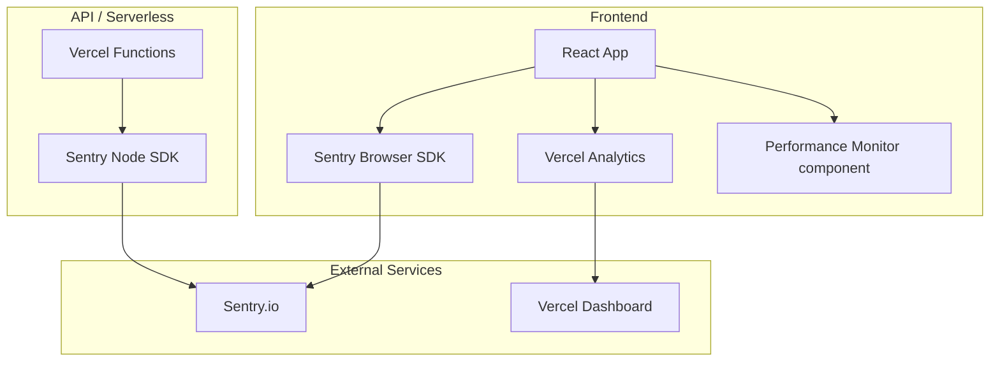
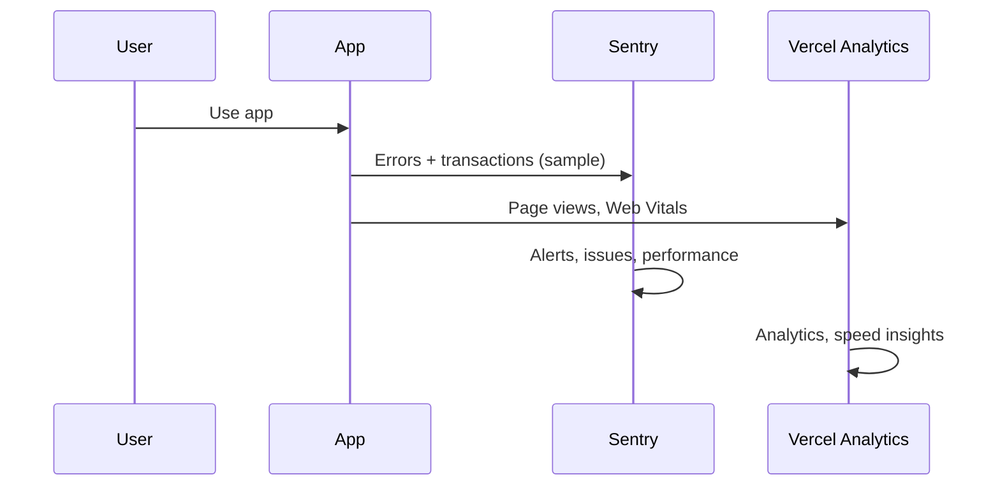

# Monitoring Documentation

**Last Updated**: 2026-01-09
**Status**: Active

Monitoring setup and configuration for TCDynamics WorkFlowAI platform using Sentry, Vercel Analytics, and custom performance monitoring.

## Overview

The platform uses multiple monitoring solutions:

- **Sentry** - Error tracking and performance monitoring (frontend + backend)
- **Vercel Analytics** - Web analytics and performance metrics
- **Performance Monitor** - Custom in-app performance monitoring component

### Monitoring Stack



### Data Flow



## Sentry Error Tracking

### Frontend Setup

**Location**: `apps/frontend/src/utils/monitoring.tsx`

**Configuration**:
- DSN: `VITE_SENTRY_DSN` environment variable
- Sample Rate: `VITE_SENTRY_TRACES_SAMPLE_RATE` (default: `0.1` = 10%)
- Release: `VITE_SENTRY_RELEASE` or `VERCEL_GIT_COMMIT_SHA`
- Environment: Auto-detected from `MODE` (production/development)

**Initialization**:

```typescript
import { monitoring } from '@/utils/monitoring'

// Initialize Sentry (call once at app startup)
await monitoring.init()
```

**Usage**:

```typescript
// Capture errors
try {
  // ... code that might throw
} catch (error) {
  monitoring.captureError(error, {
    context: 'User action',
    userId: user.id,
  })
}

// Capture messages
monitoring.captureMessage('Important event', 'info')
```

**Source Maps**:

Source maps are automatically uploaded to Sentry during production builds via `@sentry/vite-plugin`:

```typescript
// apps/frontend/vite.config.ts
sentryVitePlugin({
  org: process.env.SENTRY_ORG,
  project: process.env.SENTRY_PROJECT,
  authToken: process.env.SENTRY_AUTH_TOKEN,
  release: process.env.VERCEL_GIT_COMMIT_SHA,
})
```

### Backend Setup

**Location**: `api/_lib/sentry.js`

**Configuration**:
- DSN: `SENTRY_DSN` environment variable
- Sample Rate: `0.1` (10% of transactions)
- Release: `SENTRY_RELEASE` or `VERCEL_GIT_COMMIT_SHA`
- Environment: `VERCEL_ENV` or `NODE_ENV`

**Initialization**:

```javascript
import { initSentry } from './_lib/sentry.js'

// Initialize Sentry (call once per cold start)
initSentry()
```

**Usage**:

```javascript
import { withSentry, captureException, captureMessage } from './_lib/sentry.js'

// Wrap API handlers
export default withSentry(async (req, res) => {
  // ... handler code
})

// Manual error capture
try {
  // ... code
} catch (error) {
  captureException(error, {
    url: req.url,
    method: req.method,
  })
}

// Capture messages
captureMessage('Important event', 'info', { context: 'data' })
```

**Production Only**:

Sentry only sends errors in production:
- Frontend: `beforeSend` filters out non-production environments
- Backend: `beforeSend` filters out non-production environments

### Environment Variables

**Frontend**:
- `VITE_SENTRY_DSN` - Sentry DSN (required for error tracking)
- `VITE_SENTRY_TRACES_SAMPLE_RATE` (optional, default: `0.1`)
- `VITE_SENTRY_RELEASE` (optional, defaults to Git commit SHA)

**Backend**:
- `SENTRY_DSN` - Sentry DSN (required for error tracking)
- `SENTRY_RELEASE` (optional, defaults to Git commit SHA)
- `SENTRY_AUTH_TOKEN` - Required for source map uploads (production builds)

**Vercel**:
- Automatically sets `VERCEL_GIT_COMMIT_SHA` for release tracking

### Sentry Dashboard

**Access**: [sentry.io](https://sentry.io)

**Features**:
- Error tracking and grouping
- Performance monitoring
- Release tracking
- User feedback
- Issue alerts

**Setup**:
1. Create Sentry project
2. Get DSN from project settings
3. Add DSN to environment variables
4. Configure alerts and notifications

## Vercel Analytics

### Setup

**Location**: `apps/frontend/src/App.tsx`

**Installation**:

```typescript
import { Analytics } from '@vercel/analytics/react'

function App() {
  return (
    <>
      {/* App content */}
      <Analytics />
    </>
  )
}
```

**Features**:
- Automatic pageview tracking
- Web Vitals tracking
- Performance metrics
- Geographic data

### Custom Event Tracking

**Location**: `apps/frontend/src/hooks/useFormSubmit.ts`, `apps/frontend/src/components/PostSubmissionFeedback.tsx`

**Usage**:

```typescript
import { track } from '@vercel/analytics'

// Track custom events
track('form_submitted', {
  formType: 'contact',
  timestamp: Date.now(),
})
```

**Events Tracked**:
- Form submissions (contact, demo)
- User interactions
- Feature usage

### Vercel Dashboard

**Access**: [vercel.com/dashboard](https://vercel.com/dashboard)

**Metrics**:
- Pageviews
- Web Vitals (LCP, FID, CLS)
- Geographic distribution
- Performance trends

## Performance Monitoring

### In-App Performance Monitor

**Location**: `apps/frontend/src/components/PerformanceMonitor.tsx`

**Features**:
- Load time tracking
- Render time tracking
- Memory usage (if available)
- Bundle size tracking

**Usage**:

The component is included in the main App component:

```typescript
import PerformanceMonitor from './components/PerformanceMonitor'

function App() {
  return (
    <>
      <PerformanceMonitor />
      {/* App content */}
    </>
  )
}
```

**Toggle**:
- Press `Ctrl+Shift+P` to toggle visibility
- Default: Visible in development, hidden in production
- Preference saved in localStorage

**Metrics Displayed**:
- Load Time (ms) - Time to first load
- Render Time (ms) - Time to first render
- Memory Usage (MB) - Current memory usage (if available)
- Bundle Size (KB) - Estimated bundle size

## Logging Strategy

### Frontend Logging

**Location**: `apps/frontend/src/utils/logger.ts`

**Usage**:
- Use `logger` utility instead of `console.log`
- Automatically filters by environment
- Integrates with Sentry for error tracking

```typescript
import { logger } from '@/utils/logger'

logger.info('User action', { userId, action })
logger.error('Error occurred', error)
logger.warn('Warning message', { context })
```

### Backend Logging

**Location**: `api/_lib/logger.js`

**Features**:
- PII hashing (clerkId, userId, orgId)
- Structured logging
- Error context preservation

**Usage**:

```javascript
import { logger } from './_lib/logger.js'

logger.info('API request', { endpoint, method })
logger.error('API error', error, { requestId })
logger.warn('Rate limit warning', { ip })
```

**PII Protection**:
- Automatically hashes sensitive fields (clerkId, userId, orgId)
- Uses `PII_HASH_SALT` environment variable for additional security
- SHA-256 hashing before logging

## Dashboard Access

### Sentry Dashboard

**URL**: `https://sentry.io/organizations/{org}/projects/{project}/`

**Access**:
1. Log in to Sentry account
2. Navigate to project
3. View errors, performance, releases

### Vercel Dashboard

**URL**: `https://vercel.com/{project-name}`

**Access**:
1. Log in to Vercel account
2. Navigate to project
3. View Analytics tab for metrics

**Metrics Available**:
- Pageviews
- Web Vitals
- Geographic data
- Performance trends

## Alerting Configuration

### Sentry Alerts

**Setup**:
1. Navigate to Sentry project → Alerts
2. Create alert rule
3. Configure conditions (error rate, performance degradation)
4. Set notification channels (email, Slack, PagerDuty)

**Recommended Alerts**:
- Error rate spike (> 10 errors/minute)
- Performance degradation (p95 > 2000ms)
- Critical errors (5xx responses)
- Release deployment failures

### Vercel Alerts

**Setup**:
1. Navigate to Vercel project → Settings → Notifications
2. Configure alert preferences
3. Set notification channels

**Available Alerts**:
- Deployment failures
- Function execution errors
- Performance degradation

## Performance Monitoring

### Web Vitals

**Tracked Automatically**:
- **LCP** (Largest Contentful Paint) - Load performance
- **INP** (Interaction to Next Paint) - Interactivity
- **CLS** (Cumulative Layout Shift) - Visual stability

**Dashboard**: Vercel Analytics → Web Vitals tab

### Custom Performance Metrics

**Tracked via Performance Monitor**:
- Load time (ms)
- Render time (ms)
- Memory usage (MB)
- Bundle size (KB)

**Access**: Press `Ctrl+Shift+P` in development mode

## Best Practices

### Error Tracking

1. **Capture meaningful context** - Include user ID, action, timestamp
2. **Don't log sensitive data** - PII is automatically hashed
3. **Use appropriate severity levels** - info, warning, error
4. **Group related errors** - Use consistent error messages

### Performance Monitoring

1. **Monitor Web Vitals** - Track Core Web Vitals in production
2. **Set performance budgets** - Define acceptable thresholds
3. **Alert on degradation** - Get notified when performance drops
4. **Track custom metrics** - Monitor business-critical metrics

### Logging

1. **Use structured logging** - Include context objects
2. **Avoid sensitive data** - PII is hashed automatically
3. **Log at appropriate levels** - info, warning, error
4. **Include request IDs** - Trace requests across services

## Troubleshooting

### Sentry Not Initializing

**Issue**: Errors not appearing in Sentry

**Solutions**:
- Verify `SENTRY_DSN` or `VITE_SENTRY_DSN` is set
- Check environment is set to `production`
- Verify network requests to Sentry API
- Check browser console for Sentry initialization errors

### Vercel Analytics Not Tracking

**Issue**: Pageviews not appearing in Vercel Analytics

**Solutions**:
- Verify `Analytics` component is included in App
- Check deployment is on Vercel
- Verify analytics are enabled in Vercel project settings
- Wait 24-48 hours for initial data to appear

### Performance Monitor Not Showing

**Issue**: Performance Monitor not visible

**Solutions**:
- Press `Ctrl+Shift+P` to toggle
- Check localStorage: `showPerfMonitor` preference
- Verify development mode: `MODE=development`
- Check component is included in App

## Related Documentation

- [Environment Setup](../development/environment-setup.md) - Monitoring environment variables
- [CI/CD Guide](./ci-cd.md) - Deployment and monitoring integration
- [Security Headers](../security/headers.md) - Security configuration

---

**Last Updated**: 2026-01-09
