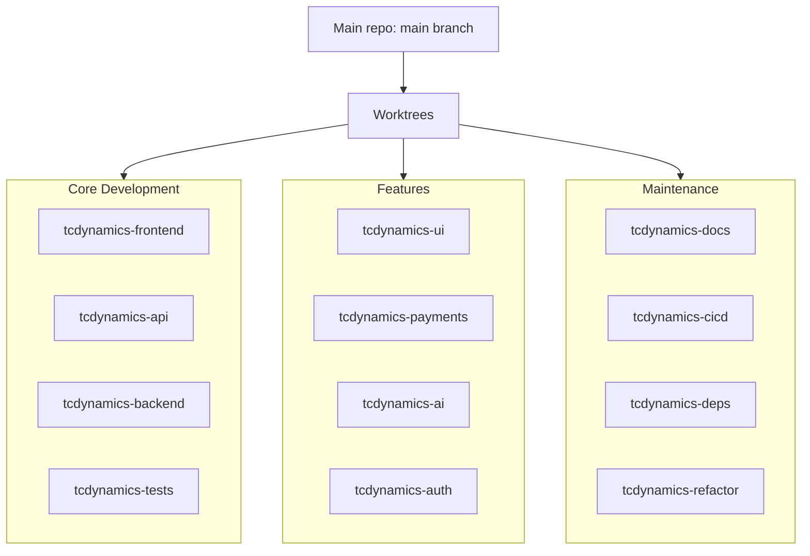
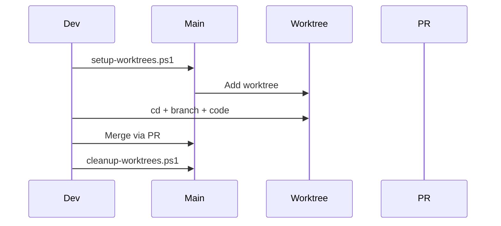

# Worktree Strategy for TCDynamics

**Last Updated**: 2026-01-09
**Status**: Active

This document explains the worktree setup for parallel development without breaking things.

### Worktree Overview



### Worktree Lifecycle



## Current Status

✅ **Cleaned up**: All old AI-generated worktrees (glx, luf, mqb, ora, utr, uuq) have been removed.

**Current worktrees:**
- `C:/Users/Tomco/OneDrive/Documents/Projects` - Main repository (main branch)
- `C:/Users/Tomco/.cursor/worktrees/Projects/azn` - Current worktree (detached HEAD)

## Quick Start

### Setup All Worktrees

```powershell
# From the main repo directory
cd C:\Users\Tomco\OneDrive\Documents\Projects
.\scripts\setup-worktrees.ps1
```

This creates 17 worktrees organized by purpose:
- **Core Development**: frontend, api, backend, tests
- **Features**: ui, payments, ai, auth
- **Maintenance**: docs, cicd, deps, refactor
- **Bug Fixes**: fixes, hotfix, perf
- **Experimental**: experiment, migration, research

### List Worktrees

```powershell
.\scripts\list-worktrees.ps1
```

### Cleanup Worktrees

```powershell
.\scripts\cleanup-worktrees.ps1
```

## Worktree Structure

```
C:\Users\Tomco\.cursor\worktrees\Projects\
├── azn\                          # Current (keep for now)
├── tcdynamics-frontend\          # React/TypeScript work
├── tcdynamics-api\               # Vercel serverless functions
├── tcdynamics-backend\           # Express backend (local dev)
├── tcdynamics-tests\             # Test improvements
├── tcdynamics-ui\                # UI/UX components
├── tcdynamics-payments\          # Polar payment features
├── tcdynamics-ai\                # Vertex AI features
├── tcdynamics-auth\              # Clerk/auth features
├── tcdynamics-docs\              # Documentation
├── tcdynamics-cicd\              # CI/CD improvements
├── tcdynamics-deps\              # Dependency updates
├── tcdynamics-refactor\          # Code refactoring
├── tcdynamics-fixes\             # Bug fixes
├── tcdynamics-hotfix\            # Production hotfixes
├── tcdynamics-perf\              # Performance work
├── tcdynamics-experiment\        # Experimental features
├── tcdynamics-migration\         # Migration work
└── tcdynamics-research\          # Research & planning
```

## Usage

### Switch to a Worktree

Just `cd` into it:

```powershell
cd C:\Users\Tomco\.cursor\worktrees\Projects\tcdynamics-frontend
```

### Work on Multiple Features

You can have multiple terminals/windows open:
- Terminal 1: `tcdynamics-frontend` - Working on React components
- Terminal 2: `tcdynamics-api` - Working on serverless functions
- Terminal 3: `tcdynamics-docs` - Updating documentation

### Sync with Main

```bash
# In any worktree
git pull origin main
```

### Merge Back to Main

```bash
# In the worktree
git checkout main
git merge feat/your-feature
git push origin main
```

### Remove a Worktree

```bash
# From main repo or any worktree
git worktree remove C:\Users\Tomco\.cursor\worktrees\Projects\tcdynamics-frontend
```

Or use the cleanup script:
```powershell
.\scripts\cleanup-worktrees.ps1
```

## Best Practices

1. **One worktree per concern** - Don't mix features in one worktree
2. **Never commit to main directly** - Always use a worktree branch
3. **Test before merging** - Run tests in the worktree before merging
4. **Regular sync** - Pull from main regularly to stay up to date
5. **Clean up** - Remove worktrees when branches are merged

## Safety Rules

✅ **DO:**
- Create a new worktree for each feature
- Test changes in isolation
- Merge back to main when complete
- Remove worktrees when done

❌ **DON'T:**
- Commit directly to main branch
- Mix multiple features in one worktree
- Leave worktrees in detached HEAD state
- Keep old worktrees around

## Troubleshooting

### "fatal: 'main' is already used by worktree"

The main branch is checked out in the main repo. This is normal. Worktrees should use feature branches.

### "fatal: working tree is locked"

A worktree is in use (maybe another terminal). Close it or use `--force` (be careful).

### Worktree has uncommitted changes

Either commit, stash, or discard changes before removing:
```bash
git stash
git worktree remove <path>
```

## Migration from Old Worktrees

All old AI-generated worktrees (glx, luf, mqb, ora, utr, uuq, silly-chaum) have been cleaned up.

If you need to recover work from them, check git reflog:
```bash
git reflog
```
