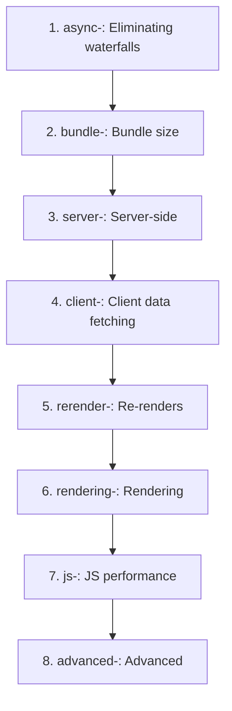
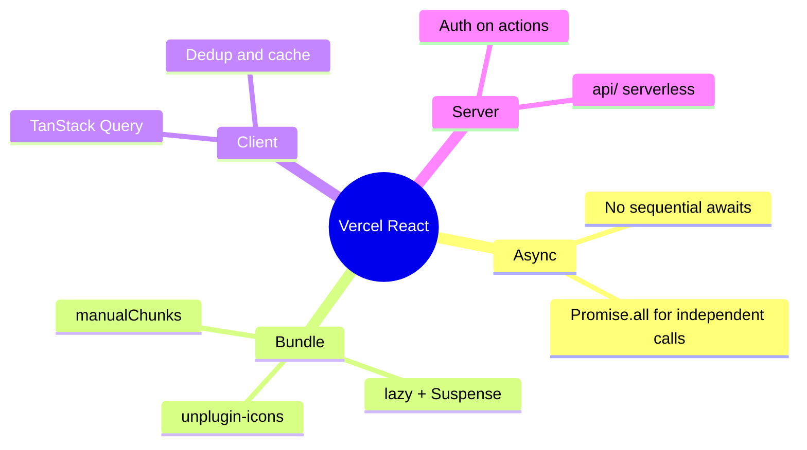

# Vercel React Best Practices – TCDynamics Frontend

**Last Updated**: 2026-02-07
**Status**: Active

Quick reference for applying the **Vercel React Best Practices** skill in this project, plus comprehensive audit findings.  
Full rules: `~/.cursor/skills/vercel-react-best-practices/` (see `SKILL.md` and `rules/*.md`).

---

## Part 1: Quick Reference

### Rule Categories (by priority)





---

## When to use

- Writing or refactoring React components
- Adding or changing data fetching
- Improving bundle size or load time
- Reviewing code for performance

---

## What we already do (aligned)

| Practice | Where / How |
|----------|-------------|
| **async-parallel** | No independent sequential awaits in critical paths; API calls are single-request or token-dependent. |
| **bundle-dynamic-imports** | Route-level `lazy()` in `App.tsx`; `LazyAIChatbot`; heavy pages (Dashboard, Chat, Files, etc.) are code-split. |
| **bundle-defer-third-party** | Vercel Analytics loaded via `lazy()` and rendered only after consent (`ConsentAnalytics`). |
| **client-swr-dedup** | TanStack Query for server state: request deduplication, caching, `staleTime`/`gcTime` configured. |
| **Suspense** | `Suspense` + `PageSkeleton` for routes; `LazyAIChatbot` has its own fallback. |
| **Barrel imports** | No `lucide-react` barrel; icons via `unplugin-icons` (`~icons/lucide/...`). UI imports are direct (`@/components/ui/button`, etc.). |
| **Bundle layout** | `vite.config.ts`: `manualChunks` for vendor, router, ui (Radix), query, utils. |

---

## Recommended next steps (by priority)

1. **bundle-barrel-imports**  
   If we add `lucide-react` (or similar) later, use direct imports or Vite's equivalent of `optimizePackageImports` so we don't pull the full barrel.

2. **async-parallel**  
   When adding multiple independent API calls in one flow, use `Promise.all([...])` instead of sequential `await` (e.g. in new hooks or API helpers).

3. **rendering-conditional-render**  
   For numeric (or other falsy) conditions in JSX, use `count > 0 ? <Node /> : null` instead of `count && <Node />` to avoid rendering `0` or `NaN`.

4. **rerender-***  
   When touching state and effects: prefer derived state in render, primitive effect deps, `useMemo`/`useCallback` only where needed, and `startTransition` for non-urgent updates.

5. **server-*** (API / backend)  
   For any server-side or API logic: auth on all actions, minimize serialized payloads, parallelize independent fetches. Our API is in `api/` (Vercel serverless); backend in `apps/backend`.

---

## Rule categories (from skill)

| Priority | Category | Prefix |
|----------|----------|--------|
| 1 | Eliminating waterfalls | `async-` |
| 2 | Bundle size | `bundle-` |
| 3 | Server-side | `server-` |
| 4 | Client data fetching | `client-` |
| 5 | Re-renders | `rerender-` |
| 6 | Rendering | `rendering-` |
| 7 | JS performance | `js-` |
| 8 | Advanced | `advanced-` |

Note: Rules mentioning `next/dynamic` or Next-specific APIs map to **Vite + React** here: use `React.lazy()` + `Suspense` (as we already do) instead of `next/dynamic`.

---

## Part 2: Audit Report

**Date:** 2025-01-24  
**Scope:** `apps/frontend/src` (Vite + React)  
**Guide:** [Vercel React Best Practices](https://vercel.com) — AGENTS.md / rules in `.cursor/skills/vercel-react-best-practices/`

---

## Summary

| Priority | Category                | Status | Action |
|----------|-------------------------|--------|--------|
| 1        | Eliminating Waterfalls  | N/A    | App is client-side Vite; RSC/API rules don't apply. |
| 2        | Bundle Size             | ⚠️     | `lucide-react` barrel imports; `@vercel/analytics` in main bundle. |
| 3        | Server-Side             | N/A    | No Next.js RSC/Server Actions. |
| 4        | Client Data Fetching    | ✅     | TanStack Query for dedup; consider SWR where no Query. |
| 5        | Re-render Optimization  | ⚠️     | Minor: lazy init, functional setState, derived state — mostly OK. |
| 6        | Rendering               | ⚠️     | `&&` conditionals (low risk); scroll/touch listeners not passive. |
| 7        | JavaScript              | ⚠️     | `.sort()` used where `.toSorted()` is safer (state/immutability). |
| 8        | Advanced                | —      | No urgent issues. |

---

## 1. Bundle Size (CRITICAL)

### 2.1 Avoid Barrel Imports — `lucide-react`

**Finding:** 39 files import from `'lucide-react'` barrel, e.g.:

```ts
import { Check, X, Menu } from 'lucide-react'
```

**Impact:** Barrel can pull in a large module graph; dev cold start and build time can be 200–800 ms heavier (see [Vercel post](https://vercel.com/blog/how-we-optimized-package-imports-in-next-js)).

**Recommendation (Vite):**

- **Option A:** Use `unplugin-icons` + `unplugin-icons/resolver` with Lucide to get per-icon imports at build time.
- **Option B:** Import from ESM paths (if the package supports it), e.g.  
  `import Check from 'lucide-react/dist/esm/icons/check'` (verify with your `lucide-react` version).
- **Option C:** If you migrate to Next.js 13.5+, use `optimizePackageImports: ['lucide-react']` in `next.config.js` and keep barrel imports.

**Files:** All 39 under `apps/frontend/src` that import from `'lucide-react'`.

---

### 2.3 Defer Non-Critical Third-Party — `@vercel/analytics`

**Finding:** `Analytics` from `@vercel/analytics/react` is statically imported in `App.tsx` and rendered in the main tree.

**Impact:** Analytics does not need to block first paint or hydration. Deferring reduces main bundle and can improve TTI.

**Recommendation:** Lazy-load and render after hydration:

```tsx
const Analytics = lazy(() =>
  import('@vercel/analytics/react').then((m) => ({ default: m.Analytics }))
)
// In tree: <Suspense fallback={null}><Analytics /></Suspense>
```

**Status:** Implemented in `App.tsx`.

---

### 2.4 Dynamic Imports for Heavy Components

**Finding:** Route-level `lazy()` is already used for pages in `App.tsx`. `LazyAIChatbot` exists but is commented out.

**Status:** ✅ In good shape. Re‑enable `LazyAIChatbot` when the feature is turned back on.

---

### 2.5 Preload on Hover/Focus

**Finding:** `SimpleNavigation` uses `routePrefetchers` and prefetches on `onMouseEnter`/`onFocus` for nav links.

**Status:** ✅ Aligned with "preload on user intent".

---

## 2. Client-Side Data Fetching (MEDIUM–HIGH)

### 4.2 Passive Event Listeners for Scroll/Touch

**Finding:** Scroll (and similar) listeners are added without `{ passive: true }`:

- `SimpleNavigation.tsx` — `window.addEventListener('scroll', handleScroll)`
- `ThemeProvider.tsx` — `mediaQuery.addEventListener('change', handleChange)` (not scroll; `passive` not applicable)
- `PerformanceMonitor.tsx` — `load`, `keydown` (not scroll/touch)
- `OfflineIndicator.tsx` — `online`/`offline` (not scroll/touch)

**Impact:** For `scroll`/`touchstart`/`wheel`, non‑passive listeners can delay scrolling until the handler runs. `passive: true` is safe when you do not call `preventDefault()`.

**Recommendation:** Use `{ passive: true }` for:

- `scroll`
- `touchstart` / `touchend` / `touchmove`
- `wheel`

**Status:** Applied for the scroll listener in `SimpleNavigation.tsx`.

---

### 4.4 Version and Minimize `localStorage`

**Finding:**

- `ThemeProvider`: `theme` — no version prefix; `try/catch` present.
- `Settings`, `Dashboard`, `Recommendations`, `Pages`: `rum.projectId`, `rum.writeKey` — no version.
- `PerformanceMonitor`: `showPerfMonitor` — no version.
- `aiCache`: `ai_response_cache`, `current_month_tokens` — no version.

**Recommendation:**

- Add a version in the key or value, e.g. `theme:v1`, `rum.projectId:v1`, `showPerfMonitor:v1`, `ai_response_cache:v1`.
- Store only the fields the UI needs; avoid persisting big server blobs.
- Keep `getItem`/`setItem` in `try/catch` (Safari private, quota, disabled storage).

---

## 3. Re-render Optimization (MEDIUM)

### 5.1 Derived State / 5.10 Lazy State Init

**Finding:**

- `ThemeProvider`: `useState` for `theme` uses a lazy initializer reading `localStorage` — ✅ OK.
- `ThemeProvider`: `resolvedTheme` is effectively derived from `theme` + `prefers-color-scheme`; it is updated in `useEffect`. The guide prefers deriving during render where possible; that would require a custom hook (e.g. `useResolvedTheme(theme)`) to avoid `useEffect`. Acceptable as-is for now.

**Status:** No high‑impact change required.

---

### 5.9 Functional `setState`

**Finding:** No clear misuse. `Diagnostics.tsx` uses `setLongTasks(prev => [...prev, ...items].slice(-200))` — ✅ functional update.

**Status:** OK.

---

### 5.11 `startTransition` for Non‑Urgent Updates

**Finding:** `SimpleNavigation` updates `isScrolled` and `showBackToTop` on every scroll. These are non‑critical UI details.

**Recommendation:** Wrap `setIsScrolled` / `setShowBackToTop` in `startTransition` to avoid blocking more important updates.

**Status:** Applied in `SimpleNavigation.tsx`.

---

## 4. Rendering (MEDIUM)

### 6.8 Explicit Conditional Rendering (`&&` vs `? :`)

**Finding:** Several `{ condition && <Component /> }` usages:

- `App.tsx`: `{!hideMarketingChrome && <SimpleNavigation />}` — `hideMarketingChrome` is boolean ✅
- `App.tsx`: `{!hideMarketingChrome && <Footer />}` — boolean ✅
- `Files.tsx`: `{message && <p>...}` — if `message` can be `0` or `''`, behavior differs.
- `Chat.tsx`: `{error && <p>...}` — same.
- `PerformanceMonitor`: `{metrics.memoryUsage && <div>...}` — if `memoryUsage` is `0`, it would render `0`.
- `toaster`: `{title && <ToastTitle>...}` — depends on `title` type.

**Recommendation:** For numeric or string fields that can be `0` or `''`, use `x != null && x !== '' ? <Component /> : null` (or similar) to avoid rendering `0` or blank. For booleans, `&&` is fine.

**Status:** Documented; low risk for current types. Adjust if `memoryUsage` or `message`/`error`/`title` can be `0` or `''`.

---

## 5. JavaScript (LOW–MEDIUM)

### 7.12 `.toSorted()` Instead of `.sort()`

**Finding:**

1. **`Diagnostics.tsx` (important):**
   ```ts
   longTasks.sort((a, b) => b.duration - a.duration).slice(0, 50)
   ```
   `longTasks` is React state. `.sort()` mutates it. This can cause subtle bugs and breaks the usual immutability assumptions.

2. **`utils/performance.ts`:**
   ```ts
   .map(...).sort((a, b) => b.avgTime - a.avgTime).slice(0, 5)
   ```
   `.map()` returns a new array; `.sort()` mutates that new array. No state mutation, but `.toSorted()` is clearer and avoids accidental reuse of a sorted buffer.

**Recommendation:** Prefer `.toSorted()` (or `[...arr].sort()` where `toSorted` is not available) whenever the source might be shared or is state.

**Status:** Applied in both files.

---

## 6. Already in Good Shape

- **Lazy routes:** `lazy()` for page-level components in `App.tsx`.
- **Route prefetch:** `SimpleNavigation` prefetches on hover/focus.
- **Suspense:** `Suspense` with `PageLoader` for lazy routes.
- **Manual chunks:** `vite.config` splits `vendor`, `router`, `ui`, `query`, `icons`, `utils`; `lucide-react` in `icons` chunk.
- **TanStack Query:** Used for server state; provides dedup and caching.
- **ThemeProvider `useState` init:** Lazy init with `localStorage` and `try/catch`.

---

## 7. Implemented in This Audit

| Item                          | File(s)              | Change |
|-------------------------------|----------------------|--------|
| Defer `@vercel/analytics`     | `App.tsx`            | `Analytics` loaded via `React.lazy` and rendered inside `Suspense` (fallback `null`). |
| Passive scroll listener       | `SimpleNavigation`   | `addEventListener('scroll', ..., { passive: true })`. |
| `startTransition` for scroll  | `SimpleNavigation`   | `setIsScrolled` / `setShowBackToTop` wrapped in `startTransition`. |
| Immutable sort (state)        | `Diagnostics.tsx`    | `longTasks.sort(...)` → `longTasks.toSorted(...).slice(0, 50)`. |
| Immutable sort (util)         | `utils/performance.ts` | `.sort(...)` → `.toSorted(...)`. |

---

## 8. Suggested Next Steps (Not Implemented)

1. **`lucide-react`:** Introduce `unplugin-icons` (or equivalent) and switch to per‑icon imports; or validate ESM paths for your `lucide-react` version.
2. **`localStorage` keys:** Add version suffixes and, where relevant, trim stored data to the minimum needed.
3. **Conditional rendering:** Replace `&&` with `? :` (or equivalent) for any prop that can be `0`, `''`, or `NaN` and should not be rendered as-is.
4. **Re‑enable `LazyAIChatbot`** when the feature is back in scope.

---

## References

- `.cursor/skills/vercel-react-best-practices/AGENTS.md`
- `.cursor/skills/vercel-react-best-practices/rules/*.md`
- [Vercel – Optimized package imports in Next.js](https://vercel.com/blog/how-we-optimized-package-imports-in-next-js)
- [React: You Might Not Need an Effect](https://react.dev/learn/you-might-not-need-an-effect)

---

**Last Updated**: 2026-02-07
