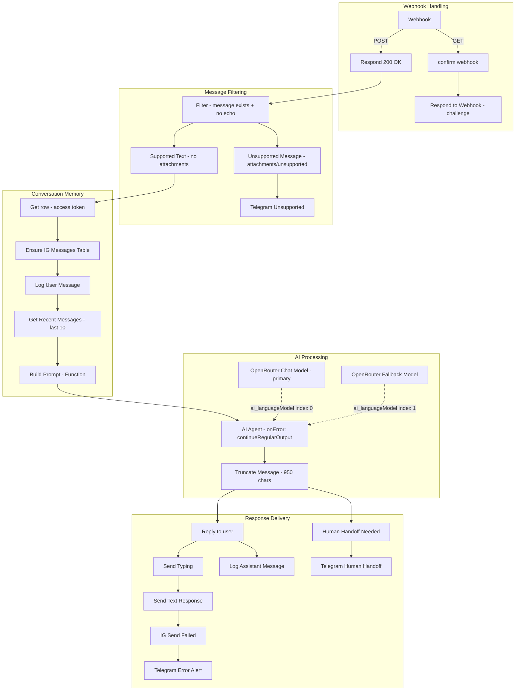

# Instagram DM Bot -- n8n Workflow Reference

**Workflow**: `68 Instagram Prod Access`
**Workflow ID**: `aHE4Q2nq07fYqUFelfoq7`
**Status**: Active, production
**Last Updated**: 2026-02-06

---

## Architecture Overview

The workflow handles Instagram DM automation via the Instagram Messaging API and an n8n webhook. It receives messages, runs them through an AI agent, and sends a reply -- all while logging conversations, detecting unsupported content, and notifying via Telegram on errors or handoff requests.



---

## Node Inventory (31 nodes)

### Webhook Handling

| Node                   | Type             | Purpose                                                                     |
| ---------------------- | ---------------- | --------------------------------------------------------------------------- |
| **Webhook**            | webhook          | Receives Instagram webhook events (GET for verification, POST for messages) |
| **confirm webhook**    | filter           | Checks `hub.mode=subscribe` + `hub.verify_token=tomcoustols`                |
| **Respond to Webhook** | respondToWebhook | Returns `hub.challenge` to Meta for webhook verification                    |
| **Respond 200 OK**     | respondToWebhook | Returns `EVENT_RECEIVED` immediately to prevent Instagram retries           |

### Message Filtering

| Node                     | Type        | Purpose                                                                                             |
| ------------------------ | ----------- | --------------------------------------------------------------------------------------------------- |
| **Filter**               | filter      | Passes items where `message` exists AND `message.is_echo` does not exist (blocks bot echo messages) |
| **Supported Text**       | filter      | Passes items where `message.attachments` and `message.is_unsupported` do not exist                  |
| **Unsupported Message**  | filter      | Catches items with `attachments` or `is_unsupported`                                                |
| **Telegram Unsupported** | httpRequest | Sends Telegram notification when unsupported message received. Uses `$node["Webhook"].json.body.entry[0].messaging[0].sender.id` for sender ID (upstream of Function, so `$node` syntax required) |

### Conversation Memory (n8n Data Tables)

| Node                         | Type      | Purpose                                                                                                       |
| ---------------------------- | --------- | ------------------------------------------------------------------------------------------------------------- |
| **Get row(s)1**              | dataTable | Fetches Instagram access token from `n8n test` data table (must have `access_token` column)                   |
| **Ensure IG Messages Table** | dataTable | Creates `instagram_messages` table if it doesn't exist (columns: `sender_id`, `role`, `content`, `timestamp`) |
| **Log User Message**         | dataTable | Inserts the incoming user message into `instagram_messages`                                                   |
| **Get Recent Messages**      | dataTable | Retrieves last 10 messages for the sender (ordered by timestamp)                                              |
| **Log Assistant Message**    | dataTable | Saves the AI response to `instagram_messages` after sending                                                   |

### AI Processing

| Node                          | Type              | Purpose                                                                                                                                                                                        |
| ----------------------------- | ----------------- | ---------------------------------------------------------------------------------------------------------------------------------------------------------------------------------------------- |
| **Build Prompt (Function)**   | function          | Takes up to 10 recent messages, builds a `User: ... / Assistant: ...` transcript, appends instruction to reply                                                                                 |
| **AI Agent**                  | agent (langchain) | Sales assistant for TC Dynamics. System prompt enforces: under 400 chars, reply in user language, warm tone, handoff phrase if needed. `needsFallback: true`, `onError: continueRegularOutput` |
| **OpenRouter Chat Model**     | lmChatOpenRouter  | Primary model: `openrouter/free` (ai_languageModel index 0)                                                                                                                                    |
| **OpenRouter Fallback Model** | lmChatOpenRouter  | Fallback model: `openrouter/free` (ai_languageModel index 1). Only invoked when primary model fails                                                                                             |
| **Truncate Message**          | function          | Caps output at 950 characters (Instagram limit is 1000 bytes). Falls back to handoff message if output is empty                                                                                |

### Response Delivery

| Node                       | Type        | Purpose                                                                                       |
| -------------------------- | ----------- | --------------------------------------------------------------------------------------------- |
| **Reply to user**          | filter      | Passes only when output does _not_ contain handoff phrases (no DM sent when handoff detected) |
| **Send Typing**            | httpRequest | `POST /v23.0/me/messages` with `sender_action: typing_on`                                     |
| **Send Text Response**     | httpRequest | `POST /v23.0/me/messages` with the AI reply text. Uses `alwaysOutputData: true`, `continueOnFail: true`, `fullResponse: true` so IG Send Failed can read `statusCode` |
| **IG Send Failed**         | filter      | Checks for `statusCode >= 400`, `error` exists, or `body.error` exists                        |
| **Telegram Error Alert**   | httpRequest | Sends Telegram notification with error details                                                |
| **Human Handoff Needed**   | filter      | Checks if AI output contains "connect you with our team" or "let me check"                    |
| **Telegram Human Handoff** | httpRequest | Sends Telegram notification requesting human intervention                                     |

### Token Refresh (separate trigger)

| Node                 | Type            | Purpose                                          |
| -------------------- | --------------- | ------------------------------------------------ |
| **Schedule Trigger** | scheduleTrigger | Runs every 30 days                               |
| **Get row(s)**       | dataTable       | Reads current access token                       |
| **HTTP Request1**    | httpRequest     | Calls `graph.instagram.com/refresh_access_token` |
| **Update row(s)**    | dataTable       | Saves refreshed token back to data table         |

---

## Key Expression Patterns

**Downstream of Function node** (Build Prompt): paired item tracking breaks, so use `.first()`:

```
$('Webhook').first().json.body.entry[0].messaging[0].sender.id
$('Truncate Message').first().json.output
$('Get row(s)1').first().json.access_token
```

**Upstream of Function** (e.g. Log User Message, Get Recent Messages): use `.item`:

```
$('Webhook').item.json.body.entry[0].messaging[0].sender.id
$('Webhook').item.json.body.entry[0].messaging[0].message.text
```

**Telegram Unsupported** (Unsupported Message branch): use `$node["Webhook"]` — `$('Webhook').item` may not resolve correctly in this branch:

```
$node["Webhook"].json.body.entry[0].messaging[0].sender.id
```

---

## Bugs Fixed During Implementation

### 1. Filters silently dropping valid messages

**Problem**: `Supported Text` and `Unsupported Message` used string-based `isEmpty`/`isNotEmpty` checks on `message.text`. When `message.text` was a string but the operator expected an object, n8n threw type errors or silently filtered everything out.

**Fix**: Changed `Supported Text` to check `message.attachments` notExists AND `message.is_unsupported` notExists. Changed `Unsupported Message` to check `attachments` exists OR `is_unsupported` exists. Both use loose type validation.

### 2. Rate limit on `openrouter/free` model

**Problem**: The generic `openrouter/free` model route can rotate into rate-limited models, causing `OpenAI: Rate limit reached` errors.

**Current state**: Live workflow uses `openrouter/free` for both primary and fallback. If rate limits persist, switch to specific free models: `meta-llama/llama-3.1-8b-instruct:free` (primary) and `google/gemma-2-9b-it:free` (fallback) for dedicated quotas.

### 3. Paired item errors downstream of Function node

**Problem**: `Send Text Response`, `Send Typing`, `Log Assistant Message`, and Telegram nodes all used `$('NodeName').item` which broke after `Build Prompt (Function)` condensed multiple items into one.

**Fix**: Changed all references to `$('NodeName').first()` in every node downstream of the Function node.

### 4. Type validation crashes in IG Send Failed

**Problem**: `IG Send Failed` used strict type validation. When `Send Text Response` returned an error string in `$json.error`, the filter expected an object and crashed.

**Fix**: Switched `IG Send Failed` and `Human Handoff Needed` to loose type validation.

### 5. Fallback model kills workflow even when primary succeeds

**Problem**: Two compounding issues caused the AI Agent to crash consistently:

1. **Both models used the generic `openrouter/free` route** instead of specific free models. The Bug #2 fix (documented above) was never actually applied to the live workflow. Since `openrouter/free` routes to a random free model, both primary and fallback shared the same rate limit pool and would fail together.
2. **No error handling on the AI Agent node.** n8n's native fallback (`needsFallback: true`, second model on `ai_languageModel` index 1) correctly tries the fallback when the primary fails. But when both models fail, n8n crashes at `executeBatch.ts` with `Cannot read properties of undefined (reading 'message')` because the agent has no `onError` handler.

Error logs confirmed this:

- Execution 175: Fallback model rate limited → `Cannot read properties of undefined (reading 'message')`
- Execution 168: Both models rate limited simultaneously → `OpenAI: Rate limit reached`

**Fix** (current live workflow):

1. Both models use `openrouter/free`. If rate limits persist, consider switching to specific models: `meta-llama/llama-3.1-8b-instruct:free` (primary) and `google/gemma-2-9b-it:free` (fallback) for dedicated quotas.
2. Set `onError: "continueRegularOutput"` on the AI Agent node (and Webhook node for resilience).

Now: primary fails → n8n tries the fallback model. If both somehow still fail, `continueRegularOutput` passes null output to `Truncate Message`, which catches empty output and substitutes "Let me connect you with our team who can help better." instead of crashing the workflow. The **Reply to user** filter then prevents that handoff message from being sent to Instagram (no DM), while **Human Handoff Needed** still triggers the Telegram notification.

### 6. Echo message loop (bot replying to itself)

**Problem**: When the bot sends a reply, Instagram sends the message back as a webhook event with `message.is_echo: true`. The `Filter` node checked the wrong path (`messaging[0].message_echo` -- doesn't exist) so echo events passed through, triggering the AI again and causing infinite loops / rate limit errors.

**Fix**: Updated `Filter` to check `messaging[0].message.is_echo` (correct path). Echo messages are now dropped at the earliest stage.

---

## Credentials and Configuration

| Resource               | Location                                                     | Notes                                             |
| ---------------------- | ------------------------------------------------------------ | ------------------------------------------------- |
| Instagram access token (messaging) | n8n Data Table `n8n test`                         | Must have row with `access_token` column          |
| Instagram access token (refresh)   | n8n Data Table `Plateform Access Token`           | Auto-refreshed every 30 days via Schedule Trigger |
| OpenRouter API key     | n8n Credential `OpenRouter account` (ID: `I47RUiCslWJxPDpf`) | Used by both primary and fallback models          |
| Telegram bot token     | n8n env var `TELEGRAM_BOT_TOKEN`                             | Used for all Telegram notifications               |
| Telegram chat ID       | n8n env var `TELEGRAM_CHAT_ID`                               | Target chat for notifications                     |
| Webhook verify token   | Hardcoded: `tomcoustols`                                     | Must match Meta App Dashboard config              |
| Webhook path           | `/webhook/ig-template`                                       | Exposed via ngrok                                 |

---

## Limitations and Known Issues

- **Telegram notifications**: Telegram nodes use `$env.TELEGRAM_BOT_TOKEN` and `$env.TELEGRAM_CHAT_ID`. If notifications do not arrive, verify these env vars are set in n8n and the bot/chat IDs are correct.
- **Handoff = no DM**: When human intervention is detected (AI outputs "connect you with our team" or "let me check"), the workflow sends **no message** to the user on Instagram, avoiding a repeated handoff message loop. Only the Telegram human-handoff notification is sent.
- **Free model rate limits**: Even specific `:free` models can hit rate limits under heavy use. Monitor Telegram error alerts. Consider a paid OpenRouter plan for production traffic.
- **No duplicate message detection**: If Instagram retries a webhook (e.g., slow 200 response), the same message may be processed twice. The `Respond 200 OK` node mitigates this but doesn't fully prevent it.
- **Ngrok dependency**: The webhook URL uses ngrok (`incretionary-natantly-kasha.ngrok-free.dev`). If ngrok restarts, the URL changes and Meta's webhook config must be updated.
- **Conversation memory is per-sender only**: `Get Recent Messages` queries by `sender_id`. It doesn't separate conversations by time gaps -- all messages from the same sender are in one thread.
- **No image/attachment handling**: Unsupported messages (images, stickers, voice) trigger a Telegram notification but no reply to the user.

---

## Testing Checklist

- [ ] Send a text DM -- bot should reply within ~10 seconds
- [ ] Send an image/sticker -- should trigger Telegram "unsupported" notification, no reply
- [ ] Check execution list -- echo webhook should stop at Filter (no error)
- [ ] Check `instagram_messages` data table -- should contain both user and assistant messages
- [ ] Wait for AI to say "connect you with our team" -- should trigger Telegram human handoff notification; user should receive **no** DM (no repeated handoff message)
- [ ] Intentionally break the access token -- should trigger Telegram error alert
