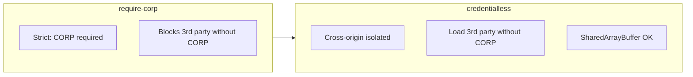
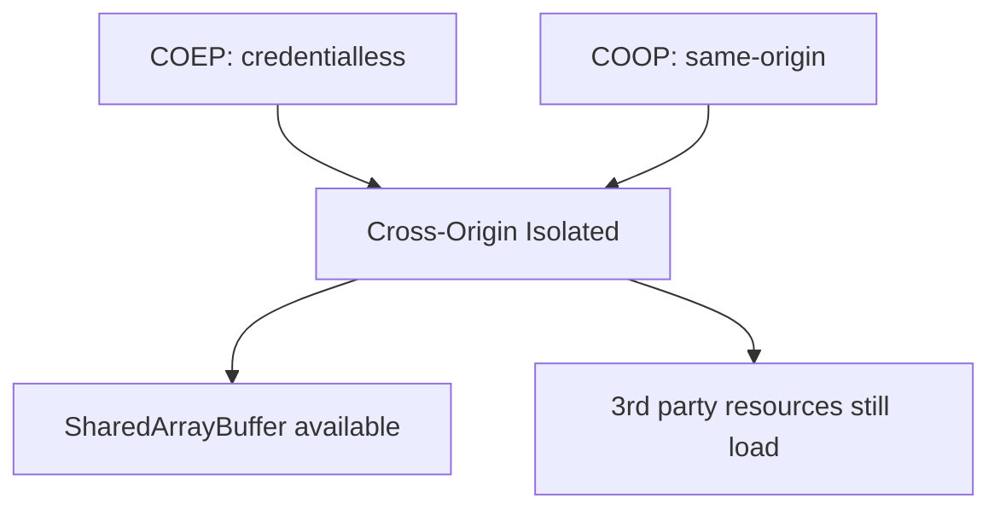

# COEP Header Rationale

## Why `Cross-Origin-Embedder-Policy: credentialless`?

We use `Cross-Origin-Embedder-Policy: credentialless` to enable high-performance browser features like `SharedArrayBuffer` while maintaining compatibility with third-party resources.

### COEP Options Compared

### Isolation Outcome

### The Problem

- Modern browser features (like `SharedArrayBuffer`, used by WASM libraries) require a "Cross-Origin Isolated" environment.
- Traditionally, this required:
  - `Cross-Origin-Opener-Policy: same-origin`
  - `Cross-Origin-Embedder-Policy: require-corp`
- `require-corp` is strict: it blocks **all** cross-origin subresources (images, scripts, styles) unless they explicitly send a `Cross-Origin-Resource-Policy` (CORP) header. Many 3rd party services (CDNs, analytics, social widgets) do not send this header, breaking the app.

### The Solution: `credentialless`

- `credentialless` provides the necessary isolation for `SharedArrayBuffer`.
- **Benefit**: It allows loading cross-origin resources _without_ requiring them to send CORP headers, by treating them as if they were requested without credentials (cookies, client certs).
- **Result**: We get security and high-performance features without breaking external integrations.

## References

- [MDN: Cross-Origin-Embedder-Policy](https://developer.mozilla.org/en-US/docs/Web/HTTP/Reference/Headers/Cross-Origin-Embedder-Policy)
- [Vercel Guide: SharedArrayBuffer is not defined](https://vercel.com/kb/guide/fix-shared-array-buffer-not-defined-nextjs-react)
