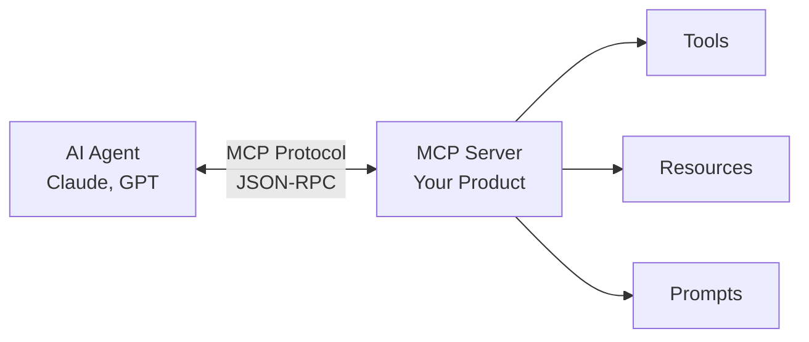

# MCP Layer Differentiation Strategy for TCDynamics

**Research Date**: 2026-01-09
**Method**: NIA Oracle Deep Research
**Purpose**: Explore how adding an MCP layer can differentiate TCDynamics from competitors
**Reference**: Nia from Nozomio by Arlan (YC S25) as a successful implementation example

---

## Executive Summary

The **Model Context Protocol (MCP)** is an open-source standard that acts as a "USB-C port for AI"—enabling AI applications to connect to external data sources, tools, and workflows through a unified interface. For TCDynamics WorkFlowAI, implementing an MCP layer could create a significant competitive moat by enabling AI agents to directly interact with workflows, integrations, and automation logic.

> [!IMPORTANT]
> MCP integration has demonstrated **27% improvement in agent task completion rates** through enhanced context augmentation, according to research on implementations like Nia.

---

## What is MCP (Model Context Protocol)?

MCP is an open standard developed to solve a critical challenge: AI agents need reliable, structured ways to access external capabilities without custom integrations for each tool.

### Core MCP Components

| Component            | Purpose                                            | Example                            |
| -------------------- | -------------------------------------------------- | ---------------------------------- |
| **MCP Server**       | Exposes tools, resources, and prompts to AI agents | Nia MCP server                     |
| **MCP Client**       | AI agent that consumes MCP capabilities            | Claude, Cursor, Windsurf           |
| **Tool Definitions** | Structured descriptions with typed parameters      | `search`, `read`, `explore`        |
| **Resources**        | Indexed data sources accessible to agents          | GitHub repos, documentation        |
| **Prompts**          | Reusable context templates                         | Research patterns, workflow guides |

### How MCP Works



---

## Nia by Nozomio: A Case Study in MCP Excellence

Nia is a YC S25-backed MCP server that enhances AI coding agents with indexed knowledge from GitHub repositories, documentation sites, and research papers.

### Key Success Factors

| Aspect                  | Implementation                               | Impact                             |
| ----------------------- | -------------------------------------------- | ---------------------------------- |
| **Tool Consolidation**  | 8 unified tools vs. fragmented APIs          | Reduced agent confusion            |
| **Semantic Search**     | AI-powered context retrieval                 | 27% task completion improvement    |
| **Knowledge Indexing**  | GitHub, docs, papers as searchable resources | Persistent context across sessions |
| **Enterprise Features** | SOC-2 compliance, audit logging              | Enterprise sales enablement        |
| **Pricing Model**       | Free tier → Pro ($19) → Enterprise           | Low friction adoption              |

### Nia's 8 Core Tools

| Tool                  | Purpose                                | TCDynamics Equivalent Opportunity       |
| --------------------- | -------------------------------------- | --------------------------------------- |
| `nia_search`          | Semantic search across indexed sources | Search workflows, templates, executions |
| `nia_read`            | Read content from repos/docs/packages  | Read workflow definitions, step data    |
| `nia_explore`         | Browse file structures                 | Explore workflow nodes, integrations    |
| `nia_grep`            | Regex search in code                   | Search expressions, credentials, logs   |
| `nia_index`           | Add new resources to index             | Index user workflows, templates         |
| `nia_research`        | AI-powered deep research               | Research integration patterns           |
| `nia_context`         | Cross-agent context sharing            | Share workflow context between sessions |
| `nia_manage_resource` | Manage indexed resources               | Manage workflow library                 |

### Key Insight from Nia

> Most MCP implementations fail because they expose too many granular tools. Nia succeeds by offering **8 thoughtfully consolidated tools** with clear decision patterns for when to use each.

---

## Strategic MCP Opportunities for TCDynamics WorkFlowAI

### Opportunity 1: Workflow-Aware AI Assistant

Enable AI agents to understand, modify, and create workflows through natural language.

```
User: "Create a workflow that sends a Slack notification
       when a Stripe payment fails, then creates a Jira ticket"

AI Agent (via MCP):
  1. nia_search → Find similar workflow templates
  2. nia_read → Read Stripe webhook node documentation
  3. workflowai_create → Generate workflow definition
  4. workflowai_deploy → Deploy to user's workspace
```

**Value Proposition**: Competitors require manual drag-and-drop; we enable voice/text-driven automation.

### Opportunity 2: Cross-Platform Workflow Intelligence

Make TCDynamics workflows searchable and executable from any MCP-compatible AI agent.

| Use Case            | Traditional Approach           | MCP-Enabled Approach                        |
| ------------------- | ------------------------------ | ------------------------------------------- |
| Find a workflow     | Login → Search UI → Browse     | "Find my Stripe webhook workflows"          |
| Debug failures      | Check execution logs manually  | "Why did my order workflow fail?"           |
| Create integrations | Research API docs → Build node | "Add Notion integration to my CRM workflow" |

### Opportunity 3: Template Marketplace with AI Discovery

Transform the template library into a semantic knowledge base.

**Current State** (Industry Standard):

- Category-based browsing
- Keyword search
- Manual installation

**MCP-Enhanced State**:

- Natural language template discovery
- AI-explained workflow logic
- Contextual recommendations based on existing workflows
- One-command deployment

### Opportunity 4: Workflow Debugging Copilot

Expose execution data and logs through MCP for AI-assisted debugging.

```javascript
// Proposed MCP Tools for Debugging
{
  "workflowai_get_execution": {
    "description": "Retrieve execution details including step data",
    "parameters": ["execution_id", "step_filter"]
  },
  "workflowai_analyze_failure": {
    "description": "AI-powered failure root cause analysis",
    "parameters": ["execution_id"]
  },
  "workflowai_suggest_fix": {
    "description": "Suggest fixes based on error patterns",
    "parameters": ["execution_id", "error_context"]
  }
}
```

---

## Proposed MCP Tool Architecture for TCDynamics

### Tier 1: Core Tools (MVP)

| Tool Name            | Description                                       | Priority |
| -------------------- | ------------------------------------------------- | -------- |
| `workflowai_search`  | Semantic search across workflows, templates, docs | Launch   |
| `workflowai_read`    | Read workflow definitions, step configurations    | Launch   |
| `workflowai_list`    | List user's workflows, executions, credentials    | Launch   |
| `workflowai_execute` | Trigger workflow execution                        | Launch   |

### Tier 2: Creation & Modification Tools

| Tool Name                     | Description                               | Priority |
| ----------------------------- | ----------------------------------------- | -------- |
| `workflowai_create`           | Create new workflow from natural language | Week 2-4 |
| `workflowai_modify`           | Modify existing workflow nodes            | Week 2-4 |
| `workflowai_template_install` | Install template to workspace             | Week 2-4 |
| `workflowai_debug`            | Analyze execution failures                | Week 2-4 |

### Tier 3: Advanced Capabilities

| Tool Name                         | Description                    | Priority |
| --------------------------------- | ------------------------------ | -------- |
| `workflowai_generate_integration` | AI-generated custom nodes      | Month 2+ |
| `workflowai_optimize`             | Suggest workflow optimizations | Month 2+ |
| `workflowai_context`              | Cross-session workflow memory  | Month 2+ |

---

## Technical Implementation Blueprint

### MCP Server Architecture

```
┌───────────────────────────────────────────────────────────┐
│                  TCDynamics MCP Server                    │
├───────────────────────────────────────────────────────────┤
│  Transport Layer: stdio | SSE | HTTP                     │
├───────────────────────────────────────────────────────────┤
│                                                           │
│  ┌─────────────┐  ┌─────────────┐  ┌─────────────────┐   │
│  │   Tools     │  │  Resources  │  │    Prompts      │   │
│  ├─────────────┤  ├─────────────┤  ├─────────────────┤   │
│  │ search      │  │ workflows   │  │ workflow_create │   │
│  │ read        │  │ templates   │  │ debug_guide     │   │
│  │ create      │  │ integrations│  │ best_practices  │   │
│  │ execute     │  │ executions  │  │                 │   │
│  └─────────────┘  └─────────────┘  └─────────────────┘   │
│                                                           │
├───────────────────────────────────────────────────────────┤
│  Backend Integration: WorkFlowAI API + MongoDB + Auth    │
└───────────────────────────────────────────────────────────┘
```

### Technology Stack

| Component      | Technology                             | Reason                             |
| -------------- | -------------------------------------- | ---------------------------------- |
| MCP SDK        | TypeScript (@modelcontextprotocol/sdk) | Official SDK, type safety with Zod |
| Transport      | stdio (local) + SSE (cloud)            | Standard patterns                  |
| Authentication | API Keys + OAuth                       | Match existing auth                |
| Search         | Vector DB (Pinecone/Supabase)          | Semantic search capability         |
| Caching        | Redis                                  | Tool response caching              |

### Sample Tool Implementation

```typescript
import { McpServer } from '@modelcontextprotocol/sdk/server/mcp.js'
import { z } from 'zod'

const server = new McpServer({
  name: 'workflowai',
  version: '1.0.0',
})

// Search workflows tool
server.tool(
  'workflowai_search',
  'Search workflows, templates, and documentation semantically',
  {
    query: z.string().describe('Natural language search query'),
    type: z.enum(['workflow', 'template', 'integration', 'all']).optional(),
    limit: z.number().max(20).default(10),
  },
  async ({ query, type, limit }) => {
    const results = await semanticSearch(query, { type, limit })
    return {
      content: [{ type: 'text', text: formatResults(results) }],
    }
  }
)

server.run()
```

---

## Competitive Analysis: MCP Differentiation Matrix

| Feature                   | n8n | Zapier | Make.com | TCDynamics + MCP     |
| ------------------------- | --- | ------ | -------- | -------------------- |
| Visual Builder            | ✅  | ✅     | ✅       | ✅                   |
| API Access                | ✅  | ✅     | ✅       | ✅                   |
| AI Assistant              | ❌  | Basic  | ❌       | **MCP-Native**       |
| Agent Integration         | ❌  | ❌     | ❌       | **✅ Full MCP**      |
| Natural Language Creation | ❌  | ❌     | ❌       | **✅ AI-Generated**  |
| Cross-Agent Context       | ❌  | ❌     | ❌       | **✅ Persistent**    |
| Semantic Template Search  | ❌  | ❌     | ❌       | **✅ Vector Search** |

> [!TIP]
> No major workflow automation platform currently offers MCP integration. This represents a **first-mover opportunity** to capture the AI-native automation market.

---

## Monetization Strategy

### Tiered Pricing Model (Inspired by Nia)

| Tier           | Price          | MCP Features                                    | Target              |
| -------------- | -------------- | ----------------------------------------------- | ------------------- |
| **Free**       | $0             | 100 MCP tool calls/month, basic search          | Individual users    |
| **Pro**        | $19/month      | 10K tool calls, workflow creation, debugging    | SME power users     |
| **Team**       | $49/user/month | Unlimited calls, shared context, team workflows | Growing teams       |
| **Enterprise** | Custom         | Private deployment, SSO, audit logs, SLA        | Large organizations |

### Per-Usage Pricing Options

| Metric            | Rate                 | Use Case                 |
| ----------------- | -------------------- | ------------------------ |
| Tool Calls        | $0.001/call          | High-volume automation   |
| Indexed Workflows | $0.10/workflow/month | Large template libraries |
| Semantic Searches | $0.01/search         | Heavy search users       |

---

## Implementation Roadmap

### Phase 1: Foundation (Weeks 1-2)

- [ ] Set up MCP server with TypeScript SDK
- [ ] Implement authentication via API keys
- [ ] Create `workflowai_search` tool with basic keyword search
- [ ] Create `workflowai_read` tool for workflow definitions
- [ ] Create `workflowai_list` tool for user's workflows
- [ ] Documentation for Claude Desktop integration

### Phase 2: Core Capabilities (Weeks 3-4)

- [ ] Add vector search with embedding models
- [ ] Implement `workflowai_execute` for manual triggers
- [ ] Create `workflowai_debug` for execution analysis
- [ ] Add Cursor/Windsurf integration guides
- [ ] Launch public beta

### Phase 3: Advanced Features (Month 2)

- [ ] Implement `workflowai_create` for natural language workflow creation
- [ ] Add `workflowai_modify` for node-level editing
- [ ] Build template semantic search
- [ ] Cross-session context persistence
- [ ] Usage tracking and billing integration

### Phase 4: Enterprise (Month 3+)

- [ ] Private/local MCP server deployment option
- [ ] SOC-2 compliance preparation
- [ ] Audit logging
- [ ] SSO integration
- [ ] Enterprise SLA

---

## Risk Assessment

| Risk                     | Mitigation                                                 |
| ------------------------ | ---------------------------------------------------------- |
| MCP protocol immaturity  | Follow official SDK updates, participate in working groups |
| Security concerns        | API key scoping, audit logging, rate limiting              |
| User adoption friction   | Provide one-click setup guides for major AI clients        |
| Tool overload for agents | Consolidate tools, create decision tree documentation      |
| Competitor fast-follow   | Move fast, build network effects with shared templates     |

---

## Key Takeaways

1. **MCP is the Interface Layer for AI-Native Products**: Just as REST APIs enabled web connectivity, MCP enables AI agent connectivity.

2. **First-Mover Advantage is Available**: No major workflow automation platform has MCP integration yet.

3. **Tool Design Matters More Than Tool Count**: Nia's success comes from 8 well-designed tools, not 100 fragmented ones.

4. **Context Persistence is a Killer Feature**: The ability to remember workflow context across sessions and agents creates stickiness.

5. **Enterprise Readiness Opens Revenue**: SOC-2, audit logging, and private deployment unlock enterprise budgets.

6. **Natural Language Automation is the Endgame**: MCP enables workflows to be created, modified, and debugged through conversation.

---

## Next Steps

1. **Validate with Users**: Survey existing users on AI assistant value proposition
2. **Prototype MCP Server**: Build minimal viable MCP with search + read tools
3. **Test with Claude Desktop**: Validate end-to-end flow with real AI agent
4. **Iterate on Tool Design**: Refine based on agent behavior patterns
5. **Plan Template Vectorization**: Prepare template library for semantic search

---

## References

- [Model Context Protocol Specification](https://modelcontextprotocol.io)
- [Nia by Nozomio Documentation](https://docs.nozomio.com)
- [MCPAgentBench Research (841 tasks, 20K+ tools)](https://arxiv.org/abs/2412.05839)
- [Anthropic MCP SDK](https://github.com/modelcontextprotocol/sdk)
- [Workflow Research](./workflow-research.md) - Foundation research for TCDynamics WorkFlowAI

---

**Note**: This document explores MCP as a strategic differentiator. Implementation decisions should align with TCDynamics' technical capacity, market positioning, and business priorities.
