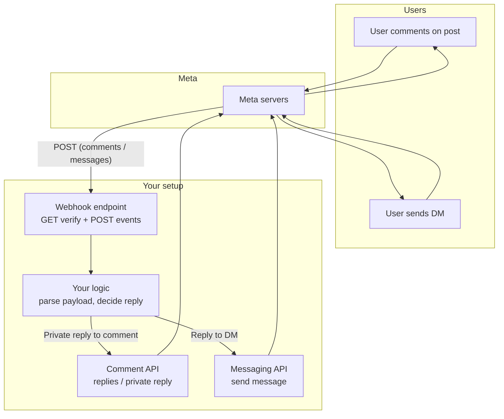
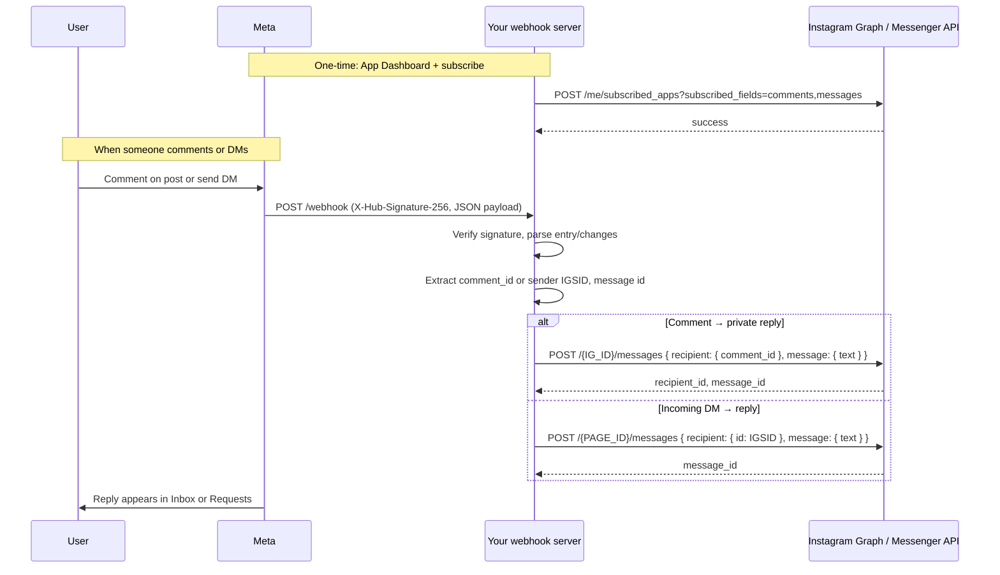
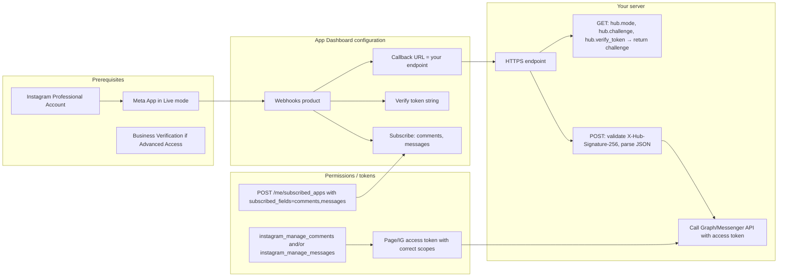

# Meta Instagram Comment & Message Automation — How It Works

This doc is built from **Nia-only** search and grep over the indexed Meta/Instagram documentation. It describes the flow, what’s needed, limitations, and use cases. Open-source options found via Nia are listed; none are indexed in Nia, so their content was not grepped.

---

## 1. Open source resources (Nia research, not indexed)

Nia research returned these repos; **none are in Nia’s index**, so they were **not** grepped or explored in-detail:

| Repo                                     | Description                                                                                                                            |
| ---------------------------------------- | -------------------------------------------------------------------------------------------------------------------------------------- |
| **fbsamples/graph-api-webhooks-samples** | Meta’s official sample: webhook endpoint (Node.js), verification, Heroku deploy. Used to receive Instagram (and other) webhook events. |
| **biggaji/insta-webhook**                | “Instagram Webhook Boilerplate” — community starter for Instagram webhooks.                                                            |

To **grep/explore** either repo you would need to **index** it in Nia first (e.g. `index(url: "https://github.com/fbsamples/graph-api-webhooks-samples")`), then use `nia_grep` / `nia_read` / `nia_explore`.

---

## 2. How it works — high-level flow

---

## 3. Detailed flow (what happens step by step)

---

## 4. What is needed for it to work

| Need                               | Detail                                                                                                                                                                                                                                                 |
| ---------------------------------- | ------------------------------------------------------------------------------------------------------------------------------------------------------------------------------------------------------------------------------------------------------ |
| **Instagram Professional Account** | Business or Creator; required for API.                                                                                                                                                                                                                 |
| **Meta App**                       | Created in Meta for Developers; set to **Live** so webhooks are delivered.                                                                                                                                                                             |
| **Webhook endpoint**               | Public HTTPS URL. **GET**: accept `hub.mode=subscribe`, `hub.verify_token`, `hub.challenge`; verify token, respond with `hub.challenge`. **POST**: validate `X-Hub-Signature-256` (SHA256 of body with App Secret), respond 200, then process payload. |
| **App Dashboard**                  | Webhooks product: Callback URL, Verify Token, subscribe to `comments` and `messages` (and optionally `live_comments`, `mentions`, etc.).                                                                                                               |
| **Enable subscriptions**           | `POST /me/subscribed_apps?subscribed_fields=comments,messages` with the correct access token (IG or Page).                                                                                                                                             |
| **Permissions**                    | For comments: `instagram_manage_comments` (+ `instagram_basic` etc.). For DMs: `instagram_manage_messages`. Facebook Login apps also need `pages_manage_metadata`, `pages_read_engagement`, `pages_show_list`.                                         |
| **Access token**                   | Instagram User token (Business Login for Instagram) or Facebook Page token (Facebook Login for Business); long-lived and with the scopes above.                                                                                                        |
| **Business Verification**          | Required if the app uses **Advanced Access** (e.g. used by accounts that don’t belong to you).                                                                                                                                                         |

---

## 5. Limitations (from indexed Meta docs)

| Limitation                       | Detail                                                                                                                                                             |
| -------------------------------- | ------------------------------------------------------------------------------------------------------------------------------------------------------------------ |
| **Private reply to comment**     | Only **one** private reply per comment; must be sent within **7 days** of the comment (except Live: only during the broadcast).                                    |
| **Inbox placement**              | Private reply goes to the user’s **Inbox** if they follow you, otherwise **Request** folder.                                                                       |
| **Messaging window**             | Standard messaging window (e.g. 24 hours) applies; for longer support you use **human agent** escalation (e.g. Handover Protocol, up to 7 days with message tags). |
| **App must be Live**             | Webhook notifications are only sent when the app is in **Live** mode.                                                                                              |
| **Advanced Access for comments** | Receiving `comments` (and `live_comments`) webhooks requires **Advanced Access** for those permissions.                                                            |
| **Public account for comments**  | The Instagram professional account must be **public** to get notifications for comments and @mentions.                                                             |
| **Inbox folders**                | Replies sent via API don’t control Instagram’s Inbox folders; third-party replies can move conversations to **General**.                                           |
| **Rate limits**                  | Graph/Messenger APIs have rate limits (e.g. per account, per endpoint); exact numbers are in Meta’s rate-limiting docs.                                            |

---

## 6. Good use cases

| Use case                     | Comment webhook                                                              | Messages webhook                                        | Notes                                                                         |
| ---------------------------- | ---------------------------------------------------------------------------- | ------------------------------------------------------- | ----------------------------------------------------------------------------- |
| “Comment X and we’ll DM you” | ✅ Subscribe `comments`, on new comment send private reply with `comment_id` | Optional                                                | Respect “one private reply per comment” and 7-day window.                     |
| Auto-reply to DMs            | Optional                                                                     | ✅ Subscribe `messages`, on incoming message send reply | Stay within messaging window; disclose automation if required.                |
| Comment moderation           | ✅ Subscribe `comments`, get/delete/hide/reply                               | —                                                       | Public replies via Comment API; private reply via messages with `comment_id`. |
| Live comment reply           | ✅ Subscribe `live_comments`                                                 | —                                                       | Reply only during the live broadcast.                                         |
| Human handover               | —                                                                            | ✅ Subscribe `messages` (+ handover)                    | Bot replies first; hand over to human when needed (Handover Protocol).        |
| @mention alerts              | ✅ `mentions` (or included in `comments`)                                    | —                                                       | React to @mentions (e.g. notify, log, or auto-reply).                         |

---

## 7. Source of truth (Nia-indexed docs)

All of the above is derived from **Nia search and nia_grep** over these indexed documentation sources (no open-source repos were indexed or grepped):

- Instagram Platform — **Webhooks** (endpoint, verify, subscribe, `subscribed_apps`, fields like `comments`, `messages`).
- Instagram Platform — **Comment Moderation** (get comments, replies).
- Instagram Platform — **Private Replies** (one reply per comment, 7 days, `comment_id`, Inbox/Requests).
- Messenger Platform — **Instagram Messaging Webhook** (receive DMs).
- Messenger Platform — **Instagram Send Message** (send reply to DMs).

Open-source repos found via **nia_research** (not indexed): **fbsamples/graph-api-webhooks-samples**, **biggaji/insta-webhook**. To explore their code with Nia, index the repo first then use `nia_grep` / `nia_read` / `nia_explore`.

---

## 8. Domain + n8n: what people do (Nia research)

Research via Nia (community.n8n.io, n8n docs, Meta docs) shows how people get their **Meta app** working when they have **both a domain and an n8n instance**.

### Two common setups

| Setup                            | What people do                                                                                                                                                                                                                                                                                            | Meta callback URL                                                 |
| -------------------------------- | --------------------------------------------------------------------------------------------------------------------------------------------------------------------------------------------------------------------------------------------------------------------------------------------------------- | ----------------------------------------------------------------- |
| **n8n URL only**                 | Point Meta’s webhook directly at the **n8n Webhook node URL** (e.g. `https://n8n.yourhost.com/webhook/xxx` or ngrok `https://xxx.ngrok-free.app`). One workflow: GET webhook for verification (return `hub.challenge`), POST webhook for comment/message events.                                          | n8n webhook URL                                                   |
| **Domain + n8n (reverse proxy)** | Run n8n behind a **reverse proxy** (nginx, Cloudflare, Caddy) on **your domain**. Set n8n’s **`WEBHOOK_URL`** to your public URL (e.g. `https://api.yourdomain.com`). Proxy forwards e.g. `https://api.yourdomain.com/webhook/...` to n8n. Meta’s callback is then **your domain**, not the raw n8n host. | Your domain (e.g. `https://api.yourdomain.com/webhook/instagram`) |

So: **if they have a domain but want logic in n8n**, they use the **reverse-proxy** approach: Meta calls their domain, proxy forwards to n8n; n8n still does verification (GET) and event handling (POST).

### What’s needed for it to work (from community + docs)

1. **App in Live mode** — Webhook events for real comments/messages are only sent when the app is **Live** (not Development).
2. **Webhook subscription toggle** — In Meta: **Instagram** product → Webhook config (or “Generate access token” tab). Turn **on** the webhook subscription toggle; otherwise Meta never sends POSTs even if verification succeeded.
3. **Subscribe in the right place** — Configure and subscribe in **Instagram** product → Webhooks (callback URL, verify token, subscribe to `comments` and `messages`). The generic “Webhooks” product tab is a different subscription; Instagram comment/message events use the **Instagram** webhook section.
4. **Verification (GET)** — Meta sends `hub.mode=subscribe`, `hub.verify_token`, `hub.challenge`. The endpoint (your domain or n8n URL) must return the **challenge** so Meta accepts the callback. In n8n: Webhook node in GET mode + Respond to Webhook (or Set node) that returns `{{ $json["query"]["hub.challenge"] }}` (or equivalent).
5. **Reverse proxy (if using your domain)** — Set `WEBHOOK_URL=https://api.yourdomain.com` (or your chosen base). Set `N8N_PROXY_HOPS=1` and have the proxy send `X-Forwarded-For`, `X-Forwarded-Host`, `X-Forwarded-Proto` so n8n builds correct webhook URLs and trusts the client.

### Limitations and gotchas (from community)

- **Facebook Trigger node** — Many reports of “Application Secret required” or verification failing when using only the Facebook Trigger node. Community workaround: use a **plain Webhook node** (GET for verify, POST for events) and call Meta APIs (e.g. HTTP Request node) yourself; or use the trigger only after credentials and subscription are confirmed.
- **Verify token** — You choose any string; put the same value in Meta’s “Verify token” field and in n8n (if the Webhook node uses it). No special format.
- **Ngrok / dynamic URLs** — For testing, people often use ngrok; paid ngrok keeps a stable URL. If the URL changes, update the callback in Meta and re-verify.
- **Two workflows** — Some use one workflow for GET (verification) and a second for POST (events) so the “production” webhook URL stays stable for Meta while the GET is only used during setup.

### Good use case for “domain + n8n”

- You want **one public URL** (your domain) for all integrations (Meta, Stripe, etc.) and don’t want to expose the n8n hostname.
- You want to **edit and debug** the “on comment / on message” logic in n8n (branching, HTTP calls to Meta, logging).
- You already run n8n behind a reverse proxy; adding `WEBHOOK_URL` and a route like `/webhook/instagram` gives you a stable, domain-based callback for Meta.
