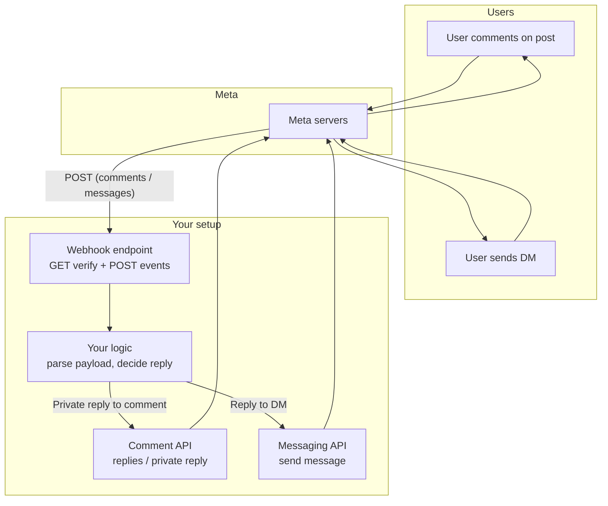
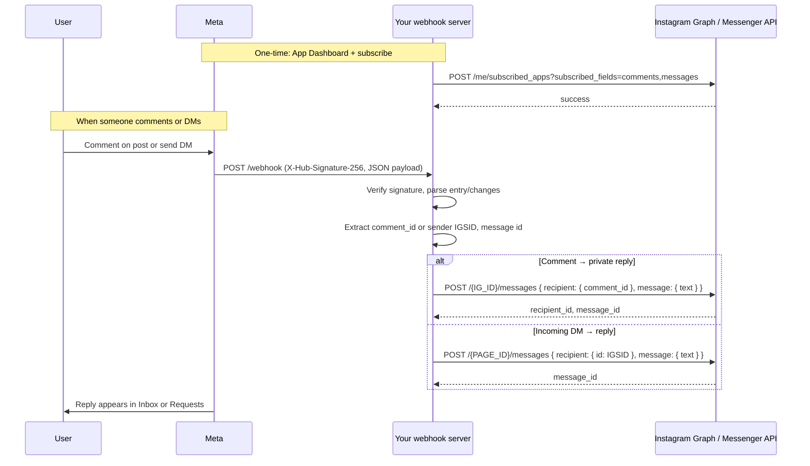
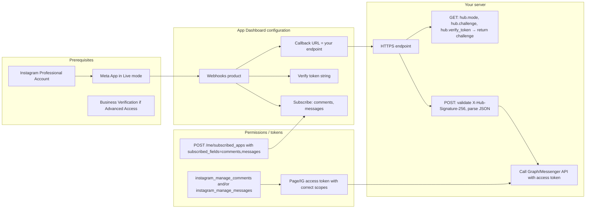

# Meta Social Automation: Instagram & TikTok

**Last Updated**: 2026-02-07
**Status**: Active

Comprehensive guide for automating Instagram (Meta) and TikTok presence using their official APIs, including process guides, automation flows, and API integration patterns.

---

## Table of Contents

1. [Process Guide: Menus, Where You Are, and What to Do Next](#process-guide-menus-where-you-are-and-what-to-do-next)
2. [Instagram Automation: Flow and Graph](#instagram-automation-flow-and-graph)
3. [Instagram & TikTok API Automation](#instagram--tiktok-api-automation)

---

## Process Guide: Menus, Where You Are, and What to Do Next

**Purpose:** One place to understand every menu you see (Meta Dashboard, Instagram API setup, n8n, Permissions, Verification, Graph API Explorer), where you are in the process, and the exact steps to finish Instagram comment/message automation.

---

### 1. Menu map — what each screen is for

| Where you are                                                         | What it's for                                                                                                                    |
| --------------------------------------------------------------------- | -------------------------------------------------------------------------------------------------------------------------------- |
| **Meta: My Apps → TCDynamics → Dashboard**                            | App overview: published status, rate limits, and which use cases are on (e.g. "Manage messaging & content on Instagram").        |
| **Meta: TCDynamics → Use cases → Customize use case → Instagram API** | The **5-step Instagram API setup**: (1) Permissions, (2) Generate tokens, (3) Webhooks, (4) Business login, (5) App review.      |
| **Meta: TCDynamics → Review → Verification**                          | **Business verification** (who you are) and **Access verification** (Tech Provider, optional).                                   |
| **Meta: TCDynamics → Use cases → Permissions and features**           | List of all Instagram/Facebook permissions; status (e.g. "Ready for testing" or "Add to App Review") and actions.                |
| **Meta: Tools → Graph API Explorer**                                  | Sandbox to **generate an access token**, pick permissions, and **test API calls** (e.g. `GET /me?fields=id,name`) before coding. |
| **n8n: Personal → Workflows**                                         | Your automation workflows. "Test Webhook Workflow" is where you'd receive Meta's webhook (GET for verify, POST for events).      |
| **n8n: Credentials**                                                  | Where you store **tokens and API keys** (e.g. Instagram/Meta token) for use in workflows.                                        |
| **n8n: Executions**                                                   | History of workflow runs (success/fail) for debugging.                                                                           |

So: **Meta** = app config, permissions, verification, tokens, webhook URL. **n8n** = the server that hosts the webhook and runs your automation logic.

---

### 2. Where you are in the process (status from your screenshots)

Summary:

- **Meta app:** TCDynamics is **Published**, use case "Manage messaging & content on Instagram" is on, no required actions, 0% rate limit.
- **Business verification:** **Done** (e.g. "Tom coustols" verified).
- **Instagram API 5-step setup:**
  - **Step 1 – Permissions:** Done (required messaging permissions added).
  - **Steps 2–5:** Not done yet: **Generate access tokens**, **Configure webhooks**, **Set up Instagram business login**, **Complete app review**.
- **Permissions and features:** Several are **"Ready for testing"** (e.g. `instagram_business_manage_messages`, `instagram_manage_comments`, `instagram_business_basic`, `instagram_basic`, `public_profile`). Others show "+ Add to App Review" when you need them for production.
- **Access verification (Tech Provider):** Optional; only needed if you need to access **other businesses'** Meta assets. You can ignore for now unless you're building a multi-tenant product.
- **Graph API Explorer:** TCDynamics is selected; no token generated yet — so you haven't run real API calls from there.
- **n8n:** You have workflows (e.g. "Test Webhook Workflow"); the **webhook URL** from n8n is not yet entered in Meta, and Meta's webhook is not yet verified/saved.

So in one sentence: **You're past app creation and permissions; next you must generate tokens, configure the webhook in Meta (using n8n's URL), set up business login, and then complete app review for live data.**

---

### 3. What is needed (high level)

From Nia-indexed Meta docs (this document consolidates the previous `meta-instagram-automation-graph.md`):

1. **Webhook endpoint**
   - Public HTTPS URL (your n8n webhook URL, or your domain with a reverse proxy in front of n8n, or your own API route that then calls n8n). **See § 3b** for a deep dive on **website vs n8n** (direct n8n, reverse proxy, or your app as listener).
   - **GET:** Accept `hub.mode=subscribe`, `hub.verify_token`, `hub.challenge`; if token matches, respond with `hub.challenge`.
   - **POST:** Validate `X-Hub-Signature-256`, respond 200, then process payload (comments/messages).

2. **Meta Dashboard configuration**
   - In **Instagram API → API setup with Instagram login**:
     - **Callback URL** = your webhook URL (e.g. n8n webhook or `https://api.yourdomain.com/webhook/instagram`).
     - **Verify token** = any string you choose; same value in Meta and in your endpoint (n8n).
   - Turn **on** the webhook subscription and subscribe to `comments` and/or `messages` (Instagram product → Webhooks).

3. **Access token**
   - Long-lived token with the right scopes (e.g. `instagram_manage_comments`, `instagram_business_manage_messages`, `instagram_business_basic`).
   - Generated after "Instagram business login" is set up; you can test in Graph API Explorer first.

4. **App in Live mode**
   - Already the case for TCDynamics (Published).
   - Webhooks for real comments/messages are only sent when the app is Live.

5. **App review (for production)**
   - Required for **advanced access** to live data from accounts you don't own.
   - For your own account/testing, "Ready for testing" is enough to generate tokens and receive webhooks in development/test mode.

So: **Menus** = where you configure the above; **what's needed** = webhook URL + verify token in Meta, working GET/POST in n8n, token with correct permissions, then app review when you go to production.

---

### 3b. Setup configuration (deep): website vs n8n, and when to use which

This section answers: **Should Meta call your website or n8n? And if you have a website, should it be the listener or just a proxy in front of n8n?**

#### Three possible setups

| Option                                             | Who receives the webhook first               | Meta callback URL                                                           | When to use                                                                                                                                                                                            |
| -------------------------------------------------- | -------------------------------------------- | --------------------------------------------------------------------------- | ------------------------------------------------------------------------------------------------------------------------------------------------------------------------------------------------------ |
| **1. n8n only**                                    | n8n                                          | Your n8n webhook URL (e.g. `https://n8n.yourhost.com/webhook/xxx` or ngrok) | Fastest to get going; you're fine exposing the n8n hostname or using ngrok for testing.                                                                                                                |
| **2. Your domain → reverse proxy → n8n**           | Your server (proxy), which forwards to n8n   | Your domain (e.g. `https://api.tcdynamics.fr/webhook/instagram`)            | You want **one public URL** for all integrations (Meta, Stripe, etc.), don't want to expose n8n, and you want **logic to stay in n8n** (edit workflows there).                                         |
| **3. Your website as the listener, then call n8n** | Your app (e.g. Vercel serverless or Express) | Your domain (e.g. `https://api.tcdynamics.fr/webhook/instagram`)            | You want **your code** to validate, log, or transform the payload first, then **trigger n8n** (e.g. via n8n's API or by forwarding the body). Logic is split: your app = gatekeeper, n8n = automation. |

#### Option 1: n8n only (Meta → n8n directly)

- **Meta callback URL:** the URL from your n8n Webhook node (e.g. `https://your-n8n-host.com/webhook/abc123` or `https://xxx.ngrok-free.app/webhook/abc123`).
- **Pros:** Easiest; no proxy or app code. GET/POST handled entirely in n8n.
- **Cons:** You expose the n8n hostname to Meta; if you use ngrok, URL can change (paid ngrok keeps it stable).
- **Config:** Nothing else. Just use the n8n webhook URL and verify token in Meta.

#### Option 2: Your domain (reverse proxy) → n8n

- **Meta callback URL:** your domain, e.g. `https://api.tcdynamics.fr/webhook/instagram`.
- **Flow:** Meta calls your domain → nginx/Cloudflare/Caddy forwards the request to n8n (e.g. `https://n8n.internal/webhook/instagram`). n8n still does GET (return `hub.challenge`) and POST (handle events). Meta never sees n8n's hostname.
- **Pros:** Single public URL; no n8n hostname exposed; all automation logic stays in n8n.
- **Config:**
  - **Reverse proxy:** Route `/webhook/instagram` (or `/webhook/`) to your n8n instance (e.g. by host or path).
  - **n8n:** Set `WEBHOOK_URL=https://api.tcdynamics.fr` (or your base URL) so n8n generates webhook URLs under your domain. Set `N8N_PROXY_HOPS=1` and ensure the proxy sends `X-Forwarded-For`, `X-Forwarded-Host`, `X-Forwarded-Proto` so n8n trusts the client and builds correct URLs.
- **Reference:** See [Domain + n8n: what people do](#8-domain--n8n-what-people-do-nia-research) section below.

#### Option 3: Your website as the listener, then call n8n

- **Meta callback URL:** your domain, e.g. `https://api.tcdynamics.fr/webhook/instagram`.
- **Flow:** Your app (e.g. Vercel serverless `api/webhooks/instagram.js` or Express route) receives GET/POST. You implement GET (verify token, return `hub.challenge`) and POST (validate `X-Hub-Signature-256`, return 200, then optionally forward the body to n8n or call n8n's "Execute Workflow" API to run your automation).
- **Pros:** Full control in your code (logging, rate limiting, multi-tenant routing); n8n is a downstream worker.
- **Cons:** You own signature validation and GET/POST logic; you must keep n8n in sync (e.g. forward the same payload n8n expects).
- **Config:** Your endpoint must:
  - **GET:** read `hub.mode`, `hub.verify_token`, `hub.challenge`; if token matches, respond with `hub.challenge`.
  - **POST:** verify `X-Hub-Signature-256` (HMAC SHA256 of raw body with App Secret), respond 200 quickly, then either POST the body to an n8n webhook URL or trigger n8n via API.

#### Recommendation for TCDynamics

- **Quickest path (testing / MVP):** **Option 1** — point Meta at your n8n webhook URL (or ngrok). No website changes.
- **If you want a single domain and logic in n8n:** **Option 2** — put a reverse proxy in front of n8n, set `WEBHOOK_URL`, use `https://api.tcdynamics.fr/webhook/instagram` (or similar) in Meta.
- **If you want your backend to be the single entry point for all webhooks (Stripe, Meta, etc.) and then delegate to n8n:** **Option 3** — implement the webhook route in your API (e.g. under `api/` or Express), then call n8n from there.

#### Test with n8n first, then merge with your website later?

**Yes.** You can start with **Option 1** (Meta → n8n directly, e.g. n8n or ngrok URL) to validate the flow, then switch to your website as the middleman later.

- **Meta:** The callback URL is just a setting in the App Dashboard. Change it to your new endpoint (e.g. `https://api.tcdynamics.fr/webhook/instagram`), re-enter the same verify token, and click **Verify and save**. No lock-in.
- **n8n:** The workflow (GET/POST logic) can stay the same. If you move to **Option 2**, you only add a reverse proxy and set `WEBHOOK_URL`; if you move to **Option 3**, your new API route receives the webhook and forwards the body to the same n8n webhook URL (or triggers n8n via API). So you're not rewriting the automation, just changing who receives the request first.

#### What people usually do (Nia research: n8n docs, community, web)

- **Start direct, then centralize:** Many people first point external services (Meta, Stripe, etc.) at **n8n's webhook URL** (or ngrok) to get something working, then later put **their own domain** in front — either via **reverse proxy to n8n** (Option 2) or **their API then n8n** (Option 3). (Sources: n8n docs "Configure webhook URLs with reverse proxy", community threads "How can I host my own webhook URL?", "Reverse proxy and custom webhook domain".)
- **Keep things separate vs one gateway:** Both patterns exist. "Keep separate" = each integration (Meta, Stripe) points to its own n8n webhook URL. "Merge" = one public URL (your domain) that either proxies to n8n (reverse proxy) or your API receives and then forwards to n8n. People often move to the single-URL approach when they want one place to manage security, logging, or company policy (n8n docs, community: WEBHOOK_URL, reverse proxy, N8N_PROXY_HOPS).
- **Monorepo:** In a monorepo, "website as middleman" usually means a webhook route inside your app (e.g. `api/webhooks/instagram.js` in Vercel, or a route in `apps/backend`). That route does GET/POST (and optionally validation), then POSTs to your n8n webhook URL or calls n8n's "Execute Workflow" API. n8n can stay in a separate deployment; your repo just gains one (or more) webhook handlers that delegate to n8n.

The rest of this guide (Steps A–F) assumes **Option 1 or 2** (n8n is the one doing GET/POST). If you choose **Option 3**, Step A becomes "Implement GET/POST in your app and optionally forward to n8n"; the verify token and callback URL still go in Meta the same way.

---

### 4. Ordered next steps (what to do)

Do these in order. Each step tells you **which menu** to use.

#### Step A: Get your n8n webhook URL and verify token

- **Where:** n8n → open (or create) the workflow that will handle Instagram (e.g. "Test Webhook Workflow").
- **What:**
  - Add a **Webhook** node.
  - Set it to respond to **GET** and **POST**.
  - For **GET:** output the value of `hub.challenge` when `hub.verify_token` equals a secret you choose (e.g. a long random string).
  - Copy the **Webhook URL** (e.g. `https://your-n8n-host.com/webhook/xxx` or ngrok URL).
  - Choose a **verify token** string and remember it (e.g. store in n8n as a constant or in Credentials).
- **Docs:** See [Domain + n8n: what people do](#8-domain--n8n-what-people-do-nia-research) section and Nia search: "Configure in App Dashboard … Set your endpoint URL … Enter your Verify Token."

##### n8n Webhook + Respond to Webhook (official n8n docs / n8n MCP)

From [n8n Webhook node](https://docs.n8n.io/integrations/builtin/core-nodes/n8n-nodes-base.webhook/) and [Respond to Webhook](https://docs.n8n.io/integrations/builtin/core-nodes/n8n-nodes-base.respondtowebhook/):

1. **Webhook node → Respond parameter** (three options):
   - **Immediately**: Returns "Workflow got started" — no custom body; Meta verification will fail because Meta needs the `hub.challenge` value in the response body.
   - **When Last Node Finishes**: Returns the output of the last node — use if the last node outputs the challenge.
   - **Using 'Respond to Webhook' Node**: The response is defined by a **Respond to Webhook** node in the workflow — use this for Meta so you can return `hub.challenge` for GET.

2. **To fix "Unused Respond to Webhook node" / "Verify that the Webhook node's Respond parameter is set to Using Respond to Webhook Node":**
   - Open the **Webhook** node (the trigger).
   - In **Parameters**, set **Respond** to **"Using 'Respond to Webhook' Node"** (exact wording in n8n).
   - Save. The Respond to Webhook node is then used and the warning goes away.

3. **Respond to Webhook node:**
   - **Respond With:** e.g. **Text** or **First Incoming Item**. For Meta GET verification, the response body must be the raw challenge string.
   - For **Text**: set **Response Body** to `{{ $json.query["hub.challenge"] }}` (Webhook puts query params in `query`). Optionally add **Response Headers** → `Content-Type: text/plain`.
   - For **First Incoming Item**: ensure the incoming item has a field that equals `hub.challenge` (e.g. a **Set** node before Respond to Webhook that sets `body = {{ $json.query["hub.challenge"] }}`, then in Respond to Webhook choose to respond with that field).
   - The node runs once with the first incoming item; place it after any node that passes the challenge through.

#### Step B: Configure webhooks in Meta (Step 3 of the 5-step flow)

- **Where:** Meta → TCDynamics → **Use cases** → **Customize use case** → **Instagram API** → **API setup with Instagram login** → step "Configure webhooks".
- **What:**
  - **Callback URL:** paste your n8n webhook URL from Step A.
  - **Verify token:** same string as in n8n.
  - Click **Verify and save**.
  - After verification, **subscribe** to the fields you need (e.g. `comments`, `messages`) in the Instagram product → Webhooks.
- **Important:** Turn **on** the webhook subscription toggle; otherwise Meta won't send POSTs even if verification succeeded (see your strategy doc § 8).
- **Note:** If your screenshot showed a different Instagram app (e.g. "n8n-IG"), do this in the app that you actually use for TCDynamics (same app as in the Dashboard).

#### Step C: Generate access tokens (Step 2 of the 5-step flow)

- **Where:**
  - **Option 1:** Same 5-step page → "Generate access tokens" → "Add an Instagram account" and follow the flow.
  - **Option 2:** **Tools → Graph API Explorer** (Meta app = TCDynamics).
- **What:**
  - In Graph API Explorer: click **Generate Access Token**, choose **User or Page** (or Instagram Business Account if shown), select the permissions you need (e.g. `instagram_basic`, `instagram_manage_comments`, `instagram_business_manage_messages`, `instagram_business_basic`).
  - Complete the login/authorization.
  - Copy the token; store it in **n8n → Credentials** (or in your workflow) so your workflow can call the Graph/Messenger API to reply to comments or DMs.
- **Docs:** Nia search result: "Generate Access Token … Use the Instagram Graph API with user credentials."

#### Step D: Set up Instagram business login (Step 4)

- **Where:** Same 5-step page → "Set up Instagram business login".
- **What:** Follow Meta's flow so businesses can securely grant your app permissions (required for production and for long-lived tokens). For a single business (yours), this is the step that makes "Generate access tokens" and token refresh work properly.
- **Docs:** Meta's in-product links and your strategy doc (§ 4, "Access token … Instagram User token (Business Login for Instagram)").

#### Step E: Complete app review (Step 5) when going to production

- **Where:** Meta → TCDynamics → **Review** → **App Review**.
- **What:** Submit the permissions you need for **advanced access** (e.g. comments/messages for accounts you don't own). For your own account and "Ready for testing" permissions, you can test without this; for live data from other businesses, App Review is required.
- **Docs:** Your strategy doc (§ 4: "Business Verification … Required if the app uses Advanced Access"; § 5: "Advanced Access for comments"). Nia: "App must be in Live Mode for production webhooks … Advanced Access level needed."

#### Step F: Test end-to-end in n8n

- **Where:** n8n → your Instagram webhook workflow.
- **What:**
  - Trigger a real comment or DM on the connected Instagram account (or use Meta's test tools if available).
  - Confirm **Executions** shows a successful run.
  - In the workflow, call the Graph/Messenger API (e.g. reply to comment or message) using the token from Step C.
  - Check that the reply appears on Instagram.
- **Docs:** See [Detailed flow](#3-detailed-flow-what-happens-step-by-step) and [Good use cases](#6-good-use-cases) sections above.

---

### 5. How this ties to your other docs

- **[Meta Social Automation](meta-social-automation.md)** (this document) — Flow, prerequisites, webhook GET/POST, permissions, limits; "domain + n8n" and verification toggle.
- **[Client Onboarding Strategy](../strategy/client-onboarding-strategy.md)** — Product onboarding (progress, templates, RGPD); not Meta setup.
- **[Architecture Overview](../architecture/architecture-overview.md)** — Where TCDynamics sits (frontend, API, DB, external services); the "Webhooks" box in the architecture is what you're configuring with Meta + n8n.
- **mcp-strategy.md** — MCP layer for AI/workflows; optional later; not required to finish Instagram automation.

---

### 6. Quick checklist (copy and tick)

- [ ] **A** – n8n webhook URL and verify token ready (GET returns `hub.challenge`).
- [ ] **B** – Meta: Callback URL + Verify token set; Verify and save; subscribe to `comments` and/or `messages`; subscription ON.
- [ ] **C** – Access token generated (Graph API Explorer or "Generate access tokens"), stored in n8n.
- [ ] **D** – Instagram business login set up.
- [ ] **E** – App review submitted (when you need advanced access / production).
- [ ] **F** – One real comment or DM received in n8n and reply sent via API.

---

### 7. Nia research used for this guide

- **Indexed Meta/Instagram docs in Nia:** `developers.facebook.com/docs/instagram-platform/webhooks`, `docs/instagram-api`, `docs/graph-api/webhooks/getting-started/webhooks-for-instagram`, and related Messenger/Instagram send-message and comment-moderation docs.
- **Nia search:** "Instagram API webhook setup callback URL verify token subscribe" — steps for endpoint, configure webhooks, verify token, subscribe to `comments`/`messages`, and Live Mode / Advanced Access.
- **Nia search:** "Instagram API setup with Instagram login generate access token webhook verify token app review" — create endpoint, verify token, configure in dashboard, app review requirements.
- This document was built from Nia-only search over indexed Meta docs; the domain + n8n, verification toggle, and GET/POST sections align with the steps above.

**Summary:** You're not lost — you're at "permissions done, verification done, app published; now wire the webhook and tokens." Use **Meta's Instagram API 5-step page** for steps 2–5, **Graph API Explorer** to get a token, and **n8n** as the webhook endpoint. Do steps A → B → C → D in order, then E when going live, then F to validate.

---

## Instagram Automation: Flow and Graph

This doc is built from **Nia-only** search and grep over the indexed Meta/Instagram documentation. It describes the flow, what's needed, limitations, and use cases. Open-source options found via Nia are listed; none are indexed in Nia, so their content was not grepped.

---

### 1. Open source resources (Nia research, not indexed)

Nia research returned these repos; **none are in Nia's index**, so they were **not** grepped or explored in-detail:

| Repo                                     | Description                                                                                                                            |
| ---------------------------------------- | -------------------------------------------------------------------------------------------------------------------------------------- |
| **fbsamples/graph-api-webhooks-samples** | Meta's official sample: webhook endpoint (Node.js), verification, Heroku deploy. Used to receive Instagram (and other) webhook events. |
| **biggaji/insta-webhook**                | "Instagram Webhook Boilerplate" — community starter for Instagram webhooks.                                                            |

To **grep/explore** either repo you would need to **index** it in Nia first (e.g. `index(url: "https://github.com/fbsamples/graph-api-webhooks-samples")`), then use `nia_grep` / `nia_read` / `nia_explore`.

---

### 2. How it works — high-level flow

---

### 3. Detailed flow (what happens step by step)

---

### 4. What is needed for it to work

| Need                               | Detail                                                                                                                                                                                                                                                 |
| ---------------------------------- | ------------------------------------------------------------------------------------------------------------------------------------------------------------------------------------------------------------------------------------------------------ |
| **Instagram Professional Account** | Business or Creator; required for API.                                                                                                                                                                                                                 |
| **Meta App**                       | Created in Meta for Developers; set to **Live** so webhooks are delivered.                                                                                                                                                                             |
| **Webhook endpoint**               | Public HTTPS URL. **GET**: accept `hub.mode=subscribe`, `hub.verify_token`, `hub.challenge`; verify token, respond with `hub.challenge`. **POST**: validate `X-Hub-Signature-256` (SHA256 of body with App Secret), respond 200, then process payload. |
| **App Dashboard**                  | Webhooks product: Callback URL, Verify Token, subscribe to `comments` and `messages` (and optionally `live_comments`, `mentions`, etc.).                                                                                                               |
| **Enable subscriptions**           | `POST /me/subscribed_apps?subscribed_fields=comments,messages` with the correct access token (IG or Page).                                                                                                                                             |
| **Permissions**                    | For comments: `instagram_manage_comments` (+ `instagram_basic` etc.). For DMs: `instagram_manage_messages`. Facebook Login apps also need `pages_manage_metadata`, `pages_read_engagement`, `pages_show_list`.                                         |
| **Access token**                   | Instagram User token (Business Login for Instagram) or Facebook Page token (Facebook Login for Business); long-lived and with the scopes above.                                                                                                        |
| **Business Verification**          | Required if the app uses **Advanced Access** (e.g. used by accounts that don't belong to you).                                                                                                                                                         |

---

### 5. Limitations (from indexed Meta docs)

| Limitation                       | Detail                                                                                                                                                             |
| -------------------------------- | ------------------------------------------------------------------------------------------------------------------------------------------------------------------ |
| **Private reply to comment**     | Only **one** private reply per comment; must be sent within **7 days** of the comment (except Live: only during the broadcast).                                    |
| **Inbox placement**              | Private reply goes to the user's **Inbox** if they follow you, otherwise **Request** folder.                                                                       |
| **Messaging window**             | Standard messaging window (e.g. 24 hours) applies; for longer support you use **human agent** escalation (e.g. Handover Protocol, up to 7 days with message tags). |
| **App must be Live**             | Webhook notifications are only sent when the app is in **Live** mode.                                                                                              |
| **Advanced Access for comments** | Receiving `comments` (and `live_comments`) webhooks requires **Advanced Access** for those permissions.                                                            |
| **Public account for comments**  | The Instagram professional account must be **public** to get notifications for comments and @mentions.                                                               |
| **Inbox folders**                | Replies sent via API don't control Instagram's Inbox folders; third-party replies can move conversations to **General**.                                           |
| **Rate limits**                  | Graph/Messenger APIs have rate limits (e.g. per account, per endpoint); exact numbers are in Meta's rate-limiting docs.                                            |

---

### 6. Good use cases

| Use case                     | Comment webhook                                                              | Messages webhook                                        | Notes                                                                         |
| ---------------------------- | ---------------------------------------------------------------------------- | ------------------------------------------------------- | ----------------------------------------------------------------------------- |
| "Comment X and we'll DM you" | ✅ Subscribe `comments`, on new comment send private reply with `comment_id` | Optional                                                | Respect "one private reply per comment" and 7-day window.                     |
| Auto-reply to DMs            | Optional                                                                     | ✅ Subscribe `messages`, on incoming message send reply | Stay within messaging window; disclose automation if required.                |
| Comment moderation           | ✅ Subscribe `comments`, get/delete/hide/reply                               | —                                                       | Public replies via Comment API; private reply via messages with `comment_id`. |
| Live comment reply           | ✅ Subscribe `live_comments`                                                 | —                                                       | Reply only during the live broadcast.                                         |
| Human handover               | —                                                                            | ✅ Subscribe `messages` (+ handover)                    | Bot replies first; hand over to human when needed (Handover Protocol).        |
| @mention alerts              | ✅ `mentions` (or included in `comments`)                                    | —                                                       | React to @mentions (e.g. notify, log, or auto-reply).                         |

---

### 7. Source of truth (Nia-indexed docs)

All of the above is derived from **Nia search and nia_grep** over these indexed documentation sources (no open-source repos were indexed or grepped):

- Instagram Platform — **Webhooks** (endpoint, verify, subscribe, `subscribed_apps`, fields like `comments`, `messages`).
- Instagram Platform — **Comment Moderation** (get comments, replies).
- Instagram Platform — **Private Replies** (one reply per comment, 7 days, `comment_id`, Inbox/Requests).
- Messenger Platform — **Instagram Messaging Webhook** (receive DMs).
- Messenger Platform — **Instagram Send Message** (send reply to DMs).

Open-source repos found via **nia_research** (not indexed): **fbsamples/graph-api-webhooks-samples**, **biggaji/insta-webhook**. To explore their code with Nia, index the repo first then use `nia_grep` / `nia_read` / `nia_explore`.

---

### 8. Domain + n8n: what people do (Nia research)

Research via Nia (community.n8n.io, n8n docs, Meta docs) shows how people get their **Meta app** working when they have **both a domain and an n8n instance**.

#### Two common setups

| Setup                            | What people do                                                                                                                                                                                                                                                                                            | Meta callback URL                                                 |
| -------------------------------- | --------------------------------------------------------------------------------------------------------------------------------------------------------------------------------------------------------------------------------------------------------------------------------------------------------- | ----------------------------------------------------------------- |
| **n8n URL only**                 | Point Meta's webhook directly at the **n8n Webhook node URL** (e.g. `https://n8n.yourhost.com/webhook/xxx` or ngrok `https://xxx.ngrok-free.app`). One workflow: GET webhook for verification (return `hub.challenge`), POST webhook for comment/message events.                                          | n8n webhook URL                                                   |
| **Domain + n8n (reverse proxy)** | Run n8n behind a **reverse proxy** (nginx, Cloudflare, Caddy) on **your domain**. Set n8n's **`WEBHOOK_URL`** to your public URL (e.g. `https://api.yourdomain.com`). Proxy forwards e.g. `https://api.yourdomain.com/webhook/...` to n8n. Meta's callback is then **your domain**, not the raw n8n host. | Your domain (e.g. `https://api.yourdomain.com/webhook/instagram`) |

So: **if they have a domain but want logic in n8n**, they use the **reverse-proxy** approach: Meta calls their domain, proxy forwards to n8n; n8n still does verification (GET) and event handling (POST).

#### What's needed for it to work (from community + docs)

1. **App in Live mode** — Webhook events for real comments/messages are only sent when the app is **Live** (not Development).
2. **Webhook subscription toggle** — In Meta: **Instagram** product → Webhook config (or "Generate access token" tab). Turn **on** the webhook subscription toggle; otherwise Meta never sends POSTs even if verification succeeded.
3. **Subscribe in the right place** — Configure and subscribe in **Instagram** product → Webhooks (callback URL, verify token, subscribe to `comments` and `messages`). The generic "Webhooks" product tab is a different subscription; Instagram comment/message events use the **Instagram** webhook section.
4. **Verification (GET)** — Meta sends `hub.mode=subscribe`, `hub.verify_token`, `hub.challenge`. The endpoint (your domain or n8n URL) must return the **challenge** so Meta accepts the callback. In n8n: Webhook node in GET mode + Respond to Webhook (or Set node) that returns `{{ $json["query"]["hub.challenge"] }}` (or equivalent).
5. **Reverse proxy (if using your domain)** — Set `WEBHOOK_URL=https://api.yourdomain.com` (or your chosen base). Set `N8N_PROXY_HOPS=1` and have the proxy send `X-Forwarded-For`, `X-Forwarded-Host`, `X-Forwarded-Proto` so n8n builds correct webhook URLs and trusts the client.

#### Limitations and gotchas (from community)

- **Facebook Trigger node** — Many reports of "Application Secret required" or verification failing when using only the Facebook Trigger node. Community workaround: use a **plain Webhook node** (GET for verify, POST for events) and call Meta APIs (e.g. HTTP Request node) yourself; or use the trigger only after credentials and subscription are confirmed.
- **Verify token** — You choose any string; put the same value in Meta's "Verify token" field and in n8n (if the Webhook node uses it). No special format.
- **Ngrok / dynamic URLs** — For testing, people often use ngrok; paid ngrok keeps a stable URL. If the URL changes, update the callback in Meta and re-verify.
- **Two workflows** — Some use one workflow for GET (verification) and a second for POST (events) so the "production" webhook URL stays stable for Meta while the GET is only used during setup.

#### Good use case for "domain + n8n"

- You want **one public URL** (your domain) for all integrations (Meta, Stripe, etc.) and don't want to expose the n8n hostname.
- You want to **edit and debug** the "on comment / on message" logic in n8n (branching, HTTP calls to Meta, logging).
- You already run n8n behind a reverse proxy; adding `WEBHOOK_URL` and a route like `/webhook/instagram` gives you a stable, domain-based callback for Meta.

---

## Instagram & TikTok API Automation

Your app is **published and verified**. This doc summarizes how to automate presence on **Instagram** (Meta) and **TikTok** using their official APIs, and how to use Nia-indexed sources for reference.

---

### Official APIs (use these for posting)

#### Instagram (Meta)

- **Docs (indexed in Nia):** [Instagram Platform – Content Publishing](https://developers.facebook.com/docs/instagram-api/guides/content-publishing)
- **Overview:** [Instagram Platform Overview](https://developers.facebook.com/docs/instagram-platform/overview)

**What you need**

- Instagram **professional account** (business or creator).
- App with **Instagram** product and either:
  - **Business Login for Instagram** → `graph.instagram.com`, tokens from Instagram login, or
  - **Facebook Login for Business** → `graph.facebook.com`, tokens from Facebook; account must be linked to a **Facebook Page**.
- Permissions for publishing:
  - Instagram Login: `instagram_business_basic`, `instagram_business_content_publish`
  - Facebook Login: `instagram_basic`, `instagram_content_publish`, `pages_read_engagement`
- **Advanced Access** (and App Review) if your app serves accounts you don't own.

**Publish flow**

1. **Create container** – `POST /<IG_ID>/media` with `image_url` or `video_url` (must be **public URL**), or `media_type=REELS` / `VIDEO` / `STORIES` / `CAROUSEL`.
2. For large videos: optional **resumable upload** to `rupload.facebook.com`.
3. **Publish** – `POST /<IG_ID>/media_publish` with `creation_id` = container ID.
4. Optionally **check status** – `GET /<IG_CONTAINER_ID>?fields=status_code`.
5. **Rate limit** – `GET /<IG_ID>/content_publishing_limit` to see usage; limit is **100 posts per 24h** (carousels count as one; 50 carousel posts per 24h).

**Automation**

- Host media on a public CDN or your app's public URLs.
- In your backend: scheduled jobs (e.g. cron, queue) that at the right time:
  - create container,
  - then call `media_publish`.
- No built-in "schedule at 3pm" in the API; scheduling is your app's responsibility.

---

#### TikTok

- **Docs:** [Content Posting API – Get Started](https://developers.tiktok.com/doc/content-posting-api-get-started)
- **Product:** [Content Posting API](https://developers.tiktok.com/products/content-posting-api/)

**What you need**

- **Registered app** on [TikTok for Developers](https://developers.tiktok.com/).
- **Content Posting API** product added; **Direct Post** configuration enabled.
- **`video.publish`** scope approved (and target user must have authorized it).
- **Audit**: unaudited apps have posts **restricted to private**; after [audit](https://developers.tiktok.com/application/content-posting-api), posts can be public.
- **Access token & open_id** for the TikTok user ([Login Kit / access tokens](https://developers.tiktok.com/doc/login-kit-manage-user-access-tokens)).
- Video: local file or **URL from a verified domain**; photo: **URL from verified domain** (see [media transfer guide](https://developers.tiktok.com/doc/content-posting-api-media-transfer-guide)).

**Publish flow**

1. **Query Creator Info** – `POST https://open.tiktokapis.com/v2/post/publish/creator_info/query/`.
2. **Init post**
   - Video: `POST .../v2/post/publish/video/init/` with `source_info.source` = `FILE_UPLOAD` or `PULL_FROM_URL`.
   - Photo: `POST .../v2/post/publish/content/init/` with `post_mode`, `media_type`, etc.
3. If `FILE_UPLOAD`: **upload** file to returned `upload_url` (PUT).
4. **Poll status** – `POST .../v2/post/publish/status/fetch/` with `publish_id`.

**Automation**

- Use **PULL_FROM_URL** with videos/photos on your **verified domain** so your server only triggers the API; TikTok pulls the file.
- Run a scheduler in your app to call "init" (and if needed upload) at the desired publish time; then poll status until done.

---

### Nia: what's indexed and how to use it

- **Meta/Instagram:**
  The Instagram API docs root is **indexed** in Nia:
  `https://developers.facebook.com/docs/instagram-api`
  After indexing finishes, use Nia **search** / **nia_read** on that documentation source for "content publishing", "media_publish", "rate limit", "reels", etc.
- **TikTok:**
  Official TikTok developer docs are **not** in Nia yet. Use the links above for implementation. For **TikTok data** (trending, hashtags, user info), the repo **`davidteather/TikTok-Api`** is indexed; it's for **reading/scraping** only (no posting).

---

### Suggested next steps for traction

1. **Instagram**
   - In your backend, add a "scheduled post" model (e.g. time, caption, media URL, type).
   - A cron or queue job runs periodically; for each due post it calls the Instagram Content Publishing flow (create container → publish).
   - Optionally call `content_publishing_limit` to avoid hitting the 100/24h limit.
2. **TikTok**
   - Verify a domain in TikTok for Developers; host video/photo URLs there.
   - Implement Direct Post: Creator Info → init (PULL_FROM_URL) → status fetch.
   - Schedule posts in your app and run a job that triggers init at publish time.
   - Complete TikTok's audit so posts can be public.
3. **Content and analytics**
   - Use **davidteather/TikTok-Api** (via Nia) for trending/hashtag data to inform **what** to post; use **official** Meta and TikTok APIs for **posting**.

---

### Quick links

| Resource                             | URL                                                                          |
| ------------------------------------ | ---------------------------------------------------------------------------- |
| Instagram Content Publishing         | https://developers.facebook.com/docs/instagram-api/guides/content-publishing |
| Instagram Platform Overview          | https://developers.facebook.com/docs/instagram-platform/overview             |
| TikTok Content Posting – Get Started | https://developers.tiktok.com/doc/content-posting-api-get-started            |
| TikTok Content Posting API product   | https://developers.tiktok.com/products/content-posting-api/                  |
| TikTok Content Posting API audit     | https://developers.tiktok.com/application/content-posting-api                |
| TikTok API reference (direct post)   | https://developers.tiktok.com/doc/content-posting-api-reference-direct-post  |
| Nia-indexed TikTok repo (read-only)  | `davidteather/TikTok-Api` (trending, hashtags, user – no posting)            |

---

**Last Updated**: 2026-02-07
