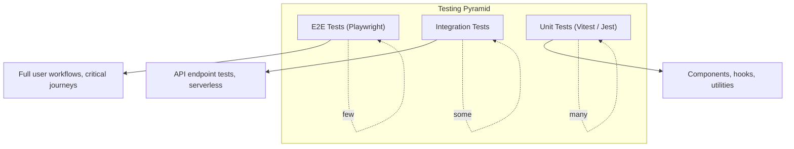
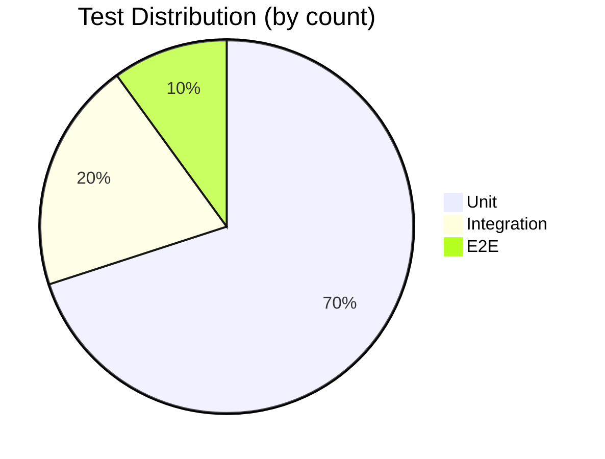

# Testing Strategy

**Last Updated**: 2026-01-09
**Status**: Active

Testing strategy, patterns, and coverage goals for the TCDynamics WorkFlowAI project.

## Overview

The project uses a testing pyramid approach with unit tests, component tests, integration tests, and E2E tests. Different testing frameworks are used for different parts of the codebase.

## Testing Pyramid





## Testing Frameworks

### Frontend Testing

**Framework**: Vitest + React Testing Library

- **Location**: `apps/frontend/src/**/__tests__/`
- **Test Files**: `*.test.ts`, `*.test.tsx`
- **Configuration**: `apps/frontend/vitest.config.ts`

**Features**:
- Fast unit tests with Vitest
- Component testing with React Testing Library
- jsdom environment for DOM testing
- Coverage reporting with v8 provider
- Global test utilities in `apps/frontend/src/test/utils.tsx`

### Backend Testing

**Framework**: Jest + Supertest

- **Location**: `apps/backend/src/**/__tests__/`
- **Test Files**: `*.test.js`, `__tests__/**/*.js`
- **Configuration**: `apps/backend/jest.config.js`

**Features**:
- Node.js environment
- API endpoint testing with Supertest
- Express route testing
- Coverage reporting

### E2E Testing

**Framework**: Playwright

- **Location**: `tests/e2e/`
- **Test Files**: `*.spec.ts`
- **Configuration**: `apps/frontend/playwright.config.ts`

**Features**:
- Cross-browser testing (Chromium, Firefox, WebKit)
- Mobile viewport testing
- Visual regression testing
- Trace recording on failures
- Screenshot and video capture

## Coverage Goals

### Current Coverage Thresholds

**Frontend** (Vitest):
- Branches: 60%
- Functions: 60%
- Lines: 60%
- Statements: 60%

**Backend** (Jest):
- Branches: 70%
- Functions: 70%
- Lines: 70%
- Statements: 70%

**Quality Gate**: Enforces 60% minimum coverage for frontend in CI/CD.

### Coverage Goals by Type

| Test Type | Target Coverage | Current Status |
|-----------|----------------|----------------|
| Unit Tests | 80%+ | ~60-70% |
| Component Tests | 70%+ | Growing |
| Integration Tests | 60%+ | Limited |
| E2E Tests | Critical Paths | Partial |

## Test Organization

### Frontend Test Structure

```
apps/frontend/src/
├── components/
│   ├── ui/
│   │   └── __tests__/
│   │       └── button.test.tsx
│   └── __tests__/
│       └── Hero.test.tsx
├── pages/
│   └── __tests__/
│       └── Features.test.tsx
├── hooks/
│   └── __tests__/
│       └── useContactForm.test.ts
└── test/
    ├── utils.tsx          # Test utilities
    └── setup.ts            # Test setup
```

### Backend Test Structure

```
apps/backend/src/
├── routes/
│   └── __tests__/
│       └── contact.test.js
├── services/
│   └── __tests__/
│       └── email.test.js
└── __tests__/
    └── setup.js            # Test setup
```

### E2E Test Structure

```
tests/e2e/
├── navigation.spec.ts
├── contact-flow.spec.ts
├── third-party-resources.spec.ts
├── global-setup.ts
└── global-teardown.ts
```

## Testing Patterns

### Component Testing

**Pattern**: Render components with required providers.

```typescript
// apps/frontend/src/test/utils.tsx
import { renderWithProviders } from '@/test/utils'

test('renders component correctly', () => {
  const { getByText } = renderWithProviders(<MyComponent />)
  expect(getByText('Hello')).toBeInTheDocument()
})
```

**Utilities**:
- `renderWithClerk()` - Render with ClerkProvider
- `renderWithQueryClient()` - Render with QueryClientProvider
- `renderWithProviders()` - Render with all providers

### Hook Testing

**Pattern**: Test hooks in isolation with renderHook.

```typescript
import { renderHook } from '@testing-library/react'
import { useMyHook } from '@/hooks/useMyHook'

test('hook returns expected value', () => {
  const { result } = renderHook(() => useMyHook())
  expect(result.current.value).toBe(expected)
})
```

### API Testing

**Pattern**: Mock fetch or use MSW (Mock Service Worker).

```typescript
import { vi } from 'vitest'

vi.mock('@/api/endpoint', () => ({
  fetchData: vi.fn(() => Promise.resolve({ data: 'test' }))
}))
```

### E2E Testing

**Pattern**: Test full user workflows.

```typescript
import { test, expect } from '@playwright/test'

test('user can submit contact form', async ({ page }) => {
  await page.goto('/')
  await page.fill('input[name="name"]', 'John Doe')
  await page.fill('input[name="email"]', 'john@example.com')
  await page.click('button[type="submit"]')
  await expect(page.locator('text=Success')).toBeVisible()
})
```

## Mocking Strategies

### Frontend Mocking

**Vitest Mocks**:
- Use `vi.mock()` for module mocking
- Mock external dependencies (API calls, third-party libraries)
- Mock environment variables with `vi.stubEnv()`

**Example**:
```typescript
import { vi } from 'vitest'

vi.mock('@/api/endpoint', () => ({
  fetchData: vi.fn()
}))

vi.stubEnv('VITE_FEATURE_ENABLE_CACHE', 'true')
```

### Backend Mocking

**Jest Mocks**:
- Use `jest.mock()` for module mocking
- Mock database connections
- Mock external API calls

**Example**:
```javascript
jest.mock('../lib/mongodb', () => ({
  connectToDatabase: jest.fn()
}))
```

### E2E Mocking

**Playwright**:
- Use `page.route()` for API mocking
- Mock network requests
- Simulate offline/online states

**Example**:
```typescript
await page.route('/api/**', route => {
  route.fulfill({ json: { success: true } })
})
```

## Test Execution

### Running Tests Locally

```bash
# Frontend tests (Vitest)
npm run test:frontend              # Run all frontend tests
npm run test:frontend:watch        # Watch mode
npm run test:frontend:coverage     # With coverage

# Backend tests (Jest)
npm run test:backend               # Run all backend tests
npm run test:backend:watch         # Watch mode
npm run test:backend:coverage      # With coverage

# E2E tests (Playwright)
npm run test:e2e                   # Run E2E tests
npm run test:e2e:ui                # UI mode
npm run test:e2e:debug             # Debug mode

# All tests
npm run test                       # Run all tests
npm run test:coverage              # All tests with coverage
```

### Running Tests in CI/CD

Tests run automatically in GitHub Actions:

- **On PR**: Quality gate runs frontend tests with coverage
- **On Push**: Quality gate runs tests before deployment
- **E2E Tests**: Run in separate workflow (if configured)

See [CI/CD Guide](../deployment/ci-cd.md) for details.

## Best Practices

### Unit Tests

1. **Test behavior, not implementation** - Test what the component does, not how it does it
2. **Use semantic queries** - Prefer `getByRole`, `getByLabelText` over `getByTestId`
3. **Test user interactions** - Simulate user actions (clicks, typing)
4. **Isolate tests** - Each test should be independent
5. **Mock external dependencies** - Don't make real API calls in unit tests

### Component Tests

1. **Test accessibility** - Verify ARIA attributes and keyboard navigation
2. **Test error states** - Verify error handling and error messages
3. **Test loading states** - Verify loading indicators and disabled states
4. **Test edge cases** - Empty states, invalid inputs, boundary conditions

### Integration Tests

1. **Test API endpoints** - Verify request/response handling
2. **Test database operations** - Verify data persistence and queries
3. **Test authentication** - Verify auth flows and protected routes

### E2E Tests

1. **Test critical paths** - Focus on high-value user journeys
2. **Test across browsers** - Verify cross-browser compatibility
3. **Test on mobile** - Verify responsive design
4. **Use data-testid sparingly** - Prefer semantic selectors

## Test Coverage

### Coverage Reports

**Frontend**:
- Generated in `apps/frontend/coverage/`
- HTML report: `coverage/index.html`
- LCOV report: `coverage/lcov.info`
- Uploaded to Codecov in CI/CD

**Backend**:
- Generated in `apps/backend/coverage/`
- HTML report: `coverage/index.html`
- LCOV report: `coverage/lcov.info`

### Viewing Coverage

```bash
# Frontend coverage
npm run test:frontend:coverage
open apps/frontend/coverage/index.html

# Backend coverage
npm run test:backend:coverage
open apps/backend/coverage/index.html
```

## Test Utilities

### Frontend Test Utilities

**Location**: `apps/frontend/src/test/utils.tsx`

**Utilities**:
- `renderWithClerk()` - Render with ClerkProvider
- `renderWithQueryClient()` - Render with QueryClientProvider
- `renderWithProviders()` - Render with all providers (Clerk + QueryClient + Router)

**Test Setup**: `apps/frontend/src/test/setup.ts`
- Global test configuration
- Mock setup
- Matcher extensions

### Backend Test Utilities

**Location**: `apps/backend/src/__tests__/setup.js`

**Utilities**:
- Test database connection
- Mock setup
- Test helpers

## Performance Testing

### Load Testing

**Not Currently Implemented**

Recommendation: Add load testing for critical API endpoints using tools like:
- k6
- Artillery
- Apache Bench (ab)

### Performance Monitoring

- **Vercel Analytics**: Automatic performance metrics
- **Sentry**: Performance monitoring with traces
- **PerformanceMonitor**: Custom performance monitoring component

See [Monitoring Guide](../deployment/monitoring.md) for details.

## Security Testing

### Current Security Testing

- **API Validation**: Input validation tests
- **Authentication**: Auth flow tests
- **Rate Limiting**: Rate limit tests

### Recommended Additions

- **OWASP ZAP**: Security scanning
- **Dependency Scanning**: npm audit, Snyk
- **Secret Scanning**: GitGuardian, TruffleHog

## Related Documentation

- [Testing Guide](../TESTING_GUIDE.md) - API Keys feature testing guide
- [API Key Testing](./api-keys.md) - Detailed API key management UI testing procedures
- [E2E Testing Guide](./e2e.md) - Playwright E2E testing guide
- [CI/CD Guide](../deployment/ci-cd.md) - Test execution in CI/CD

---

**Last Updated**: 2026-01-09
