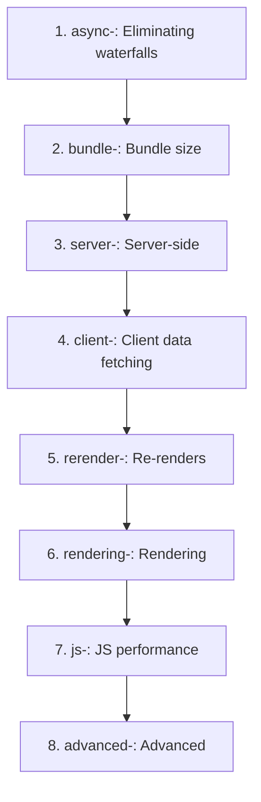
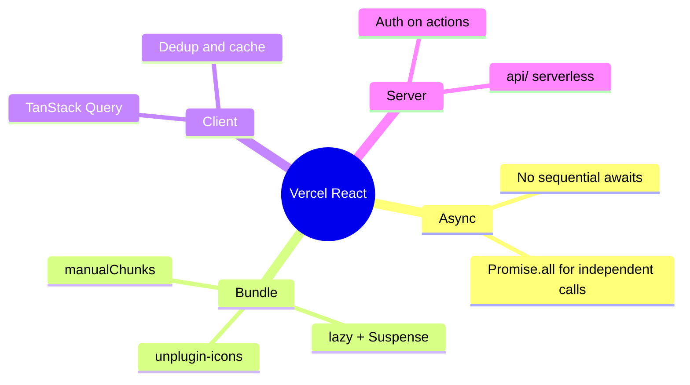

# Vercel React Best Practices – TCDynamics Frontend

Quick reference for applying the **Vercel React Best Practices** skill in this project.  
Full rules: `~/.cursor/skills/vercel-react-best-practices/` (see `SKILL.md` and `rules/*.md`).

### Rule Categories (by priority)

---

## When to use

- Writing or refactoring React components
- Adding or changing data fetching
- Improving bundle size or load time
- Reviewing code for performance

---

## What we already do (aligned)

| Practice | Where / How |
|----------|-------------|
| **async-parallel** | No independent sequential awaits in critical paths; API calls are single-request or token-dependent. |
| **bundle-dynamic-imports** | Route-level `lazy()` in `App.tsx`; `LazyAIChatbot`; heavy pages (Dashboard, Chat, Files, etc.) are code-split. |
| **bundle-defer-third-party** | Vercel Analytics loaded via `lazy()` and rendered only after consent (`ConsentAnalytics`). |
| **client-swr-dedup** | TanStack Query for server state: request deduplication, caching, `staleTime`/`gcTime` configured. |
| **Suspense** | `Suspense` + `PageSkeleton` for routes; `LazyAIChatbot` has its own fallback. |
| **Barrel imports** | No `lucide-react` barrel; icons via `unplugin-icons` (`~icons/lucide/...`). UI imports are direct (`@/components/ui/button`, etc.). |
| **Bundle layout** | `vite.config.ts`: `manualChunks` for vendor, router, ui (Radix), query, utils. |

---

## Recommended next steps (by priority)

1. **bundle-barrel-imports**  
   If we add `lucide-react` (or similar) later, use direct imports or Vite’s equivalent of `optimizePackageImports` so we don’t pull the full barrel.

2. **async-parallel**  
   When adding multiple independent API calls in one flow, use `Promise.all([...])` instead of sequential `await` (e.g. in new hooks or API helpers).

3. **rendering-conditional-render**  
   For numeric (or other falsy) conditions in JSX, use `count > 0 ? <Node /> : null` instead of `count && <Node />` to avoid rendering `0` or `NaN`.

4. **rerender-***  
   When touching state and effects: prefer derived state in render, primitive effect deps, `useMemo`/`useCallback` only where needed, and `startTransition` for non-urgent updates.

5. **server-*** (API / backend)  
   For any server-side or API logic: auth on all actions, minimize serialized payloads, parallelize independent fetches. Our API is in `api/` (Vercel serverless); backend in `apps/backend`.

---

## Rule categories (from skill)

| Priority | Category | Prefix |
|----------|----------|--------|
| 1 | Eliminating waterfalls | `async-` |
| 2 | Bundle size | `bundle-` |
| 3 | Server-side | `server-` |
| 4 | Client data fetching | `client-` |
| 5 | Re-renders | `rerender-` |
| 6 | Rendering | `rendering-` |
| 7 | JS performance | `js-` |
| 8 | Advanced | `advanced-` |

Note: Rules mentioning `next/dynamic` or Next-specific APIs map to **Vite + React** here: use `React.lazy()` + `Suspense` (as we already do) instead of `next/dynamic`.
