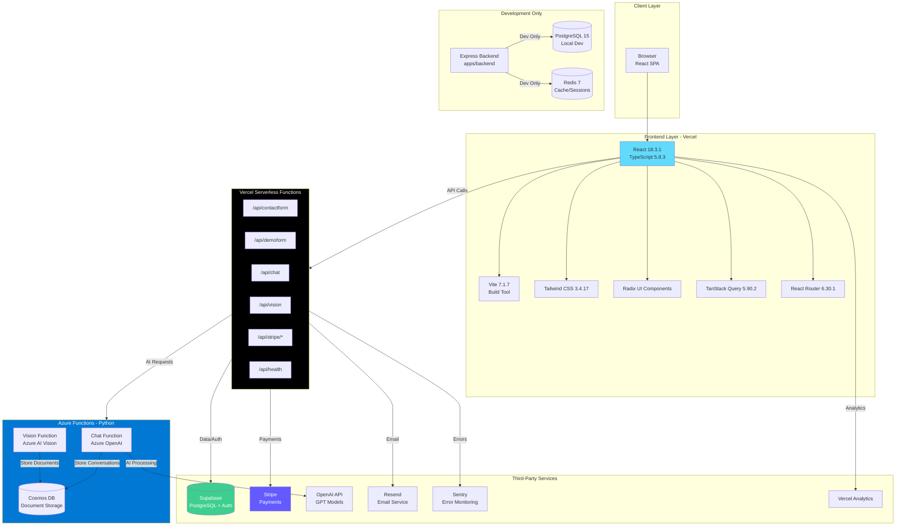
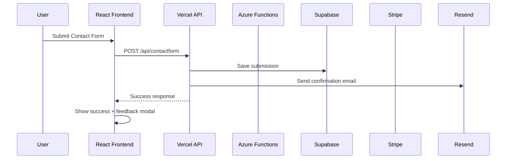
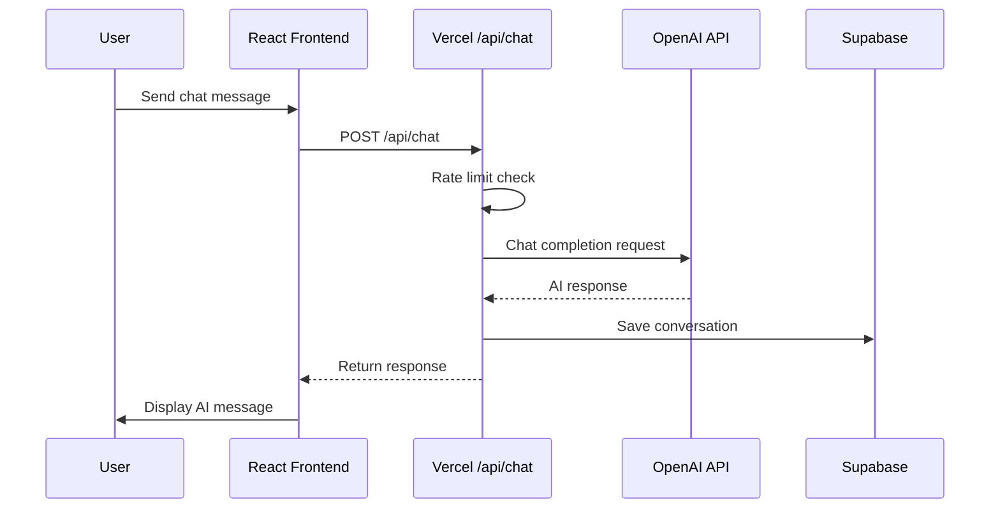
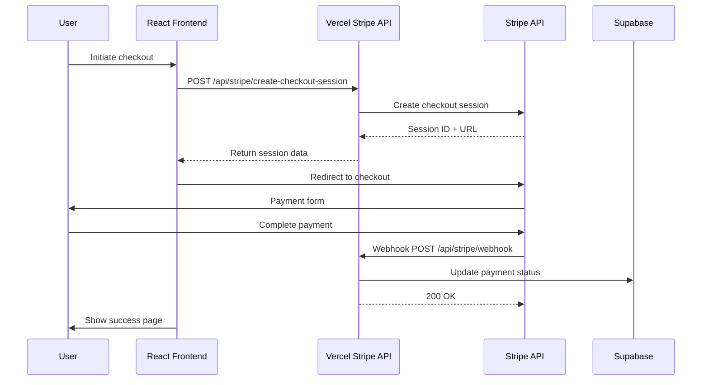
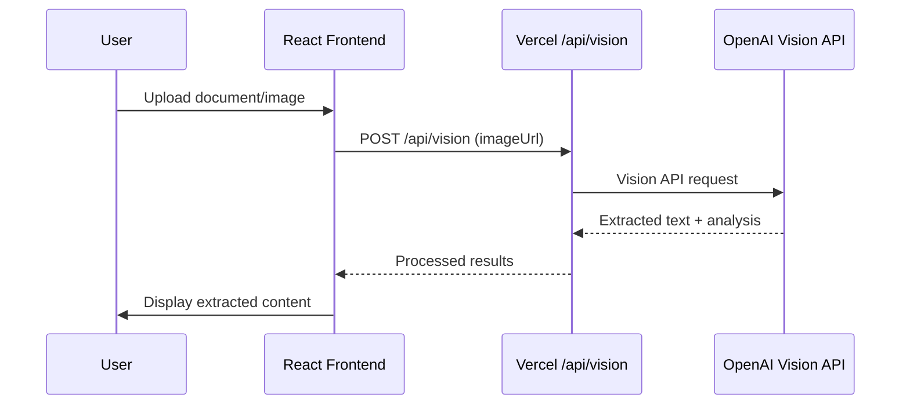

# TCDynamics Full Stack Architecture Documentation

## Overview

TCDynamics is a **hybrid serverless architecture** combining React frontend, Vercel serverless functions, Azure Functions, and multiple third-party services. The system is designed for scalability, performance, and developer experience.

## Architecture Diagram



## Technology Stack Breakdown

### Frontend Layer (`apps/frontend`)

**Core Framework:**

- **React 18.3.1** - UI library with hooks and concurrent features
- **TypeScript 5.8.3** - Type safety and developer experience
- **Vite 7.1.7** - Fast build tool with HMR (Hot Module Replacement)

**State Management & Data Fetching:**

- **TanStack Query 5.90.2** - Server state management, caching, and synchronization
- **React Router 6.30.1** - Client-side routing

**UI Components:**

- **Tailwind CSS 3.4.17** - Utility-first CSS framework
- **Radix UI** - Accessible, unstyled component primitives
- **Lucide React** - Icon library

**Validation & Forms:**

- **Zod 3.25.76** - Schema validation for forms and API responses

**Testing:**

- **Vitest 3.2.4** - Unit testing framework
- **Playwright** - End-to-end testing
- **React Testing Library** - Component testing

**Deployment:**

- **Vercel** - Frontend hosting with automatic deployments from GitHub

### API Layer (`api/` - Vercel Serverless Functions)

**Runtime:** Node.js 18+ (Vercel serverless environment)

**Key Endpoints:**

- `/api/contactform` - Contact form submissions
- `/api/demoform` - Demo request submissions
- `/api/chat` - AI chat interface (can use OpenAI or Azure)
- `/api/vision` - Document/image processing
- `/api/stripe/*` - Payment processing (checkout, webhooks, sessions)
- `/api/health` - Health check endpoint

**Key Dependencies:**

- `@supabase/supabase-js` - Database and authentication
- `stripe` - Payment processing
- `resend` - Email delivery
- `@sentry/node` - Error tracking
- `google-auth-library` - Google authentication

**Characteristics:**

- Stateless functions (10s max duration)
- Automatic scaling
- Edge deployment for low latency
- Environment variable configuration

### Azure Functions (`apps/functions`)

**Runtime:** Python 3.11

**Functions:**

- **Chat Function** - AI chat using Azure OpenAI
- **Vision Function** - Document processing using Azure Computer Vision API

**Key Dependencies:**

- `azure-functions` - Azure Functions runtime
- `openai` - OpenAI SDK
- `azure-ai-vision-imageanalysis` - Azure Vision API
- `azure-cosmos` - Cosmos DB for document storage
- `stripe` - Payment processing

**Storage:**

- **Cosmos DB** - NoSQL database for conversations and documents

**Deployment:** Azure Functions App (`func-tcdynamics-contact`)

### Express Backend (`apps/backend` - Development Only)

**Purpose:** Local development, testing, and API route prototyping

**Stack:**

- **Express 4.21.2** - Web framework
- **TypeScript** - Type safety
- **PostgreSQL 15** - Local database (via Docker)
- **Redis 7** - Caching and session storage
- **Joi 17.13.3** - Request validation
- **Helmet 8.1.0** - Security headers
- **Pino 8.19.0** - Structured logging

**Not Deployed:** This backend is for local development only. Production uses Vercel serverless functions.

### Database & Storage

**Supabase (Production):**

- PostgreSQL database
- Authentication system
- Real-time subscriptions
- Storage buckets

**Cosmos DB (Azure):**

- NoSQL document database
- Stores chat conversations
- Stores processed documents
- Automatic scaling

**Local Development:**

- PostgreSQL 15 (Docker container)
- Redis 7 (Docker container)

### Third-Party Services

**Stripe:**

- Payment processing
- Subscription management
- Webhook handling for payment events

**Resend:**

- Transactional email delivery
- Used for contact/demo form confirmations

**Sentry:**

- Error tracking and monitoring
- Performance monitoring
- Frontend and backend error capture

**Vercel Analytics:**

- Web analytics
- Performance metrics
- User behavior tracking

**OpenAI:**

- GPT models for chat (GPT-3.5-turbo, GPT-4o)
- Vision API for document processing

## Data Flow Architecture

### 1. User Interaction Flow



### 2. AI Chat Flow



### 3. Payment Flow



### 4. Document Processing Flow



## How Components Work Together

### Frontend → API Communication

The frontend uses a centralized API configuration system:

**File:** `apps/frontend/src/utils/apiConfig.ts`

- Defines all API endpoints as relative URLs (`/api/*`)
- Provides `apiRequest` utility for consistent HTTP requests
- Handles error responses and JSON parsing

**Usage Pattern:**

```typescript
import { apiRequest, API_ENDPOINTS } from '@/utils/apiConfig'

const response = await apiRequest(API_ENDPOINTS.contact, {
  method: 'POST',
  body: JSON.stringify(formData),
})
```

### Vercel Functions → External Services

**Supabase Integration:**

- Database operations via `@supabase/supabase-js`
- Authentication and user management
- Real-time subscriptions for live updates

**Stripe Integration:**

- Payment processing via `stripe` SDK
- Webhook signature verification for security
- Session management for checkout flows

**Email Services:**

- Resend for transactional emails
- Nodemailer (Express backend only, dev)

### Azure Functions Integration

**Current State:**

- Azure Functions are deployed and operational
- Can be called directly from frontend or via Vercel functions
- Used for heavy AI processing workloads
- Stores data in Cosmos DB

**Frontend Configuration:**

- `apps/frontend/src/api/azureServices.ts` handles Azure Function calls
- Can fallback between Vercel chat and Azure chat
- Configurable via environment variables

## Development Workflow

### Local Development

1. **Frontend:** `npm run dev:frontend` (Vite dev server on port 5173)
2. **Backend:** `npm run dev:backend` (Express server on port 8080)
3. **Functions:** `npm run dev:functions` (Azure Functions local emulator)

### Docker Development

```bash
docker-compose up
```

Services:

- Frontend (Nginx) - Port 80/443
- Backend (Express) - Port 8080
- PostgreSQL - Port 5432
- Redis - Port 6379

### Production Deployment

**Frontend & Vercel Functions:**

- Automatic deployment via Vercel (GitHub integration)
- Build command: `npm run build:frontend`
- Output: `apps/frontend/dist`

**Azure Functions:**

- Deployed via Azure Functions App
- Command: `func azure functionapp publish func-tcdynamics-contact`

## Security Architecture

### Frontend Security

- Content Security Policy (CSP) headers
- XSS protection
- CSRF token validation
- Input sanitization with DOMPurify

### API Security

- Rate limiting (in-memory for Vercel, Redis for Express)
- Request validation (Zod schemas)
- CORS configuration
- Environment variable protection
- Stripe webhook signature verification

### Data Privacy

- IP logging disabled by default
- When enabled, IPs are hashed with salt (SHA-256)
- 90-day TTL on chat conversations
- GDPR-compliant data retention

## Performance Optimizations

### Frontend

- Code splitting with Vite
- Lazy loading of components
- Image optimization
- TanStack Query caching
- Service worker for offline support

### API

- Vercel Edge Functions for low latency
- Response caching where appropriate
- Connection pooling for databases
- Efficient error handling

## Monitoring & Observability

**Sentry:**

- Error tracking across frontend and backend
- Performance monitoring
- User session replay

**Vercel Analytics:**

- Web vitals
- User behavior
- Form submission tracking

**Custom Monitoring:**

- Health check endpoints
- Performance metrics collection
- Error logging

## Key Files Reference

### Frontend Core

- `apps/frontend/src/App.tsx` - Main application entry
- `apps/frontend/src/utils/apiConfig.ts` - API configuration
- `apps/frontend/src/hooks/useFormSubmit.ts` - Form submission logic
- `apps/frontend/src/api/azureServices.ts` - Azure integration

### API Core

- `api/contactform.js` - Contact form handler
- `api/demoform.js` - Demo form handler
- `api/chat.js` - Chat API handler
- `api/vision.js` - Vision API handler
- `api/stripe/*` - Stripe payment handlers

### Backend Core (Dev)

- `apps/backend/src/server.ts` - Express server
- `apps/backend/src/routes/*` - API routes
- `apps/backend/src/middleware/*` - Security middleware

### Configuration

- `vercel.json` - Vercel deployment configuration
- `docker/docker-compose.yml` - Docker services
- `package.json` - Workspace dependencies

## Environment Variables

**Frontend:**

- `VITE_API_BASE_URL` - API base URL
- `VITE_SUPABASE_URL` - Supabase project URL
- `VITE_SUPABASE_ANON_KEY` - Supabase anonymous key
- `VITE_STRIPE_PUBLISHABLE_KEY` - Stripe public key

**Vercel Functions:**

- `SUPABASE_URL` - Supabase project URL
- `SUPABASE_SERVICE_ROLE_KEY` - Supabase service key
- `STRIPE_SECRET_KEY` - Stripe secret key
- `STRIPE_WEBHOOK_SECRET` - Stripe webhook secret
- `OPENAI_API_KEY` - OpenAI API key
- `RESEND_API_KEY` - Resend API key

**Azure Functions:**

- `AZURE_OPENAI_ENDPOINT` - Azure OpenAI endpoint
- `AZURE_OPENAI_KEY` - Azure OpenAI key
- `COSMOS_DB_CONNECTION_STRING` - Cosmos DB connection

## Current Status

**Production:**

- ✅ Frontend deployed on Vercel
- ✅ Vercel serverless functions operational
- ✅ Azure Functions deployed
- ✅ Supabase database active
- ✅ Stripe integration complete (needs production keys)

**Development:**

- ✅ Express backend for local development
- ✅ Docker Compose setup
- ✅ Full test suite (needs re-run)

**Temporarily Disabled:**

- 💤 AI Chatbot UI (disabled for customer validation focus)

## Summary

This architecture provides scalability, developer experience, and cost efficiency through serverless functions while maintaining flexibility for future growth. The hybrid approach allows leveraging the best of both worlds:

- **Vercel** for fast, edge-deployed frontend and lightweight API functions
- **Azure Functions** for heavy AI processing workloads
- **Supabase** for managed PostgreSQL and authentication
- **Express Backend** for local development and testing

The system is designed to scale automatically, handle high traffic loads, and provide excellent developer experience with hot module replacement, TypeScript throughout, and comprehensive testing infrastructure.


