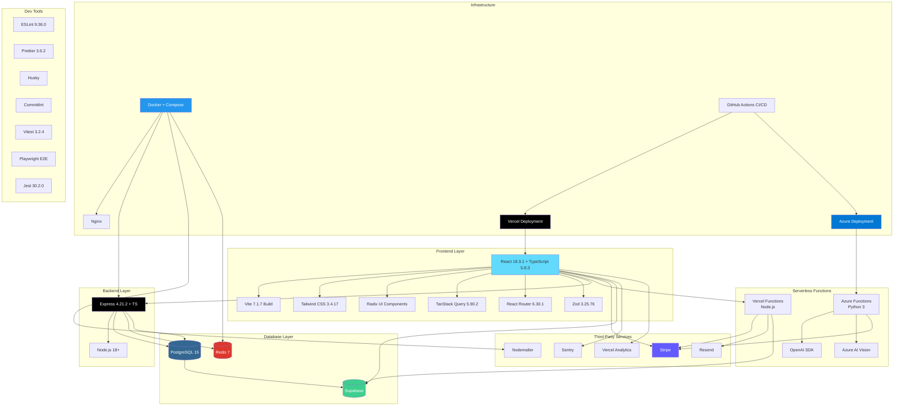

# TCDynamics Tech Stack Architecture

> **For Mermaid Live Editor**: Copy the raw code from `tech-stack-diagram.mmd` file (pure Mermaid syntax without markdown wrapper)

## Tech Stack Summary

### Frontend

- **Framework**: React 18.3.1 + TypeScript 5.8.3
- **Build**: Vite 7.1.7
- **UI**: Tailwind CSS 3.4.17 + Radix UI
- **State**: TanStack Query 5.90.2
- **Routing**: React Router 6.30.1
- **Validation**: Zod 3.25.76
- **Testing**: Vitest 3.2.4 + Playwright

### Backend

- **Runtime**: Node.js 18+
- **Framework**: Express 4.21.2 + TypeScript
- **Database**: PostgreSQL 15
- **Cache**: Redis 7
- **Logging**: Pino 8.19.0 + Winston 3.17.0
- **Security**: Helmet + CSRF + Rate Limiting
- **Testing**: Jest 30.2.0

### Serverless

- **Vercel Functions**: Node.js
- **Azure Functions**: Python 3
- **AI**: OpenAI SDK + Azure AI Vision

### Services

- **Database/Auth**: Supabase
- **Payments**: Stripe
- **Email**: Resend + Nodemailer
- **Monitoring**: Sentry
- **Analytics**: Vercel Analytics

### Infrastructure

- **Containers**: Docker + Docker Compose
- **Web Server**: Nginx
- **CI/CD**: GitHub Actions
- **Deployment**: Vercel (frontend) + Azure (functions)

### Dev Tools

- **Linting**: ESLint 9.36.0
- **Formatting**: Prettier 3.6.2
- **Git Hooks**: Husky + Commitlint
- **Package Manager**: npm 9+

